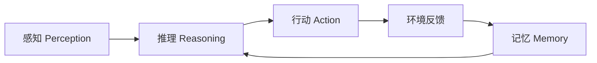

# AI Agent 概述与核心架构

> 📌 **导航**：本文是 **AI Agent 概述与核心架构** 词条，属于 ai-and-llm 术语集（Agent 方向）。相关枢纽：[[Agent 架构模式详解]]、[[多 Agent 协作系统]]、[[大模型基础术语详解]]、[[RAG 与检索技术详解]]。

## 定义

**一句话定义：** AI Agent 是能感知环境、自主推理并调用工具采取行动，以持续交互完成复杂目标的智能系统。

**通俗类比：** 如果大模型是一位博学的"顾问"，Agent 就是一位能独立办事的"助手"——不仅会想，还会动手操作、会根据结果调整下一步。

## 为什么需要它

传统模型只做"单轮问答"，一问一答、无法操作外部世界，也难以完成多步骤任务。Agent 通过"感知—推理—行动"的循环，把大模型的思考能力与工具、记忆、环境交互结合起来，让"理解意图"延伸到"执行落地"，是从对话系统走向自动化生产力的关键形态。

## 核心机制

Agent 的骨架是一个不断运转的闭环：拿到目标后先理解、再规划、调用工具行动、观察结果，据此修正策略，直到完成。

1. **感知层（Perception）**：接收并解析多模态输入——文本、图像、语音、API 返回、传感器信号，把杂乱的外部信息规整成大模型能消费的结构化上下文。感知质量直接决定后续推理的地基。
2. **推理层（Reasoning）**：以大模型为引擎做理解、分析、规划与决策，常配合思维链（CoT）把复杂问题拆成中间步骤。它是 Agent 的"大脑"，决定下一步该想什么、做什么。
3. **行动层（Action）**：通过工具调用、代码执行、API 请求在环境中产生实际影响，并把执行结果作为新观察回灌给推理层。行动能力是 Agent 区别于纯聊天模型的分水岭。
4. **记忆系统（Memory）**：短期记忆靠上下文窗口保存当前会话，长期记忆借助向量库沉淀跨会话知识，让 Agent 具备一致性与经验积累，而不是每次都"失忆"。

| 组件 | 职责 | 典型技术 |
|------|------|----------|
| 感知层 | 接收解析输入 | 文本解析、OCR、ASR |
| 推理层 | 分析与决策 | LLM、Chain-of-Thought |
| 行动层 | 执行操作 | 工具调用、代码执行、API |
| 记忆系统 | 存历史与上下文 | 上下文窗口、向量数据库 |

## 具体示例

任务"帮我订一张明早去上海的机票并加进日历"：感知（解析时间与目的地）→ 推理（拆解为查航班、比价、下单、写日历）→ 行动（调用机票 API 查询）→ 观察（价格变动）→ 重新推理比价后下单 → 行动（调日历 API）→ 完成。每一步的反馈都会更新记忆与下一步决策。

## 何时用 / 何时不用

- **用**：任务多步骤、需要调用外部工具、要根据中间结果动态调整时。
- **不用**：单轮事实问答、纯文本生成、或延迟极敏感的场景——直接调模型即可，Agent 循环反而增加成本与不确定性。

## 优劣与代价

✅ 把"理解"延伸到"执行"，能端到端完成复杂任务，具备自我修正能力。
✅ 工具与记忆可插拔，能力边界可随生态扩展。
⚠️ 多步循环带来更高的 Token 成本、延迟与误差累积，一步错可能步步错。
⚠️ 行为不确定性上升，生产落地必须配套可观测与兜底（见 [[AI Agent 开发最佳实践]]）。

## 与相关概念的区别

- **vs 传统 LLM 应用**：LLM 是"输入→输出"的单次映射；Agent 是"带反馈的循环"，会主动规划与调用工具。
- **vs RAG**：RAG 专注"检索增强生成"这一种能力，常作为 Agent 的一个工具被调用；Agent 是更上层的调度者。
- **vs 多 Agent 系统**：本文讲单体 Agent 的内部结构；多 Agent 关注多个 Agent 之间的通信与分工。

## 常见误区

- 只要接入了一个大模型，系统就算是一个 AI Agent。
- Agent 与传统 AI 的唯一区别就是"能调用工具"，与循环、记忆无关。
- Agent 越自主越好，生产环境也应尽量少设人工确认环节。

## 面试速答

> 🎯 AI Agent 是"感知—推理—行动"闭环：以 LLM 为大脑做规划决策，用工具层影响环境，用记忆层积累经验，靠反馈循环逐步逼近目标。相比单轮模型，它能多步、自主、可修正，代价是更高成本与不确定性。
> 🔍 追问：Agent 和 RAG 是什么关系？（RAG 常作为 Agent 的一个检索工具，被上层调度调用）
> 🔍 追问：为什么说误差累积是 Agent 的核心风险？（多步链路上每步偏差会向后传播放大，需反馈纠偏）

## 相关术语

[[Agent 架构模式详解]]、[[Agent 规划与推理]]、[[Agent 记忆系统]]、[[Agent 评估与基准]]、[[多 Agent 协作系统]]、[[大模型基础术语详解]]、[[RAG 与检索技术详解]]、[[Prompt 工程与 Agent 详解]]、[[AI Agent 开发最佳实践]]

## 参考资料

建议人工核验：可参考各框架官方文档（LangChain / AutoGPT / CrewAI 等）、*AI Agents in Action* (Michael Landsman)、Anthropic 工程博客 *Building Effective Agents*，以及 OpenAI / Anthropic 官方 Agent 开发文档。
