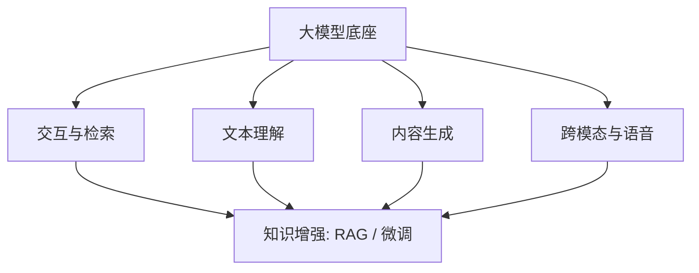

# AI 应用详解

> 📌 **导航**：本文是 **AI 应用详解** 词条，属于 ai-and-llm 术语集（应用方向），是一张按能力族索引各专项词条的枢纽。相关枢纽：[[大模型基础术语详解]]、[[RAG 与检索技术详解]]、[[多 Agent 协作系统]]、[[Prompt 工程与 Agent 详解]]。

## 定义

**一句话定义：** AI 应用是把大模型的理解、生成与跨模态能力封装成具体功能的产品形态，覆盖对话、文本理解、内容生成、语音与知识增强等族。

**通俗类比：** 大模型是一台通用发动机，AI 应用就是装上不同车身、方向盘和仪表的整车——同样动力，被改造成聊天、搜索、翻译、看图说话等各不相同的用途。

## 为什么需要它

模型能力本身不产生价值，落到场景才有。企业真正要解决的是一类类具体任务：怎么读懂评论、怎么自动归类工单、怎么把文档变成答案、怎么"听懂"和"开口"。理解 AI 应用的分类版图，才能在众多能力里为需求选对形态、组合出可上线的方案。

## 核心机制

把散落的应用按"要模型做什么"归成五族，每族都有专项词条承载细节：

1. **交互与检索族**：以对话系统、AI 搜索、编程助手为代表，核心是把模型接进人机回路——对话保持上下文多轮推进，搜索直接产出带来源的答案，编程助手理解仓库上下文补全与重构。选型关键在延迟与可控性。
2. **文本理解族**：包含摘要、分类、命名实体识别（NER）、情感分析，本质都是"从文本抽结构化信号"。抽取式/生成式摘要、二分类/多分类/多标签、实体标注、正负中性判别，是传统 NLP 与大模型共同服务的高频任务。
3. **内容生成族**：代码生成与图像生成（Stable Diffusion / Midjourney / DALL-E）。把自然语言意图翻译成可执行代码或像素，价值在降低创作门槛，风险在正确性与风格可控。
4. **跨模态与语音族**：多模态模型、语音识别（Whisper）、语音合成（TTS）、机器翻译，处理文本以外的输入输出。它们决定 AI 能否看图、听声、说话、跨语言。
5. **知识增强族**：RAG 与微调（Fine-tuning）是让模型适配特定领域的两条路线，常组合使用——微调内化风格与能力，RAG 补充实时、可溯源的知识。

**能力族索引（各专项词条）：**

| 应用 | 归属族 | 一句话 |
|------|--------|--------|
| 对话系统 | 交互与检索 | 多轮自然语言交互，保持上下文 |
| AI 搜索引擎 | 交互与检索 | 直接给带来源的答案而非链接 |
| 代码生成 / 编程助手 | 内容生成 | 自然语言→可执行代码 |
| 文本摘要 | 文本理解 | 长文压缩保留核心信息 |
| 文本分类 | 文本理解 | 划入预定义类别，支持多标签 |
| 命名实体识别 NER | 文本理解 | 抽出人名/地名/机构/时间 |
| 情感分析 | 文本理解 | 判正面/负面/中性 |
| 图像生成 | 内容生成 | 文字描述→图像 |
| 多模态模型 | 跨模态与语音 | 同时处理文本/图像/音频 |
| 语音识别 / TTS | 跨模态与语音 | 语音↔文字双向转换 |
| 机器翻译 | 跨模态与语音 | 跨语言自动转换 |
| RAG vs 微调 | 知识增强 | 领域适配的两条路线 |

## 具体示例

做"智能客服"：用对话系统承载多轮交互 → 用意图分类把工单归到技术/售后/投诉 → 用 NER 从描述里抽出订单号与产品名 → 用 RAG 从知识库检索标准答复并附来源 → 敏感或高频场景再用微调固化品牌语气。一个产品往往跨多族拼装。

## 何时用 / 何时不用

- **用**：需求可映射到某一明确能力族（理解、生成、检索、跨模态）时，先找对应族的成熟形态再落地。
- **不用**：需求本质是确定性规则或数据库查询，套 AI 反增不确定性与成本；此时传统方案更合适。

## 优劣与代价

✅ 把通用模型能力产品化，覆盖任务广、组合灵活、门槛持续下降。
⚠️ 不同族成本与延迟差异大（生成式远高于分类式），选型错方向就白白烧钱。
⚠️ 生成类应用有幻觉与风格漂移风险，多数生产场景都要叠加检索或评估兜底。

## 与相关概念的区别

- **vs 模型（如 [[多模态大模型]]）**：模型是能力底座，本词条是底座之上的应用版图与选型视角。
- **vs Agent（[[AI Agent 概述与核心架构]]）**：应用多指单一功能能力，Agent 则把多种应用能力当工具自主调度起来完成复合目标。

## 常见误区

- 做 AI 应用一定要上最复杂的多模态大模型，能力越全越好。
- RAG 和微调是对立关系，只能二选一，不可能同时使用。
- 有了大模型，文本分类、NER 这类传统 NLP 任务就彻底被淘汰了。

## 面试速答

> 🎯 AI 应用按"要模型做什么"分五族：交互检索（对话/搜索/编程助手）、文本理解（摘要/分类/NER/情感）、内容生成（代码/图像）、跨模态语音（多模态/ASR/TTS/翻译）、知识增强（RAG vs 微调）。落地时按数据是否更新、能否容错、成本高低在族内选形态。
> 🔍 追问：知识天天更新，选 RAG 还是微调？（RAG，改库即生效、可溯源，无需重训）
> 🔍 追问：想让模型稳定输出特定风格或格式该用哪个？（微调，把风格内化进权重）

## 相关术语

[[大模型基础术语详解]]、[[RAG 与检索技术详解]]、[[多 Agent 协作系统]]、[[Prompt 工程与 Agent 详解]]、[[AI Agent 概述与核心架构]]、[[机器学习基础]]、[[多模态大模型]]、[[Embedding 技术详解]]、[[语音AI技术]]、[[向量数据库技术]]

## 参考资料

建议人工核验：本词条内容建议对照相关技术官方文档、权威教材与论文做准确性复核；未编造文献编号、标准号或 URL，如需引用请补充具体出处。
