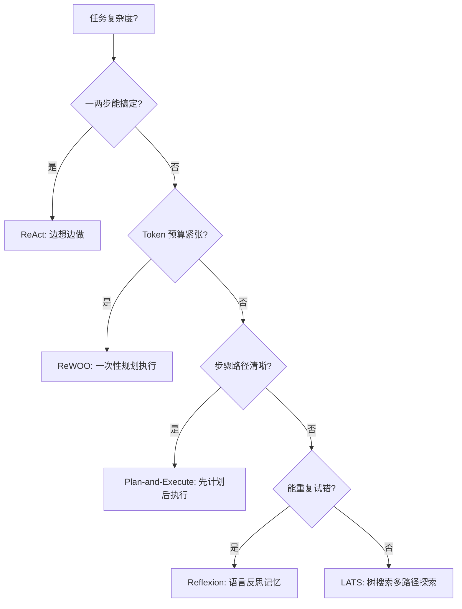

# Agent 架构模式详解

> 📌 **导航**：本文是 **Agent 架构模式详解** 词条，属于 ai-and-llm 术语集（Agent 方向）。相关枢纽：[[AI Agent 概述与核心架构]]、[[多 Agent 协作系统]]、[[大模型基础术语详解]]。

## 定义

**一句话定义：** Agent 架构模式是规范大模型如何拆解任务、调用工具、处理反馈并最终输出结果的工程化控制流框架。

**通俗类比：** 给大模型配一套"工作 SOP"——是边想边做、先做计划再执行、还是做错了写反思日记，决定了它的办事效率和靠谱程度。

展开一句：大模型本身只是"大脑"，架构模式决定了它如何与外部世界（工具、环境、记忆）交互。没有最好的架构，只有针对特定任务在"可靠性、Token 成本、延迟"三者间的最佳取舍。

## 为什么需要它

直接让 LLM 回答复杂问题（Zero-shot）容易产生幻觉，且无法操作外部系统；而简单的工具调用又缺乏全局规划。架构模式通过引入"思考-行动循环"、"规划器"、"反思记忆"等机制，把不可控的生成过程变成可追踪、可干预、可复盘的工程流水线，是 Agent 从"玩具"走向"生产"的必经之路。

## 核心机制

工业界主流的五种架构，本质上是应对不同复杂度任务的策略：

1. **ReAct（推理与行动交替）**：最经典的基线。Thought（思考下一步）→ Action（调用工具）→ Observation（观察结果）循环，直到得出答案。直观但 Token 消耗大，易陷入死循环。
2. **Plan-and-Execute（先规划后执行）**：引入 Planner 生成步骤列表，Executor 逐步执行。适合步骤明确的长流程任务，但一旦初始计划错误，后续会一错到底，需引入 Replan 机制。
3. **Reflexion（自我反思）**：不更新模型权重，而是把失败原因写成自然语言"反思"，存入记忆缓冲区供下次尝试参考。适合有明确评估标准（如代码测试用例）的试错场景。
4. **LATS（语言 Agent 树搜索）**：结合蒙特卡洛树搜索（MCTS），在多条候选路径中探索、评估、回退。可靠性最高，但 Token 和延迟成本也最高。
5. **ReWOO（无观察推理）**：Planner 一次性生成带变量占位符的完整工具调用计划，Worker 批量执行，Solver 最后总结。极大节省 Token，但丧失了中途根据观察结果调整计划的灵活性。

**选型决策图：**

**核心取舍对比：**

| 架构模式 | 适用场景 | 可靠性 | Token 成本 | 核心代价 |
|---------|---------|--------|-----------|---------|
| **ReAct** | 通用问答、简单工具调用 | 中 | 中 | 上下文膨胀、易死循环 |
| **Plan-and-Execute** | 多步骤、流程化任务 | 高 | 中 | 规划错误会导致全局崩溃 |
| **Reflexion** | 编程、逻辑推理等可验证任务 | 高 | 高 | 依赖可靠的评估器（Evaluator） |
| **LATS** | 开放探索、高容错要求任务 | 很高 | 很高 | 算力与延迟成本极高 |
| **ReWOO** | 效率优先、依赖关系明确的任务 | 中 | 低 | 丧失中途纠偏能力 |

## 具体示例

任务："调研并生成某公司的竞品分析报告"。
- **ReAct**：搜一下公司名 → 发现没财报 → 再搜财报 → 发现要登录 → 卡死或胡乱编造。
- **Plan-and-Execute**：先列出"1.找官网 2.下财报 3.找竞品 4.对比分析"计划，然后按部就班执行，即使第 2 步失败也能尝试跳过或换源。
- **ReWOO**：一次性生成 5 个搜索 API 调用计划，并发执行拿回所有数据，最后让 LLM 统一写报告，速度最快且最省钱。

## 何时用 / 何时不用

- **用**：任务需要多步推理、调用外部工具、或需要高可靠性保障时。生产环境通常从 ReAct 起步，遇到瓶颈再升级。
- **不用**：简单的单轮问答、纯文本生成、或延迟要求极严（<1s）的场景（直接走传统 API 或缓存）。

## 优劣与代价

✅ 提供了将 LLM 能力工程化落地的标准范式，大幅降低幻觉和失控风险。
✅ 不同架构可组合使用（如 Plan-and-Execute 的 Executor 内部嵌套 ReAct）。
⚠️ 隐性成本：架构越复杂，调试和追踪（Trace）的难度呈指数级上升。
⚠️ 评估困难：除了最终结果，中间步骤的合理性很难自动化评估，依赖人工抽检或 LLM-as-a-Judge。

## 与相关概念的区别

- **vs Prompt Chain（提示词链）**：Chain 是硬编码的 DAG 流程（A→B→C），Agent 架构是 LLM 自主决定下一步（动态控制流）。
- **vs 多 Agent 协作**：本词条讨论的是"单体 Agent 内部的思考执行逻辑"，多 Agent 关注的是"多个 Agent 之间的通信与角色分工"。

## 常见误区

- ReAct 架构因为每步都带完整历史，所以 Token 消耗比一次性规划的 ReWOO 更低。
- Reflexion 架构通过反向传播更新模型权重来提升 Agent 表现。

## 面试速答

> 🎯 Agent 架构是规范 LLM 思考与执行的控制流。基线是 ReAct（边想边做）；长流程用 Plan-and-Execute；可验证试错用 Reflexion（语言记忆）；省 Token 用 ReWOO（规划执行解耦）；高可靠探索用 LATS（树搜索）。核心是在可靠性、成本、延迟间做取舍。
> 🔍 追问：ReAct 容易陷入死循环，工程上怎么兜底？（答：最大步数限制、重复 Action 检测、强制 Replan）
> 🔍 追问：Plan-and-Execute 如果第一步计划就错了怎么办？（答：引入 Replan 机制，Executor 发现异常时触发重新规划）

## 相关术语

[[AI Agent 概述与核心架构]]、[[Agent 规划与推理]]、[[Agent 记忆系统]]、[[多 Agent 协作系统]]、[[Prompt 工程与 Agent 详解]]

## 参考资料

- Yao, S. et al. (2022). ReAct: Synergizing Reasoning and Acting in Language Models. *ICLR 2023*.
- Shinn, N. et al. (2023). Reflexion: Language Agents with Verbal Reinforcement Learning. *NeurIPS 2023*.
- Zhou, A. et al. (2023). Language Agent Tree Search Unifies Reasoning, Acting, and Planning in Language Models. *ICML 2024*.
- Xu, B. et al. (2023). ReWOO: Decoupling Reasoning from Observations for Efficient Augmented Language Models.
- Anthropic Engineering (2024). Building Effective Agents.
