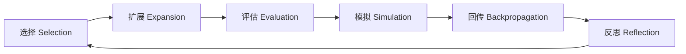
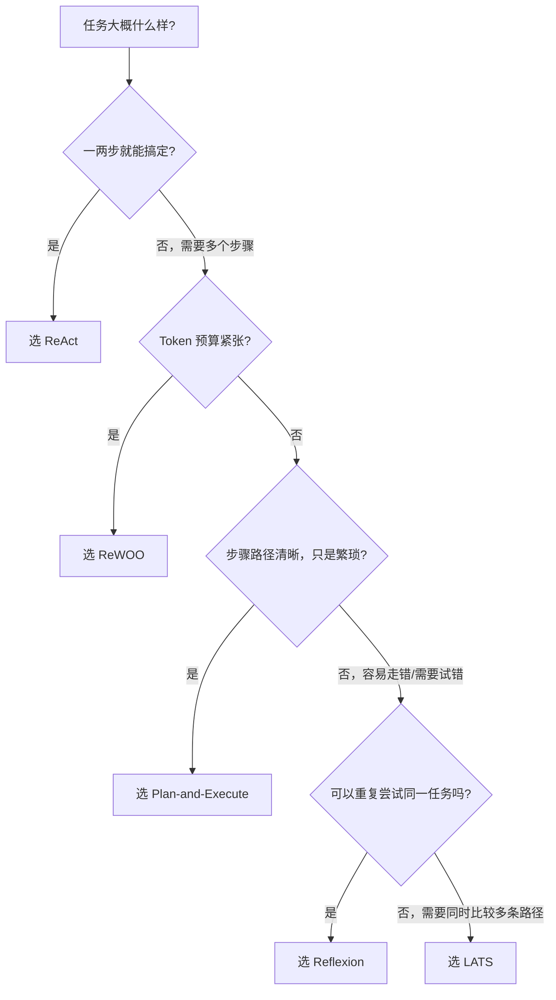

# Agent 架构模式详解

> 📌 **导航**：本文是 **Agent 架构模式详解** 词条，属于 ai-and-llm 术语集（Agent 方向）。相关枢纽：[[AI Agent 概述与核心架构]]、[[Agent 架构模式详解]]、[[多 Agent 协作系统]]、[[大模型基础术语详解]]、[[RAG 与检索技术详解]]。

## 概述

Agent 的架构模式决定了它如何思考、规划和执行任务。这些模式看起来五花八门，但本质上都在 **可靠性、Token 成本、延迟** 三者之间做取舍——先想清楚任务需要哪种取舍，再挑架构，比死记硬背名字更重要。

本文按"要解决什么问题 → 怎么解决 → 代价是什么"的顺序，梳理五种主流架构：**ReAct、Plan-and-Execute、Reflexion、LATS、ReWOO**，每种都标注了出处论文，方便进一步查证。

## ReAct：推理与行动交替

### 要解决的问题

只做推理（比如 Chain-of-Thought）的模型不接触真实世界，容易凭内部知识"编"出看似合理却错误的答案；只做行动、不显式推理的 Agent，又容易丢失对任务全局的把控，遇到异常不知道怎么调整。ReAct 的做法是让模型交替生成"想法"（Thought）和"行动"（Action）：用推理决定下一步做什么，再用行动换来的观察结果反过来修正推理。

> 出处：*ReAct: Synergizing Reasoning and Acting in Language Models*（Yao 等，2022，arXiv:2210.03629），后发表于 ICLR 2023。

### 工作流程

```
用户问题 → Thought(推理) → Action(行动) → Observation(观察) → Thought → ... → 最终答案
```

### 代码示例

```python
class ReActAgent:
    def __init__(self, llm, tools):
        self.llm = llm
        self.tools = {t.name: t for t in tools}

    def run(self, question: str, max_steps=10) -> str:
        prompt = self.build_prompt(question)
        for step in range(max_steps):
            response = self.llm.generate(prompt)
            action = self.parse_action(response)
            if action is None:
                return self.parse_final_answer(response)
            tool_name, tool_input = action
            observation = self.tools[tool_name].run(tool_input)
            prompt += f'\nObservation: {observation}\n'
        return '达到最大步骤数限制'
```

| 优势 | 劣势 |
|------|------|
| 直观易理解 | Token 消耗大（每一步都要把历史全部带上） |
| 调试方便，每步都可见 | 可能陷入循环 |
| 适用场景广泛 | 复杂任务效率低，容易"走一步看一步"迷路 |

## Plan-and-Execute：先规划后执行

### 要解决的问题

像 ReAct 这样"边想边做"，任务步骤一多，上下文就会不断膨胀、成本升高，模型也容易在中途忘记最初的目标。Plan-and-Execute 把任务拆成两阶段：先让一个"规划器"把整体步骤想清楚、列成计划，再交给"执行器"逐步落实，只有在计划明显不适用时才重新规划。

> 出处：并非来自单一论文，而是 LangChain 团队在 2023 年提出的工程模式，思路上受 Yohei Nakajima 的 BabyAGI 项目、以及王等人《Plan-and-Solve Prompting》（ACL 2023）的启发。

### 代码示例

```python
class PlanAndExecuteAgent:
    def __init__(self, planner_llm, executor_llm, tools):
        self.planner = planner_llm
        self.executor = executor_llm
        self.tools = tools

    def run(self, task: str) -> str:
        plan = self.create_plan(task)
        results = []
        for step in plan:
            result = self.execute_step(step, results)
            results.append({'step': step, 'result': result})
            if self.need_replan(step, result):
                plan = self.replan(task, results)
        return self.synthesize_results(results)
```

- ✅ **优势**：上下文更聚焦，规划和执行分离，适合步骤多、路径相对明确的复杂任务。
- ⚠️ **局限**：规划阶段依赖模型对任务的整体判断，如果一开始就想歪了，后续执行会一直"错下去"，直到触发重新规划。

## Reflexion：自我反思

### 要解决的问题

让 Agent 靠传统强化学习"试错学习"，需要大量样本和昂贵的权重更新；但如果只是让它在失败后用自然语言"反思"哪里错了、下次要注意什么，并把这些反思存进一个记忆缓冲区、供下一次尝试参考，效果也能明显提升——这是 Reflexion 的核心洞察：**不更新权重，只更新"语言记忆"**。原论文里反思信号可以来自环境的标量反馈、预定义的启发式规则，或模型自己生成的自由文本反思。

> 出处：*Reflexion: Language Agents with Verbal Reinforcement Learning*（Shinn 等，2023，arXiv:2303.11366），发表于 NeurIPS 2023。

### 代码示例

```python
class ReflexionAgent:
    def __init__(self, llm, tools, max_retries=3):
        self.llm = llm
        self.tools = tools
        self.max_retries = max_retries
        self.reflections = []

    def run(self, task: str) -> str:
        for attempt in range(self.max_retries):
            result = self.execute(task, self.reflections)
            if self.evaluate(task, result).success:
                return result
            self.reflections.append(self.reflect(task, result))
        return '达到最大重试次数'
```

- ✅ **优势**：不需要微调模型，就能让 Agent 在同一任务的多次尝试之间"越做越好"，适合有明确成功/失败信号的任务（编程、序列决策、需要高精度的推理）。
- ⚠️ **局限**：需要能反复尝试同一任务的场景（比如有测试用例的编程任务），且依赖一个可靠的"评估器"来判断本次尝试是否成功。

## LATS：语言 Agent 树搜索

### 要解决的问题

ReAct 和 Plan-and-Execute 本质上都只探索"一条路径"——一步走错，很难走回头路。LATS 借鉴强化学习里的蒙特卡洛树搜索（MCTS），把决策过程建模成一棵搜索树，在多条候选路径之间做搜索，而不是一条道走到黑。

> 出处：*Language Agent Tree Search Unifies Reasoning, Acting, and Planning in Language Models*（Zhou 等，2023，arXiv:2310.04406），后发表于 ICML 2024。

### 核心机制

LLM 在 LATS 里同时扮演三种角色：**行动生成器**（在每个节点采样可能的下一步）、**价值评估函数**（给候选状态打分，预测未来收益）、**反思器**（对失败或不理想的路径做自我批评，写进后续搜索的上下文）。整个搜索循环由六个操作构成：



搜索树示意：

```
       初始状态
      /   |   \
   行动1  行动2  行动3
   /  \    |    /  \
 a1   a2  a3  a4   a5
 ↓    ↓    ↓   ↓    ↓
0.3  0.8  0.5 0.9  0.4   ← 评估得分
```

- ✅ **优势**：能从走错的分支中"回退"，在开放性、探索性强的任务上可靠性最高。
- ⚠️ **局限**：每一步都要生成、评估多个候选，Token 和延迟成本也最高，不适合追求响应速度的场景。

## ReWOO：减少 Token 消耗

### 要解决的问题

像 ReAct 这种"边想边做"的模式，每调用一次工具，就要把之前的完整历史重新喂给模型一次；工具调用越多，重复的 Token 消耗就越大。ReWOO（**Rea**soning **W**ith**O**ut **O**bservation）把流程拆成三个独立模块：**Planner** 一次性规划出全部需要的工具调用（用变量占位符表示彼此的依赖关系）、**Worker** 依次执行这些调用并替换占位符、**Solver** 拿到全部证据后一次性给出最终答案。论文里这套方法在 HotpotQA 上做到了约 5 倍的 Token 效率提升。

> 出处：*ReWOO: Decoupling Reasoning from Observations for Efficient Augmented Language Models*（Xu 等，2023，arXiv:2305.18323）。原文缩写规范写法是 "ReWOO"，中文资料里也常见全大写的 "REWOO"，两者指同一方法。

### 代码示例

```python
class ReWOOAgent:
    def run(self, task):
        plan = self.planner.generate_plan(task)  # 一次性规划（Planner）
        results = {}
        for i, tool_call in enumerate(plan):
            results[f'E{i+1}'] = self.execute(tool_call)  # 依次执行（Worker）
        return self.solver.solve(task, results)  # 一次性总结（Solver）
```

- ✅ **优势**：Token 效率高，工具调用互不阻塞，某个工具失败也不会拖垮整个上下文。
- ⚠️ **局限**：规划阶段对环境信息掌握不足时，后续无法像 ReAct 那样根据中途的观察结果灵活调整计划。

## 架构模式对比

| 架构模式 | 适用场景 | 复杂度 | 可靠性 | Token 成本 | 起源 |
|---------|---------|--------|--------|----------|------|
| **ReAct** | 通用任务、问答 | 低 | 中 | 中 | Yao 等，2022（ICLR 2023） |
| **Plan-and-Execute** | 多步骤复杂任务 | 中 | 高 | 中 | LangChain，2023（受 BabyAGI / Plan-and-Solve 启发） |
| **Reflexion** | 可重复尝试、需要精确性的任务 | 中 | 高 | 高 | Shinn 等，2023（NeurIPS 2023） |
| **LATS** | 探索性、开放性任务 | 高 | 很高 | 很高 | Zhou 等，2023（ICML 2024） |
| **ReWOO** | 效率优先场景 | 中 | 中 | 低 | Xu 等，2023 |

## 怎么选：一张决策图

把上面"选择建议"画成一张可以照着走的决策图：



一个实用的经验法则（也是 Anthropic 工程博客 *Building Effective Agents* 反复强调的）：**先从最简单的 ReAct 式实现开始，只有在它明显不够用时，才逐步引入更复杂的架构**——复杂度本身也是一种成本。

## 检验自己是否理解了

试着不看上文，回答下面几个问题，再展开答案核对。

<details>
<summary>1. ReAct 和 Plan-and-Execute 最核心的区别是什么？</summary>

ReAct 是"走一步想一步"，每一步都交替做推理和行动；Plan-and-Execute 是先一次性把全部步骤规划好，再逐步执行，只有必要时才重新规划。
</details>

<details>
<summary>2. 为什么说 Reflexion 不是传统意义上的强化学习？</summary>

它不更新模型权重，而是把"反思"以自然语言的形式存进记忆缓冲区，在下一次尝试时作为上下文提供给模型，用"语言反馈"代替梯度更新。
</details>

<details>
<summary>3. LATS 里 LLM 同时扮演哪几种角色？搜索循环包含哪几步？</summary>

三种角色：行动生成器、价值评估函数、反思器。搜索循环包含选择、扩展、评估、模拟、回传、反思六个操作，循环往复直到找到足够好的路径。
</details>

<details>
<summary>4. ReWOO 为什么能省 Token？代价是什么？</summary>

因为它把规划、执行、总结拆成三个独立阶段，只需要一次性生成完整计划，不必在每次工具调用后把全部历史重新喂给模型。代价是：如果规划阶段对环境信息掌握不足，后续很难像 ReAct 那样根据中途的观察结果灵活调整计划。
</details>

<details>
<summary>5. 如果任务需要调用五六个工具、但 Token 预算有限，你会优先考虑哪种架构？为什么？</summary>

优先考虑 ReWOO（如果工具调用之间依赖关系能提前想清楚）或 Plan-and-Execute（如果步骤之间需要一定灵活性）。两者都通过"减少重复上下文"来控制 Token 成本，区别在于 ReWOO 更极致地把规划和执行分离。
</details>

## 小结

不同架构各有侧重，没有"最好"的架构，只有"当前任务更适合"的架构。实际开发中，很多生产系统会以 ReAct 这样简单的循环起步，只在遇到明确的可靠性或成本瓶颈时，才引入 Plan-and-Execute、Reflexion 这类更复杂的模式；LATS 这种高成本方案通常留给探索空间大、容错要求也高的任务。

## 相关术语

[[AI Agent 概述与核心架构]]、[[Agent 架构模式详解]]、[[Agent 规划与推理]]、[[Agent 记忆系统]]、[[Agent 评估与基准]]、[[多 Agent 协作系统]]、[[大模型基础术语详解]]、[[RAG 与检索技术详解]]、[[Prompt 工程与 Agent 详解]]

## 参考资料

- Yao, S. et al. (2022). *ReAct: Synergizing Reasoning and Acting in Language Models*. [arXiv:2210.03629](https://arxiv.org/abs/2210.03629)（ICLR 2023）
- Shinn, N. et al. (2023). *Reflexion: Language Agents with Verbal Reinforcement Learning*. [arXiv:2303.11366](https://arxiv.org/abs/2303.11366)（NeurIPS 2023）
- Zhou, A. et al. (2023). *Language Agent Tree Search Unifies Reasoning, Acting, and Planning in Language Models*. [arXiv:2310.04406](https://arxiv.org/abs/2310.04406)（ICML 2024）
- Xu, B. et al. (2023). *ReWOO: Decoupling Reasoning from Observations for Efficient Augmented Language Models*. [arXiv:2305.18323](https://arxiv.org/abs/2305.18323)
- Wang, L. et al. (2023). *Plan-and-Solve Prompting*（ACL 2023）——Plan-and-Execute 灵感来源之一
- LangChain Blog, [*Plan-and-Execute Agents*](https://www.langchain.com/blog/plan-and-execute-agents)（2023）
- Anthropic Engineering, [*Building Effective Agents*](https://www.anthropic.com/engineering/building-effective-agents)
- 各框架官方文档（LangChain / AutoGPT / CrewAI 等），建议结合最新版本核验具体实现细节
