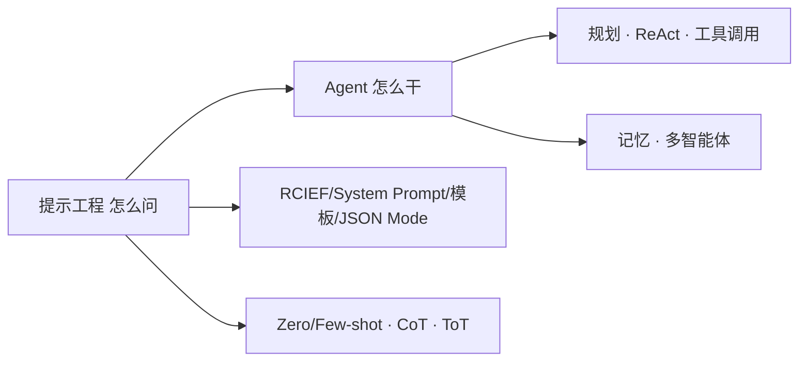

# Prompt 工程与 Agent 详解

> 📌 **导航**：本文是 **Prompt 工程与 Agent 详解** 词条，属于 ai-and-llm 术语集的枢纽。相关枢纽：[[大模型基础术语详解]]、[[AI Agent 概述与核心架构]]、[[Agent 架构模式详解]]、[[RAG 与检索技术详解]]。

## 定义

**一句话定义：** 本词条是"提示工程"与"Agent"两大概念的枢纽索引——提示工程管"怎么问"（角色、示例、格式、推理引导），Agent 管"怎么干"（规划、工具、记忆、协作），二者合起来构成大模型应用的完整心智地图。

**通俗类比：** 一张地铁图——"怎么给模型下指令"是一条线，"模型自主干活"是另一条线，沿途每一站（ReAct、CoT、Memory、Tool Use）都指向它自己的详细词条。

## 为什么需要它

新手常把"写好 prompt"和"做 Agent"混为一谈，也记不清十来个术语的关系。一个枢纽能把提示侧与智能体侧一次串清，并索引到各专项词条，既建立全局联系又避免在总览里堆砌细节。

## 核心机制

两条主线，一套接力：

1. **提示工程侧（怎么问）**：用 RCIEF 五要素——Role 角色、Context 上下文、Instruction 指令、Example 示例、Format 格式——组织输入；System Prompt 预设角色与边界、是输出安全合规的第一道防线；Prompt 模板以 role/skill/tone 占位可复用；JSON Mode 强制结构化输出便于程序解析。示例范式上，Zero/One/Few-shot 指给 0/1/几个示例来引导格式与判别，Few-shot 是临时给例、不改权重。
2. **智能体侧（怎么干）**：Agent 按"感知—规划—行动—记忆"闭环运转；ReAct 让推理与行动交替；Tool Use / Function Calling 让模型调用外部能力（模型只产出"调哪个函数 + 传什么参数"，真正执行在应用侧）；Planning 把目标拆成带顺序的子任务；Memory 分短期上下文与长期向量检索；Multi-Agent 让多个专家角色分工协作。

沿途术语的详细讲解都在各自专项词条，本文只做定位：

| 术语 | 一句话 | 详见 |
|------|--------|------|
| CoT / ToT / Self-Consistency | 推理与投票类提示技巧 | [[Prompt Engineering 高级技巧]] |
| ReAct / Plan-and-Execute | 单体 Agent 控制流架构 | [[Agent 架构模式详解]] |
| Tool Use / Function Calling / MCP | 模型如何调外部工具 | [[Function Calling 与 Tool Use]]、[[MCP（Model Context Protocol）]] |
| Planning | 任务拆解与排序 | [[Agent 规划与推理]] |
| Memory | 短期上下文 + 长期检索 | [[Agent 记忆系统]] |
| Multi-Agent | 多角色协作 | [[多 Agent 协作系统]] |

## 具体示例

"写一份竞品报告"：好的 Prompt 先给角色、结构与输出格式（提示工程半）；若这是一个 Agent，它还会 Planning 拆步骤 → Tool Use 搜索收集 → Memory 记住已获取内容 → 整合成报告（智能体半）。两半在同一任务里接力完成。

## 何时用 / 何时不用

- **用**：需要快速建立"提示 ↔ Agent"全局联系、定位某个术语该去哪篇细看时。
- **不用**：把本文当深入材料——具体机制请进对应子词条。

## 优劣与代价

✅ 一张图串清两大板块及其关系，索引直达专项词条。
⚠️ 概念细节以子词条为准，本文点到为止，不宜替代深读。
⚠️ 提示侧与 Agent 侧概念有重叠，枢纽价值在于"分工索引"而非重复展开。

## 与相关概念的区别

- **vs [[大模型基础术语详解]]**：那是模型底座术语总览，本条聚焦"提示 ↔ Agent"应用层。
- **vs [[AI Agent 概述与核心架构]]**：那是 Agent 内部结构专条，本条把提示工程一并纳入同一张地图。

## 常见误区

- 提示工程和 Agent 是同一回事，会写 prompt 就等于会做 Agent。
- Few-shot 给的示例会永久改变模型权重，效果等同于微调。
- System Prompt 只是装饰，对模型的安全与合规输出没有实际约束作用。

## 面试速答

> 🎯 这张地图分两半：提示工程管"怎么问"——用 RCIEF（角色/上下文/指令/示例/格式）、System Prompt 与 JSON Mode，配合 Few-shot、CoT、ToT 把措辞调到位；写好 prompt 只是第一步，Agent 还引入自主控制流与外部工具，两者互补。
> 🔍 追问：Few-shot 与微调的本质区别？（Few-shot 临时给例、不改权重、随会话失效；微调把能力内化进权重）
> 🔍 追问：提示工程与 Agent 的分界在哪？（前者优化单条输入输出，后者加入规划 / 工具 / 记忆形成自主控制流）

## 相关术语

[[Prompt Engineering 高级技巧]]、[[Function Calling 与 Tool Use]]、[[MCP（Model Context Protocol）]]、[[AI Agent 概述与核心架构]]、[[Agent 架构模式详解]]、[[大模型基础术语详解]]、[[Agent 规划与推理]]、[[Agent 记忆系统]]、[[多 Agent 协作系统]]

## 参考资料

建议人工核验：本词条内容建议对照相关技术官方文档、权威教材与论文做准确性复核；未编造文献编号、标准号或 URL，如需引用请补充具体出处。
