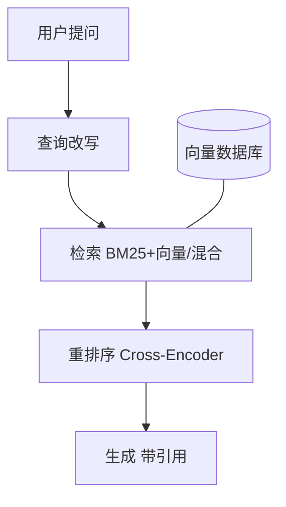

# RAG 与检索技术详解

> 📌 **导航**：本文是 **RAG 与检索技术详解** 词条，是 RAG 技术族的枢纽。相关枢纽：[[大模型基础术语详解]]、[[向量数据库技术]]、[[Embedding 技术详解]]、[[Prompt 工程与 Agent 详解]]。

## 定义

**一句话定义：** RAG（检索增强生成）先从知识库检索相关内容、再连同问题一起喂给大模型，让它基于真实资料生成可溯源的回答，本词条是其检索技术族的全景索引。

**通俗类比：** 开卷考试——先翻书找到相关章节（检索），再用自己的话组织答案（生成），比闭卷硬答（纯 LLM）准得多，还能标注答案出自第几页。

## 为什么需要它

纯 LLM 有三个硬伤：知识过时、爱幻觉、看不到你的私有数据。RAG 用"先检索再生成"把这三点一并缓解——知识存在库里、随库即时更新，回答有出处可依，私有文档也能问答，且比微调便宜灵活。

## 核心机制

一次 RAG 查询穿过四层，层层为"检得准、答得实"服务：

1. **查询处理层（Query Rewriting）**：用户问题常口语、模糊，先规范化——补充领域关键词、把复杂问题拆成子查询，或用 HyDE（让 LLM 先生成一段假想答案，再拿它去检索相似文档）。多轮对话还要结合历史消解指代，把"有没有折扣"还原成"AI 课程有没有折扣"。
2. **检索层（Retrieval）**：三路互补。**BM25** 是按"词频 × 逆文档频率"打分的经典关键词法（TF-IDF 的改进版），擅长专有名词、编号等精确匹配；**语义搜索**把查询与文档各转成向量、在向量库里算相似度，能命中字面不同但意思相同的内容；**混合检索**并行两者再用 RRF 等算法融合排序，取长补短，是生产首选。向量库选型（Pinecone 云托管、Milvus 大规模、ChromaDB 轻量、Weaviate 多模态）详见 [[向量数据库技术]]，嵌入模型见 [[Embedding 技术详解]]。
3. **重排序层（Rerank）**：初始检索"广撒网"快但糙，用 Cross-Encoder 把 (query, doc) 逐对精排、重新打分，把真正最相关的提到前面。它与 Top-K 不同——Top-K 只是截断，Rerank 是二次精排。
4. **生成层（Generation）**：把精排后的片段拼进 Prompt 交给 LLM，要求"只依据给定资料作答"并附引用溯源，从而抑制幻觉。

**文档分块（Chunking）** 是贯穿全链路的地基：固定长度、语义分块、递归分块（章节→段落→句子，最推荐，保证每块语义完整）。块太大检索不精、太小缺上下文，常见取 256–1024 token、设 50–100 token 重叠以保连贯。

## 具体示例

问"公司年假几天"：查询改写 → BM25 + 向量混合检回《员工手册-假期管理》→ Cross-Encoder 把"第 12 条 年假天数规定"提到最前 → LLM 依条款生成"入职满 1 年享 5 天"并标注出处。纯 LLM 只会含糊地编"一般 5-15 天"。

## 何时用 / 何时不用

- **用**：需要私有 / 实时 / 可溯源知识、要控幻觉时。
- **不用**：纯通用常识、无检索必要时；或对单步延迟极敏感时——检索 + 重排会明显增加延迟。

## 检索质量如何量化

没有指标就无法迭代，常用四类（值越接近 1 越好）：

| 指标 | 关注 | 直觉 |
|------|------|------|
| Recall@K | 找全没 | 前 K 个覆盖了多少真正相关文档 |
| Precision@K | 准不准 | 前 K 个里有多少确实相关 |
| MRR | 首位排第几 | 第一个正确结果名次的倒数 |
| NDCG@K | 排序好不好 | 越相关排越前得分越高（带位置折损） |

## 优劣与代价

✅ 知识可即时更新、答案可溯源、显著控幻觉，成本低于持续微调。
⚠️ 上限被检索质量卡死——检不准，生成再强也答不对。
⚠️ 链路环节多（改写 / 分块 / 嵌入 / 混合 / 重排），调优与运维复杂、延迟更高。

## 与相关概念的区别

- **vs [[微调与训练技术详解]]**：微调把知识内化进权重、更新贵且难溯源；RAG 外挂检索、改库即生效、可标注出处。
- **vs [[Agent 记忆系统]]**：记忆检索的是 Agent 自身交互历史，RAG 检索外部知识库。更细的 RAG 变体见 [[RAG 检索增强生成]]。

## 常见误区

- 只要上了 RAG，模型就一定不会再产生幻觉。
- Rerank 和取 Top-K 是一回事，都是简单截取前几个结果。
- 文档分块切得越小越好，块越小检索就一定越精准。

## 面试速答

> 🎯 RAG=先检索再生成，专治知识过时、幻觉与私有数据三大痛点。链路四层：查询改写（含 HyDE）→ 混合检索（BM25 + 向量语义，RRF 融合）→ Cross-Encoder 重排 → 把片段拼进 Prompt 让 LLM 带引用作答，地基是文档分块。优点是知识可更新、可溯源，代价是上限受检索质量约束并增加延迟。
> 🔍 追问：为什么既要 BM25 又要向量检索？（BM25 擅专名 / 编号精确匹配，向量擅语义近似，混合用 RRF 取长补短）
> 🔍 追问：Rerank 相比直接 Top-K 强在哪？（Cross-Encoder 对 (query,doc) 逐对精排，比初检的"双塔"快糙排序更准）

## 相关术语

[[RAG 检索增强生成]]、[[向量数据库技术]]、[[Embedding 技术详解]]、[[大模型基础术语详解]]、[[Prompt 工程与 Agent 详解]]、[[知识图谱与 LLM 结合]]

## 参考资料

建议人工核验：本词条内容建议对照相关技术官方文档、权威教材与论文做准确性复核；未编造文献编号、标准号或 URL，如需引用请补充具体出处。
