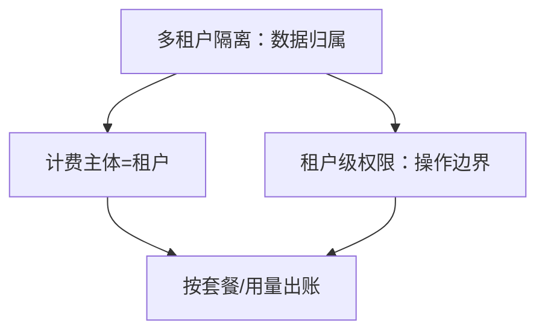

# SaaS产品技术架构

> 📌 **导航**：本文是 **SaaS产品技术架构** 词条，属于 architecture 术语集。相关枢纽：[[SaaS产品技术架构]]、[[事件驱动架构]]、[[云原生与多云架构实战指南]]、[[分布式系统设计完全指南]]、[[微服务架构]]。

## 定义

**一句话定义：** SaaS 产品技术架构是用一套应用同时服务大量客户（租户）的整体工程方案，由多租户数据隔离、租户级权限、计费系统与白标品牌呈现四根支柱协同构成。

**通俗类比：** 像经营一栋集中式公寓楼——同一套水电管线（共享应用）要分别上锁到每户（隔离）、控制每户能进哪些公共区（权限）、按户计量收租（计费）、并允许每户挂自己的招牌（白标）。

## 为什么需要它

SaaS 的本质是"一次构建、多方复用"来换取边际成本递减。若把客户、数据、权限、账单各自零散实现，会在规模化时撞上合规、对账与运维的墙；四支柱协同，才能既摊薄成本又守住隔离与收入的正确性。

## 核心机制

四支柱不是并列功能，而是"一份系统服务成千租户"这一主线在不同维度的投影：

| 支柱 | 落地 | 职责 |
|------|------|------|
| 租户与隔离 | [[SaaS 多租户架构与数据隔离]] | 共享底座下按行级/Schema/库分离数据 |
| 权限 | [[访问控制]] | 认证之后决定租户内谁能操作什么 |
| 计费 | [[SaaS 计费系统设计]] | 订阅/用量/混合计价与状态同步 |
| 品牌 | 白标与自定义域名（本文内联） | 多客户复用同一套系统的对外呈现 |

**选型主线**是"隔离强度换成本"：小客户走共享库 + 行级隔离最省，大客户按套餐路由到 Schema 级乃至独立库；权限与计费都挂在"租户"这个主体上，四支柱因此共享同一套租户上下文。

## 具体示例

一家 SaaS 的完整链路：新用户注册即落一个 tenant → 隔离层据套餐决定其数据落在共享表还是独立库 → 成员登录经[[访问控制]]判定租户内角色权限 → 用量计入该租户账本由[[SaaS 计费系统设计]]按套餐出账、欠费触发功能降级 → 前端按该租户配置渲染自定义域名与品牌。

## 何时用与何时不用

- **用**：面向多客户的标准化云端产品、需要规模化摊薄成本与按客户计费。
- **不用**：单客户私有化部署（直接交付实例更简单）、内部工具（无需租户与计费维度）。

## 优劣与代价

✅ 一份系统服务海量客户，边际成本递减、运维集中。
✅ 四支柱解耦后可各自演进（换计费方、加隔离档不牵一发动全身）。
⚠️ 多租户共享引入隔离正确性与吵闹邻居两类系统性风险。
⚠️ 白标、按租户备份等使发布与回滚比单体复杂得多。

## 与相关概念的区别

- **vs [[微服务架构]]**：微服务按业务能力切分、解决团队协作与独立部署；SaaS 多租户按客户切分数据、解决"一份系统服务多方"，两者正交，可叠加。
- **vs 私有化部署**：私有化是每客户一套独立栈、隔离彻底但成本高；SaaS 是共享栈 + 逻辑隔离。

## 常见误区

- SaaS 架构就是"把系统部署到云上"。
- 有了多租户隔离就不用再单独设计权限和计费。
- 白标只是换个 logo，不涉及架构层面的多租户配置。

## 面试速答

> 🎯 SaaS 产品技术架构 = 多租户隔离、租户级权限、计费、白标四支柱协同；主线是"一份系统服务成千租户"，靠共享租户上下文把数据归属、操作边界、价值回收、品牌呈现串成一体。
> 🔍 追问：四支柱之间靠什么统一、顺序如何？
> 🔍 追问：SaaS 多租户与微服务是同一件事吗？

## 相关术语

[[SaaS 多租户架构与数据隔离]]、[[SaaS 计费系统设计]]、[[访问控制]]、[[认证与安全实践]]、[[API设计]]、[[DDD领域驱动设计]]、[[事件驱动架构]]、[[云原生与多云架构实战指南]]、[[分布式系统设计完全指南]]、[[可观测性工程实战]]、[[微服务架构]]

## 参考资料

建议人工核验：本词条内容建议对照相关技术官方文档、权威教材与论文做准确性复核；未编造文献编号、标准号或 URL，如需引用请补充具体出处。
