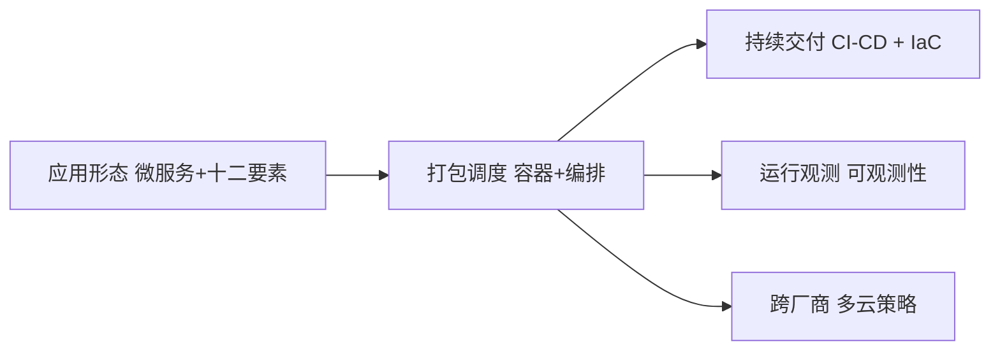

# 云原生与多云架构实战指南

> 📌 **导航**：本文是 **云原生与多云架构实战指南** 词条，属于 architecture 术语集。相关枢纽：[[SaaS产品技术架构]]、[[事件驱动架构]]、[[云原生与多云架构实战指南]]、[[分布式系统设计完全指南]]、[[微服务架构]]。

## 定义

**一句话定义：** 云原生与多云架构是以容器、微服务、持续交付和声明式 API 构建运行应用的方法论集合，并跨多家云厂商部署以规避厂商锁定、优化成本与容灾的整体技术路线。

**通俗类比：** 像用标准集装箱装货（云原生——与船公司无关，任何船和卡车都能运），再走多家航运公司比价运输（多云——不押注单一供应商，某家停运货照到）。

## 为什么需要它

绑定单一厂商的专有 API，会在涨价、区域故障或某服务缺失时进退两难；传统交付环境不一致又让"上云"频繁翻车。云原生用可移植的应用形态消除环境摩擦，多云用冗余供应商换取议价权、数据驻留合规与灾难韧性。

## 核心机制

四组支柱彼此咬合，共同支撑"可移植 + 可弹性 + 不被锁定"：

1. **云原生应用形态**：以[[微服务架构]]拆分业务能力、以[[云原生十二要素]]规范每个服务的构建方式——无状态进程、配置入环境、日志走事件流，使应用与底层设施解耦、可在任意运行环境即插即用。
2. **打包与编排**：用[[容器与编排技术详解]]把应用及依赖封成镜像，交由[[Kubernetes深入]]做声明式调度、伸缩与自愈，这是"一次构建、处处运行"的技术底座。
3. **交付与基础设施即代码**：通过[[CI 与 CD]]与[[基础设施即代码详解]]把环境、流水线与变更全部代码化，让多云间能复制一套可复现的部署面，而非手工点控制台。
4. **多云策略与可观测**：用抽象层在多家厂商间分摊负载以规避锁定、就近满足数据驻留、并以跨云冗余提升灾备；配套的[[服务网格]]治理东西向流量、[[可观测性工程实战]]保障跨云可诊断。（注：原稿多云一节抓取截断，此处仅保留可确认的策略框架，未据推测补写。）

## 具体示例

一家公司把核心 API 容器化、按[[服务网格]]治理服务间流量，CI/CD 用同一套声明式配置分别发布到 AWS 与阿里云；关键状态经抽象层访问各家托管服务，任一区域故障时流量切到另一云——既避免单一厂商涨价受制，又满足当地数据不出境。

## 何时用与何时不用

- **用**：应用需弹性伸缩、多环境频繁交付、有合规/灾备/议价诉求或担心厂商锁定。
- **不用**：初创验证期团队小、单一云已满足且无数据驻留要求——多云的运维复杂度此时弊大于利。

## 优劣与代价

✅ 可移植、可弹性、跨云容灾与议价能力。
✅ 声明式 + IaC 让环境一致、变更可审计可回滚。
⚠️ 多云拉高复杂度，各家托管服务差异大，最难迁走的往往正是最"香"的专有服务。
⚠️ 团队需同时掌握编排、流水线与跨云网络/安全模型。

## 与相关概念的区别

- **vs [[SaaS产品技术架构]]**：SaaS 架构讲"一份系统多租户复用"的业务工程，云原生讲"应用如何在云上被构建运行"的技术底座，层次不同、常并存。
- **vs [[事件驱动架构]]**：云原生是部署与运行范式，事件驱动是组件通信范式，二者正交可叠加。

## 常见误区

- 上了 Kubernetes 就等于云原生，不改造应用也算。
- 多云一定能省钱，忽略其运维与迁移的隐性成本。
- 深度用了某家云的专有托管服务，仍声称"可零成本迁走、无锁定"。

## 面试速答

> 🎯 云原生 = 微服务 + 十二要素 + 容器编排 + 持续交付/IaC 的可移植运行范式；多云 = 跨厂商部署规避锁定、优化成本与容灾。核心权衡是可移植性与弹性 vs 运维复杂度与专有服务粘性。
> 🔍 追问：容器化是否等于云原生？还差什么？
> 🔍 追问：多云真能避免厂商锁定吗？难点在哪？

## 相关术语

[[云原生十二要素]]、[[云服务详解]]、[[容器与编排技术详解]]、[[Kubernetes深入]]、[[微服务架构]]、[[服务网格]]、[[CI 与 CD]]、[[基础设施即代码详解]]、[[可观测性工程实战]]、[[API设计]]、[[DDD领域驱动设计]]、[[SaaS产品技术架构]]、[[事件驱动架构]]、[[分布式系统设计完全指南]]

## 参考资料

建议人工核验：云原生计算基金会（CNCF）与 Heroku 分别为云原生、十二要素的权威出处；AWS/阿里云服务示例建议对照其官方文档。多云一节原稿抓取截断，仅保留可确认的策略框架未予补写。
