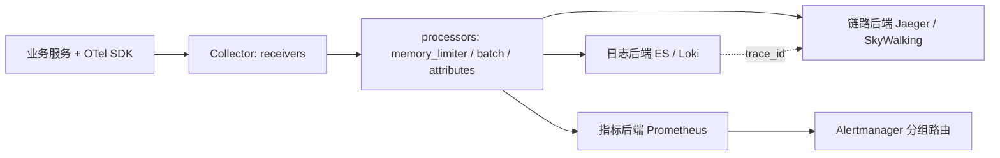

# 可观测性工程实战


> 📌 **导航**：本文是 **可观测性工程实战** 词条，属于 architecture 术语集。相关枢纽：[[SaaS产品技术架构]]、[[事件驱动架构]]、[[云原生与多云架构实战指南]]、[[分布式系统设计完全指南]]、[[微服务架构]]。

## 定义

**一句话定义：** 可观测性工程是把**日志、指标、链路**三支柱用统一语义与关联键装配成"能回答未预设问题"的系统能力，并用 OpenTelemetry 这类厂商中立的采集与传输层把它落地——它优化的不是"看板数量"，而是从异常信号下钻到根因路径的速度。

**通俗类比：** 像医院里的三样东西：化验单指标看趋势、病历记录每次现场、转诊单说明经过了哪些科室。三者共用一个病案号才讲得清病情，各存各的就只是三堆纸。

本页是**枢纽页**：讲"为什么这样分层"与"怎么用 OpenTelemetry 一次落地"，三支柱各自的落地细节走下表双链。

## 为什么需要它

可观测性一词源于控制理论——通过外部输出推断内部状态。它与监控的分界不在工具而在问题类型：监控按预定义的已知故障模式判断"是否在运行"，可观测性要探索未知故障模式、回答"为什么会这样"。分布式系统里故障的形态无法穷举枚举，于是只能要求系统随时能被追问。真正的痛点是三支柱各自为政：指标说 P99 涨了、日志里有堆栈、链路图上有慢跳，但三套系统时间轴与标识对不齐，排障就在三个界面之间手工搬运上下文。统一采集与关联键的意义，是让一次追问能自动穿越三层。

## 核心机制

采集与消费解耦是本层架构的骨架：应用只插桩一次，语义与传输标准化，后端与告警可替换。



1. **分层依据：三支柱回答三类不同的问题**：指标是聚合时间序列，便宜、适合趋势与告警；日志是带时间戳的离散事件，保留上下文细节；链路是跨服务调用路径，回答慢在哪一跳。三者的概念口径与 USE / RED、SLI / SLO 方法见 [[监控与日志详解]]，本页不重复承载。
2. **关联键把三支柱变成一件事**：trace_id 与 span_id 必须同时存在于日志字段和链路 span 里，request_id 等业务标识同样进 attributes，才构成"告警 → 调用树 → 该实例该时刻日志"的下钻闭环。缺任一环，排查就退回按时间戳肉眼对齐（见 [[日志管道与结构化采集]]、[[分布式链路追踪]]）。
3. **OpenTelemetry：API / SDK / Collector / 插桩库四件套**：API 定义遥测概念与接口，SDK 负责采样、处理与导出，Collector 是供应商无关的接收—处理—导出代理，插桩库分自动与手动两类。Collector 按 traces / metrics / logs 各配一条 pipeline，OTLP 收在 4317（gRPC）与 4318（HTTP），并兼容 Jaeger、Prometheus 抓取等既有协议；换后端不改业务代码。
4. **指标与告警是消费端，不是采集端**：埋点、基数、速率与分位数、规则的 for 去抖与 Alertmanager 的分组路由共同决定"叫谁、什么时候叫"，是成本与信噪比的主战场（见 [[Prometheus 指标与告警]]）。告警设计遵循 GOOD 原则：可操作、基于客观数据、覆盖关键路径、阈值动态调整。

| 原稿小节 | 归口 |
|---|---|
| 1) 三支柱与协同 | 本页 + [[监控与日志详解]] |
| 2) 日志架构（ELK / EFK / Loki、结构化、采样） | [[日志管道与结构化采集]] |
| 3) 指标系统与 6) 告警设计 | [[Prometheus 指标与告警]] |
| 4) 分布式链路追踪与上下文传播 | [[分布式链路追踪]] |
| 5) OpenTelemetry 标准与 Collector | 本页承载 |

## 具体示例

原稿的协同诊断路径落到一次真实故障上是这样：

```text
告警（指标）：order-service 5xx 占比 > 5%（for 2m）或 P99 > 1s（for 3m）→ critical 叫人
下钻（链路）：trace 显示 db.save_order 一跳占 1560ms，其余各跳正常
定位（日志）：按同一 trace_id 捞该实例日志，连接池耗尽的 ERROR 与 SQL 上下文俱全
处置：调池参数 + 为该依赖补超时与熔断（[[熔断与降级]]），并盯住新瓶颈
```

代码层面不需要为三支柱写三套埋点：一次 span 开启、一次 Histogram 观测、一行带 trace_id 的结构化日志，就是原稿示例要说明的全部。

## 何时用与何时不用

- **用**：跨服务调用链超过两跳、故障形态无法穷举、需要按 SLO 度量并驱动放量决策的系统。
- **不用**：原型期不要先堆一整套重型栈——先保关键 SLI 与集中日志；单体小应用把日志结构化 + trace_id 打通即够用。
- **别忘**：可观测性本身是成本中心与故障源（Collector 内存、序列基数、日志量），要有采集侧的自监控。

## 优劣与代价

✅ 装配到位后，未知故障也能被追问，排障从"复现不了"变成"按 trace 定位"。
✅ 采集与后端解耦，厂商中立，替换存储不需要重新插桩。
⚠️ 三支柱各有成本曲线：指标怕高基数、日志怕全量全文索引、链路怕侵入性与采样失真。
⚠️ 统一语义要付协调成本：字段命名、标签口径、采样策略得有人定，否则各团队各写一套。

## 与相关概念的区别

- **vs [[监控与日志详解]]**：那页给概念口径（三支柱、USE / RED、SLI / SLO / SLA）；本页给装配与落地顺序。
- **vs 单一 APM 厂商**：APM 是打包好的垂直方案，省事但语义与后端绑定；OTel 路线用集成成本换可替换性。
- **vs [[微服务治理术语百科]]**：治理组件（网关、发现、熔断）是链路的被观测对象，不是观测手段。
- **vs [[混沌工程]]**：注入故障验证的是"可观测性是否真的够用"，没有可观测性的演练只是制造事故。

## 常见误区

- 指标、日志、链路三套系统都部署齐了，系统就具备可观测性了。
- 仪表盘越多、告警规则越细，故障定位就越快。
- 接了自动插桩就不用再改业务代码，链路和日志自然会互相对应。

## 面试速答

> 🎯 可观测性三支柱按"问题类型"分工：指标看趋势并告警、日志查单次现场、链路定慢在哪跳；靠 trace_id 关联成一条下钻路径，用 OpenTelemetry 的 API/SDK/Collector 把采集与后端解耦；落地顺序是先打通关联键，再谈采样与成本治理。
> 🔍 追问：为什么说"监控不等于可观测性"？
> 🔍 追问：Collector 换成直连后端，代价是什么？

## 相关术语

[[监控与日志详解]]、[[日志管道与结构化采集]]、[[Prometheus 指标与告警]]、[[分布式链路追踪]]、[[微服务架构设计与实践]]、[[微服务治理术语百科]]、[[API网关]]、[[服务网格]]、[[容器与编排技术详解]]、[[Kubernetes深入]]、[[高并发系统设计]]、[[熔断与降级]]、[[性能优化]]、[[混沌工程]]、[[云原生十二要素]]

## 参考资料

建议人工核验：本词条内容建议对照 OpenTelemetry、Prometheus / Alertmanager、Elasticsearch / Loki、Jaeger / SkyWalking / Zipkin 官方文档做准确性复核；未编造文献编号、标准号或 URL，如需引用请补充具体出处。原稿可确认的出处线索：可观测性概念源自控制理论（通过外部输出推断内部状态）、OTLP 端口与 Jaeger 兼容端口取自原稿配置、三系统社区背景（CNCF 毕业 / Apache 顶级 / Twitter 开源）见 [[分布式链路追踪]]。

> ⚠️ 截断说明：原稿 §6「告警设计」只有 GOOD 原则四项，紧随其后的"告警分类"仅剩一个空的 yaml 围栏标题即断尾，§6 后续小节（分类、疲劳治理等）在抓取阶段已丢失；候选清单预期的"APM"独立小节同样不存在。按 v1.2 §5 不据推测补写，告警落地内容由 [[Prometheus 指标与告警]] 基于原稿 §3.3 / §3.4 的真实配置承载。
