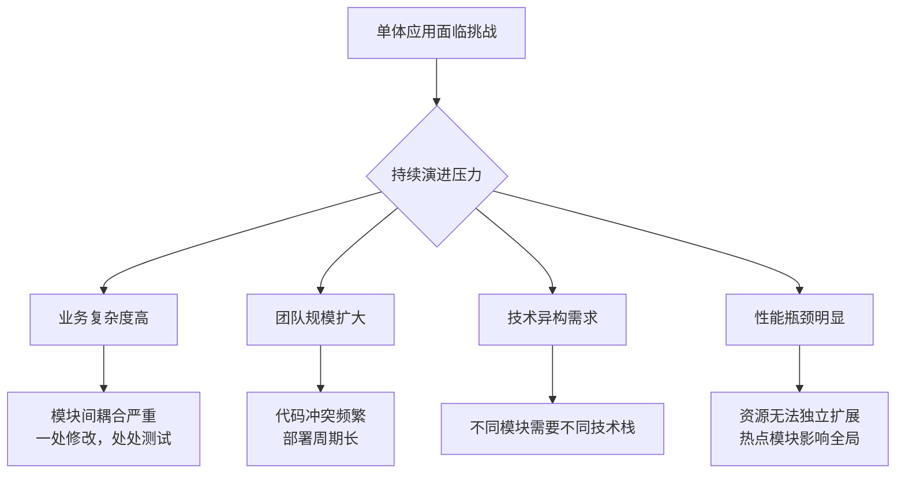
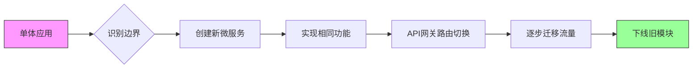
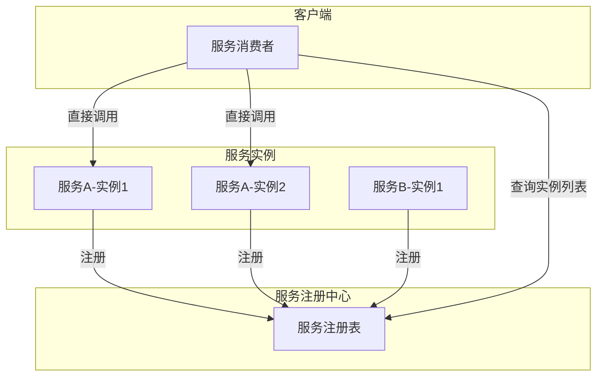

# 微服务架构设计与实践

# 微服务架构设计与实践指南

微服务架构作为一种现代化的软件构建方法，已经改变了复杂应用的设计、开发和运维方式。本指南旨在提供一份全面、深入的实践手册，帮助您理解核心概念、掌握设计原则并规避常见陷阱。

## 1. 单体架构 vs 微服务：决策与演进

### 何时应该拆分？

**保持单体的信号：**
- 业务逻辑相对简单，变化不频繁
- 团队规模小（<20人），协作成本低
- 对系统性能、可用性要求一般
- 快速验证想法的MVP阶段

**拆分为微服务的信号：**


### 如何拆分：渐进式迁移策略

**阶段一：模块化单体**
在拆分前，首先对单体应用进行模块化重构，明确模块边界：

```java
// 重构前：控制器直接访问多个DAO
@RestController
public class OrderController {
    @Autowired private OrderRepository orderRepo;
    @Autowired private InventoryRepository inventoryRepo;
    @Autowired private PaymentRepository paymentRepo;
    
    @PostMapping("/orders")
    public Order createOrder(@RequestBody OrderRequest request) {
        // 混合了订单、库存、支付逻辑
    }
}

// 重构后：通过领域服务封装业务边界
@RestController
public class OrderController {
    @Autowired private OrderService orderService;
    
    @PostMapping("/orders")
    public Order createOrder(@RequestBody OrderRequest request) {
        return orderService.createOrder(request);
    }
}

@Service
public class OrderService {
    @Autowired private OrderRepository orderRepo;
    private final InventoryClient inventoryClient; // 未来可能变为RPC调用
    private final PaymentClient paymentClient;
    
    @Transactional
    public Order createOrder(OrderRequest request) {
        // 1. 创建订单
        Order order = orderRepo.save(mapToOrder(request));
        
        // 2. 预留库存（通过抽象客户端）
        inventoryClient.reserve(order.getItems());
        
        // 3. 创建支付单
        paymentClient.initiatePayment(order);
        
        return order;
    }
}
```

**阶段二：绞杀者模式渐进迁移**
逐步将模块从单体中剥离：



## 2. 服务拆分策略

### 基于业务能力拆分
按照组织的核心业务职能划分服务：

```yaml
# 电商平台示例
services:
  - name: product-catalog
    capabilities: ["商品管理", "分类管理", "价格管理"]
    
  - name: order-management
    capabilities: ["订单创建", "订单状态管理", "订单查询"]
    
  - name: inventory-service
    capabilities: ["库存查询", "库存预留", "库存同步"]
    
  - name: user-service
    capabilities: ["用户注册", "用户认证", "用户画像"]
```

### 基于子领域拆分（DDD实践）
运用领域驱动设计的限界上下文：

```python
# 订单上下文（Order Bounded Context）
class OrderContext:
    def __init__(self):
        self.entities = {
            'Order': {
                'attributes': ['id', 'customer_id', 'items', 'status'],
                'behaviors': ['calculate_total', 'add_item', 'cancel']
            },
            'OrderItem': {
                'attributes': ['product_id', 'quantity', 'price'],
                'behaviors': []
            }
        }
        
        self.value_objects = {
            'Money': {'amount', 'currency'},
            'Address': {'street', 'city', 'country'}
        }
        
        self.aggregates = {
            'Order': ['OrderItem']  # 聚合根与子实体
        }

# 库存上下文（Inventory Bounded Context）
class InventoryContext:
    def __init__(self):
        self.entities = {
            'Stock': {
                'attributes': ['product_id', 'quantity', 'warehouse_id'],
                'behaviors': ['reserve', 'release', 'adjust']
            }
        }
        
        self.domain_events = [
            'StockReserved', 'StockReleased', 'StockAdjusted'
        ]
```

### 基于数据所有权拆分
确保每个服务对其数据拥有完全的控制权：

```sql
-- 数据库拆分示例
-- 用户服务数据库
CREATE TABLE users (
    id UUID PRIMARY KEY,
    email VARCHAR(255) UNIQUE NOT NULL,
    password_hash VARCHAR(255) NOT NULL,
    profile_data JSONB
);

-- 订单服务数据库
CREATE TABLE orders (
    id UUID PRIMARY KEY,
    customer_id UUID NOT NULL,  -- 只存储ID，不存储用户详情
    status VARCHAR(50) NOT NULL,
    created_at TIMESTAMP DEFAULT NOW(),
    FOREIGN KEY (customer_id) REFERENCES users(id) ON DELETE RESTRICT
);

-- 商品服务数据库
CREATE TABLE products (
    id UUID PRIMARY KEY,
    name VARCHAR(255) NOT NULL,
    description TEXT,
    price DECIMAL(10,2) NOT NULL,
    category_id UUID
);
```

## 3. 服务通信模式

### 同步通信 - REST与gRPC

**RESTful API设计：**
```java
// Spring Boot REST控制器示例
@RestController
@RequestMapping("/api/v1/orders")
public class OrderController {
    
    @PostMapping
    @ResponseStatus(HttpStatus.CREATED)
    public OrderResponse createOrder(@Valid @RequestBody CreateOrderRequest request) {
        // 使用HATEOAS增加链接
        Order order = orderService.create(request);
        OrderResponse response = OrderResponse.from(order);
        
        // 添加相关资源链接
        response.add(linkTo(methodOn(OrderController.class)
            .getOrder(order.getId())).withSelfRel());
        response.add(linkTo(methodOn(OrderController.class)
            .cancelOrder(order.getId())).withRel("cancel"));
        
        return response;
    }
    
    @GetMapping("/{orderId}")
    public OrderResponse getOrder(@PathVariable String orderId) {
        return orderService.findById(orderId)
            .map(OrderResponse::from)
            .orElseThrow(() -> new OrderNotFoundException(orderId));
    }
}
```

**gRPC高效通信：**
```protobuf
// order.proto
syntax = "proto3";

package order;

service OrderService {
  rpc CreateOrder (CreateOrderRequest) returns (OrderResponse);
  rpc GetOrder (GetOrderRequest) returns (OrderResponse);
  rpc StreamOrderUpdates (OrderUpdateRequest) returns (stream OrderEvent);
}

message CreateOrderRequest {
  string customer_id = 1;
  repeated OrderItem items = 2;
  ShippingAddress shipping_address = 3;
}

message OrderResponse {
  string id = 1;
  string status = 2;
  repeated OrderItem items = 3;
  double total_amount = 4;
  google.protobuf.Timestamp created_at = 5;
}
```

```java
// gRPC服务实现
@Service
public class OrderGrpcService extends OrderServiceGrpc.OrderServiceImplBase {
    
    @Override
    public void createOrder(CreateOrderRequest request, 
                          StreamObserver<OrderResponse> responseObserver) {
        try {
            Order order = orderService.createOrder(
                mapToDomain(request));
            
            OrderResponse response = OrderResponse.newBuilder()
                .setId(order.getId())
                .setStatus(order.getStatus().name())
                .setTotalAmount(order.getTotalAmount())
                .build();
            
            responseObserver.onNext(response);
            responseObserver.onCompleted();
        } catch (Exception e) {
            responseObserver.onError(
                Status.INTERNAL.withDescription(e.getMessage()).asRuntimeException());
        }
    }
}
```

### 异步通信 - 消息队列

**使用Kafka实现事件驱动架构：**
```java
// 事件发布者
@Component
public class OrderEventPublisher {
    
    @Autowired
    private KafkaTemplate<String, OrderEvent> kafkaTemplate;
    
    public void publishOrderCreated(Order order) {
        OrderEvent event = OrderEvent.builder()
            .eventId(UUID.randomUUID().toString())
            .eventType("ORDER_CREATED")
            .orderId(order.getId())
            .customerId(order.getCustomerId())
            .timestamp(Instant.now())
            .items(order.getItems().stream()
                .map(this::mapToEventItem)
                .collect(Collectors.toList()))
            .build();
        
        kafkaTemplate.send("order-events", order.getId(), event);
        
        // 也可以发送到多个主题
        kafkaTemplate.send("notification-events", order.getId(), 
            createNotificationEvent(event));
    }
}

// 事件消费者
@Component
public class InventoryEventHandler {
    
    @KafkaListener(
        topics = "order-events",
        groupId = "inventory-service",
        containerFactory = "kafkaListenerContainerFactory"
    )
    public void handleOrderEvent(OrderEvent event) {
        if ("ORDER_CREATED".equals(event.getEventType())) {
            // 预留库存
            inventoryService.reserveStock(event.getItems());
        } else if ("ORDER_CANCELLED".equals(event.getEventType())) {
            // 释放库存
            inventoryService.releaseStock(event.getItems());
        }
    }
}
```

### 事件驱动架构实现
```java
// 使用事件源模式（Event Sourcing）
public class OrderAggregate {
    
    private String orderId;
    private OrderStatus status;
    private List<OrderItem> items;
    private List<DomainEvent> pendingEvents = new ArrayList<>();
    
    public static OrderAggregate create(String customerId, List<OrderItem> items) {
        OrderAggregate order = new OrderAggregate();
        order.orderId = UUID.randomUUID().toString();
        order.items = new ArrayList<>(items);
        
        // 产生领域事件
        OrderCreatedEvent event = new OrderCreatedEvent(
            order.orderId, customerId, items, Instant.now());
        order.pendingEvents.add(event);
        
        return order;
    }
    
    public void confirm() {
        if (this.status != OrderStatus.PENDING) {
            throw new IllegalStateException("Only pending orders can be confirmed");
        }
        
        OrderConfirmedEvent event = new OrderConfirmedEvent(
            this.orderId, Instant.now());
        this.pendingEvents.add(event);
        this.status = OrderStatus.CONFIRMED;
    }
    
    public List<DomainEvent> getUncommittedEvents() {
        return Collections.unmodifiableList(pendingEvents);
    }
    
    public void markEventsAsCommitted() {
        pendingEvents.clear();
    }
}
```

## 4. API网关设计

### 主流网关方案对比

| 特性 | Kong | APISIX | Envoy |
|------|------|--------|-------|
| 性能 | 高（基于Nginx） | 极高（Lua + etcd） | 极高（C++） |
| 配置存储 | PostgreSQL/Cassandra | etcd | xDS API |
| 插件生态 | 丰富 | 丰富 | 较少但强大 |
| 扩展性 | Lua插件 | Lua/Ruby/Python插件 | Wasm扩展 |
| 适用场景 | 传统企业API管理 | 高性能API网关 | 服务网格边车 |

### Kong网关配置示例
```yaml
# docker-compose.yml
version: '3.7'

services:
  kong:
    image: kong:latest
    environment:
      KONG_DATABASE: postgres
      KONG_PG_HOST: kong-db
      KONG_PG_DATABASE: kong
      KONG_PG_USER: kong
      KONG_PG_PASSWORD: kong
      KONG_PROXY_ACCESS_LOG: /dev/stdout
      KONG_ADMIN_ACCESS_LOG: /dev/stdout
      KONG_PROXY_ERROR_LOG: /dev/stderr
      KONG_ADMIN_ERROR_LOG: /dev/stderr
      KONG_ADMIN_LISTEN: 0.0.0.0:8001
    ports:
      - "8000:8000"  # 代理端口
      - "8443:8443"  # 代理HTTPS端口
      - "8001:8001"  # 管理API端口
    depends_on:
      - kong-db
      - kong-migrations

  kong-db:
    image: postgres:9.6
    environment:
      POSTGRES_USER: kong
      POSTGRES_DB: kong
      POSTGRES_PASSWORD: kong
    volumes:
      - kong_data:/var/lib/postgresql/data

  kong-migrations:
    image: kong:latest
    command: kong migrations bootstrap
    environment:
      KONG_DATABASE: postgres
      KONG_PG_HOST: kong-db
      KONG_PG_DATABASE: kong
      KONG_PG_USER: kong
      KONG_PG_PASSWORD: kong
    depends_on:
      - kong-db

volumes:
  kong_data:
```

```bash
# 创建服务和路由
# 创建订单服务
curl -i -X POST http://localhost:8001/services \
    --data name=order-service \
    --data url=http://order-service:8080

# 创建路由
curl -i -X POST http://localhost:8001/services/order-service/routes \
    --data 'paths[]=/api/v1/orders' \
    --data 'methods[]=GET' \
    --data 'methods[]=POST' \
    --data 'strip_path=false' \
    --data 'preserve_host=true'

# 添加限流插件
curl -i -X POST http://localhost:8001/services/order-service/plugins \
    --data name=rate-limiting \
    --data config.minute=100 \
    --data config.policy=local

# 添加认证插件
curl -i -X POST http://localhost:8001/services/order-service/plugins \
    --data name=jwt \
    --data config.uri_param_names=jwt \
    --data config.header_names=Authorization
```

### Envoy动态配置
```yaml
# envoy.yaml - 使用xDS动态配置
admin:
  address:
    socket_address:
      address: 0.0.0.0
      port_value: 9901

dynamic_resources:
  lds_config:
    api_config_source:
      api_type: GRPC
      grpc_services:
        envoy_grpc:
          cluster_name: xds_cluster
  cds_config:
    api_config_source:
      api_type: GRPC
      grpc_services:
        envoy_grpc:
          cluster_name: xds_cluster

static_resources:
  clusters:
  - name: xds_cluster
    connect_timeout: 1s
    type: STATIC
    lb_policy: ROUND_ROBIN
    http2_protocol_options: {}
    load_assignment:
      cluster_name: xds_cluster
      endpoints:
      - lb_endpoints:
        - endpoint:
            address:
              socket_address:
                address: xds-server
                port_value: 18000

  listeners:
  - name: listener_0
    address:
      socket_address:
        address: 0.0.0.0
        port_value: 10000
    filter_chains:
    - filters:
      - name: envoy.filters.network.http_connection_manager
        typed_config:
          "@type": type.googleapis.com/envoy.extensions.filters.network.http_connection_manager.v3.HttpConnectionManager
          stat_prefix: ingress_http
          route_config:
            name: local_route
            virtual_hosts:
            - name: backend
              domains: ["*"]
              routes:
              - match:
                  prefix: "/"
                route:
                  cluster: dynamic_cluster
          http_filters:
          - name: envoy.filters.http.router
```

## 5. 服务发现与注册

### 核心概念


### Consul服务发现实现
```java
// 服务注册
@Configuration
@EnableDiscoveryClient
public class ServiceRegistrationConfig {
    
    @Bean
    public ConsulRegistration consulRegistration(
            ConsulDiscoveryProperties properties,
            @Value("${spring.application.name}") String appName) {
        
        Registration registration = new Registration();
        registration.setName(appName);
        registration.setId(appName + "-" + UUID.randomUUID().toString());
        registration.setAddress(properties.getHostname());
        registration.setPort(properties.getPort());
        registration.setHealthCheckUrl("/actuator/health");
        registration.setCheck(new Check() {
            {
                setInterval("10s");
                setTimeout("5s");
                setDeregisterCriticalServiceAfter("1m");
            }
        });
        
        return new ConsulRegistration(registration, properties);
    }
}

// 服务发现
@Component
public class ServiceDiscoveryClient {
    
    @Autowired
    private DiscoveryClient discoveryClient;
    
    public List<ServiceInstance> getInstances(String serviceName) {
        return discoveryClient.getInstances(serviceName);
    }
    
    public ServiceInstance getInstance(String serviceName, String version) {
        return discoveryClient.getInstances(serviceName).stream()
            .filter(instance -> {
                Map<String, String> metadata = instance.getMetadata();
                return version.equals(metadata.get("version"));
            })
            .findFirst()
            .orElseThrow(() -> new ServiceNotFoundException(serviceName, version));
    }
}

// 负载均衡
@Configuration
@LoadBalancerClient(name = "order-service", configuration = CustomLoadBalancerConfiguration.class)
public class ServiceConfiguration {
    
    @Bean
    @LoadBalanced
    public RestTemplate restTemplate() {
        return new RestTemplate();
    }
}

@Component
public class CustomLoadBalancerConfiguration {
    
    @Bean
    public ReactorLoadBalancer<ServiceInstance> reactorServiceInstanceLoadBalancer(
            Environment environment,
            LoadBalancerClientFactory loadBalancerClientFactory) {
        
        String name = environment.getProperty(LoadBalancerClientFactory.PROPERTY_NAME);
        
        return new RoundRobinLoadBalancer(
            loadBalancerClientFactory.getLazyProvider(name, ServiceInstanceListSupplier.class),
            name);
    }
    
    @Bean
    public ServiceInstanceListSupplier discoveryClientServiceInstanceListSupplier(
            ConfigurableApplicationContext context) {
        return ServiceInstanceListSupplier.builder()
                .withDiscoveryClient()
                .withHealthChecks()
                .withMetadata()
                .build(context);
    }
}
```

## 6. 配置管理

### 中心化配置（Spring Cloud Config）
```yaml
# config-server/src/main/resources/application.yml
server:
  port: 8888

spring:
  cloud:
    config:
      server:
        git:
          uri: https://github.com/company/config-repo
          default-label: main
          search-paths: '{application}'
          clone-on-start: true
        encrypt:
          enabled: true
          key-store:
            location: classpath:/server.jks
            password: ${KEYSTORE_PASSWORD}
            alias: config-server-key
```

```java
// 配置客户端
@Configuration
@RefreshScope
public class ApplicationConfig {
    
    @Value("${feature.flags.enableNewUI:false}")
    private boolean enableNewUI;
    
    @Value("${payment.gateway.timeout:30000}")
    private int paymentTimeout;
    
    @ConfigurationProperties(prefix = "app.datasource")
    @Bean
    @RefreshScope
    public DataSourceProperties dataSourceProperties() {
        return new DataSourceProperties();
    }
    
    // 动态刷新监听
    @EventListener
    public void onRefresh(EnvironmentChangeEvent event) {
        log.info("Configuration refreshed for keys: {}", event.getKeys());
        
        // 重新初始化受影响的bean
        if (event.getKeys().contains("app.datasource.url")) {
            reinitializeDataSource();
        }
    }
}
```

### 动态配置（使用Consul KV）
```java
// 动态配置管理器
@Component
public class DynamicConfigManager {
    
    @Autowired
    private ConsulClient consulClient;
    
    @Autowired
    private ApplicationContext context;
    
    private final Map<String, Object> configCache = new ConcurrentHashMap<>();
    
    @PostConstruct
    public void init() {
        // 初始加载配置
        loadAllConfigs();
        
        // 启动配置监听线程
        startConfigWatcher();
    }
    
    private void loadAllConfigs() {
        String prefix = "config/" + context.getEnvironment()
            .getProperty("spring.application.name");
        
        Response<List<GetValue>> response = consulClient.getKVValues(prefix);
        
        response.getValue().forEach(value -> {
            String key = value.getKey().replace(prefix + "/", "");
            configCache.put(key, value.getDecodedValue());
        });
    }
    
    private void startConfigWatcher() {
        ExecutorService executor = Executors.newSingleThreadExecutor();
        executor.submit(() -> {
            while (!Thread.currentThread().isInterrupted()) {
                try {
                    // 长轮询检查配置变更
                    Response<List<GetValue>> response = consulClient.getKVValues(
                        "config/", null, new QueryParams(30, lastIndex));
                    
                    response.getValue().forEach(value -> {
                        String key = value.getKey();
                        Object newValue = value.getDecodedValue();
                        
                        Object oldValue = configCache.put(key, newValue);
                        if (!Objects.equals(oldValue, newValue)) {
                            publishConfigChange(key, oldValue, newValue);
                        }
                    });
                    
                    lastIndex = response.getConsulIndex();
                } catch (Exception e) {
                    log.error("Error watching configuration", e);
                    try {
                        Thread.sleep(5000);
                    } catch (InterruptedException ie) {
                        Thread.currentThread().interrupt();
                    }
                }
            }
        });
    }
    
    private void publishConfigChange(String key, Object oldValue, Object newValue) {
        // 发布Spring事件
        ConfigChangeEvent event = new ConfigChangeEvent(this, key, oldValue, newValue);
        context.publishEvent(event);
    }
    
    public Object getConfig(String key) {
        return configCache.get(key);
    }
}
```

## 7. 分布式事务处理

### Saga模式实现
```java
// 基于事件的Saga编排
@Service
public class CreateOrderSaga {
    
    @Autowired
    private OrderService orderService;
    
    @Autowired
    private InventoryService inventoryService;
    
    @Autowired
    private PaymentService paymentService;
    
    @Autowired
    private SagaRepository sagaRepository;
    
    @Transactional
    public String createOrderSaga(CreateOrderCommand command) {
        // 创建Saga实例
        SagaInstance saga = new SagaInstance();
        saga.setId(UUID.randomUUID().toString());
        saga.setSagaType("CreateOrderSaga");
        saga.setCurrentState("STARTED");
        saga.setData(command);
        sagaRepository.save(saga);
        
        // 开始Saga步骤
        startSaga(saga);
        
        return saga.getId();
    }
    
    private void startSaga(SagaInstance saga) {
        try {
            // 步骤1：创建订单
            Order order = orderService.createOrder((CreateOrderCommand) saga.getData());
            saga.setOrderId(order.getId());
            saga.setCurrentState("ORDER_CREATED");
            
            // 发布事件触发下一步
            OrderCreatedEvent event = new OrderCreatedEvent(order.getId());
            eventPublisher.publishEvent(event);
            
        } catch (Exception e) {
            handleSagaFailure(saga, e, "ORDER_CREATION_FAILED");
        }
    }
    
    @EventListener
    public void handleOrderCreated(OrderCreatedEvent event) {
        SagaInstance saga = sagaRepository.findByOrderId(event.getOrderId());
        
        try {
            // 步骤2：预留库存
            inventoryService.reserveStock(event.getOrderId());
            saga.setCurrentState("INVENTORY_RESERVED");
            
            // 发布事件触发下一步
            InventoryReservedEvent inventoryEvent = new InventoryReservedEvent(event.getOrderId());
            eventPublisher.publishEvent(inventoryEvent);
            
        } catch (InsufficientStockException e) {
            // 补偿：取消订单
            compensateSaga(saga, "INVENTORY_RESERVATION_FAILED");
        }
    }
    
    @EventListener
    public void handleInventoryReserved(InventoryReservedEvent event) {
        SagaInstance saga = sagaRepository.findByOrderId(event.getOrderId());
        
        try {
            // 步骤3：处理支付
            paymentService.processPayment(event.getOrderId());
            saga.setCurrentState("PAYMENT_PROCESSED");
            
            // Saga成功完成
            completeSaga(saga);
            
        } catch (PaymentFailedException e) {
            // 补偿：释放库存 + 取消订单
            compensateSaga(saga, "PAYMENT_PROCESSING_FAILED");
        }
    }
    
    private void compensateSaga(SagaInstance saga, String failureReason) {
        saga.setCurrentState("COMPENSATING");
        saga.setFailureReason(failureReason);
        
        // 根据当前状态执行补偿
        switch (saga.getCurrentState()) {
            case "PAYMENT_PROCESSING_FAILED":
                // 补偿1：退款
                if (saga.getPaymentId() != null) {
                    paymentService.refundPayment(saga.getPaymentId());
                }
                // 补偿2：释放库存
                if (saga.getCurrentState().equals("INVENTORY_RESERVED")) {
                    inventoryService.releaseStock(saga.getOrderId());
                }
                // 补偿3：取消订单
                orderService.cancelOrder(saga.getOrderId());
                break;
            case "INVENTORY_RESERVATION_FAILED":
                orderService.cancelOrder(saga.getOrderId());
                break;
            default:
                break;
        }
        
        saga.setCurrentState("FAILED");
        sagaRepository.save(saga);
    }
}
```

### 两阶段提交（2PC）的替代方案
```java
// 使用分布式事务协调器（如Seata）
@Service
@GlobalTransactional(timeoutMills = 60000, name = "create-order")
public class OrderServiceWithSeata {
    
    public void createOrder(CreateOrderRequest request) {
        // 1. 订单服务 - 本地事务
        Order order = orderRepository.save(createOrder(request));
        
        // 2. 库存服务 - 远程调用
        inventoryService.deductStock(order.getItems());
        
        // 3. 账户服务 - 远程调用
        accountService.deductBalance(order.getUserId(), order.getTotalAmount());
        
        // 如果任何步骤失败，Seata会自动回滚所有操作
    }
}

// 库存服务实现
@Service
public class InventoryService {
    
    @Transactional(rollbackFor = Exception.class)
    public void deductStock(List<OrderItem> items) {
        for (OrderItem item : items) {
            Stock stock = stockRepository.findByProductId(item.getProductId());
            
            if (stock.getQuantity() < item.getQuantity()) {
                throw new InsufficientStockException(item.getProductId());
            }
            
            stock.setQuantity(stock.getQuantity() - item.getQuantity());
            stockRepository.save(stock);
            
            // 记录操作用于回滚
            StockDeductRecord record = new StockDeductRecord(
                item.getProductId(), item.getQuantity());
            stockRecordRepository.save(record);
        }
    }
    
    // Seata回滚时调用
    public void rollbackDeductStock(List<StockDeductRecord> records) {
        for (StockDeductRecord record : records) {
            Stock stock = stockRepository.findByProductId(record.getProductId());
            stock.setQuantity(stock.getQuantity() + record.getQuantity());
            stockRepository.save(stock);
        }
    }
}
```

## 8. 服务韧性模式

### 熔断器模式
```java
// 使用Resilience4j实现熔断
@Service
public class InventoryClientWithCircuitBreaker {
    
    @CircuitBreaker(
        name = "inventoryService",
        fallbackMethod = "getDefaultStock"
    )
    @Bulkhead(
        name = "inventoryService",
        type = Type.SEMAPHORE,
        maxConcurrentCalls = 50
    )
    @RateLimiter(
        name = "inventoryService",
        limitForPeriod = 100,
        limitRefreshPeriod = Duration.ofSeconds(1)
    )
    public StockResponse getStock(String productId) {
        // 调用库存服务
        return inventoryFeignClient.getStock(productId);
    }
    
    public StockResponse getDefaultStock(String productId, Exception ex) {
        // 降级逻辑：返回缓存或默认库存
        log.warn("Inventory service unavailable, using fallback", ex);
        
        // 尝试从缓存获取
        StockResponse cached = cacheManager.get("stock:" + productId);
        if (cached != null) {
            return cached;
        }
        
        // 返回默认库存
        return StockResponse.builder()
            .productId(productId)
            .quantity(0)  // 或者返回一个安全默认值
            .available(false)
            .build();
    }
}

// 熔断器配置
resilience4j.circuitbreaker:
  instances:
    inventoryService:
      register-health-indicator: true
      sliding-window-size: 10
      minimum-number-of-calls: 5
      failure-rate-threshold: 50
      wait-duration-in-open-state: 30s
      permitted-number-of-calls-in-half-open-state: 3
      automatic-transition-from-open-to-half-open-enabled: true
      slow-call-duration-threshold: 2000ms
      slow-call-rate-threshold: 100
```

### 限流与降级策略
```java
// 使用Sentinel实现限流降级
@Service
public class OrderController {
    
    @SentinelResource(
        value = "createOrder",
        blockHandler = "createOrderBlockHandler",
        fallback = "createOrderFallback"
    )
    @PostMapping("/orders")
    public OrderResponse createOrder(@RequestBody CreateOrderRequest request) {
        return orderService.createOrder(request);
    }
    
    // 限流降级处理
    public OrderResponse createOrderBlockHandler(
            CreateOrderRequest request, BlockException ex) {
        
        log.warn("Order creation rate limited: {}", ex.getRule());
        
        // 返回友好提示
        return OrderResponse.builder()
            .status("RATE_LIMITED")
            .message("系统繁忙，请稍后重试")
            .retryAfter(60) // 建议60秒后重试
            .build();
    }
    
    // 业务降级处理
    public OrderResponse createOrderFallback(
            CreateOrderRequest request, Throwable throwable) {
        
        log.error("Order creation failed, using fallback", throwable);
        
        // 创建降级订单，异步处理
        Order order = orderService.createFallbackOrder(request);
        
        return OrderResponse.builder()
            .id(order.getId())
            .status("DEGRADED")
            .message("订单已创建，部分服务暂时不可用，后续将处理")
            .build();
    }
}

// Sentinel流控规则
@Data
public class FlowRuleConfig {
    @PostConstruct
    public void initFlowRules() {
        List<FlowRule> rules = new ArrayList<>();
        
        FlowRule rule = new FlowRule();
        rule.setResource("createOrder");
        rule.setGrade(RuleConstant.FLOW_GRADE_QPS);
        rule.setCount(100); // QPS限制为100
        rule.setControlBehavior(RuleConstant.CONTROL_BEHAVIOR_WARM_UP);
        rule.setWarmUpPeriodSec(10); // 10秒预热
        rule.setMaxQueueingTimeMs(500); // 排队超时时间
        
        rules.add(rule);
        
        // 热点参数限流
        ParamFlowRule paramRule = new ParamFlowRule("createOrder")
            .setParamIdx(0) // 对第一个参数限流
            .setGrade(RuleConstant.FLOW_GRADE_QPS)
            .setDurationInSec(1)
            .setControlBehavior(RuleConstant.CONTROL_BEHAVIOR_DEFAULT);
        
        ParamFlowItem item = new ParamFlowItem()
            .setObject("VIP") // 针对VIP用户单独限流
            .setClassType(String.class.getName())
            .setCount(50); // VIP用户QPS限制50
        
        paramRule.setParamFlowItemList(Collections.singletonList(item));
        
        ParamFlowRuleManager.loadRules(Collections.singletonList(paramRule));
        FlowRuleManager.loadRules(rules);
    }
}
```

### 重试与超时策略
```java
// 使用Resilience4j实现重试
@Component
public class PaymentClient {
    
    @Retry(
        name = "paymentService",
        fallbackMethod = "processPaymentFallback"
    )
    @TimeLimiter(
        name = "paymentService",
        fallbackMethod = "processPaymentTimeoutFallback"
    )
    public CompletableFuture<PaymentResult> processPayment(
            PaymentRequest request) {
        
        return CompletableFuture.supplyAsync(() -> {
            // 支付处理逻辑
            return paymentGateway.process(request);
        });
    }
    
    // 重试降级
    public CompletableFuture<PaymentResult> processPaymentFallback(
            PaymentRequest request, Exception ex) {
        
        log.warn("Payment service failed after retries, using fallback", ex);
        
        // 返回失败结果，但记录以便后续处理
        PaymentResult result = PaymentResult.builder()
            .status("FAILED")
            .message("支付处理失败，请稍后重试")
            .retryable(true)
            .build();
        
        // 记录失败支付以便后续补偿
        failedPaymentRepository.save(new FailedPayment(request, ex.getMessage()));
        
        return CompletableFuture.completedFuture(result);
    }
    
    // 超时降级
    public CompletableFuture<PaymentResult> processPaymentTimeoutFallback(
            PaymentRequest request, TimeoutException ex) {
        
        log.warn("Payment service timeout", ex);
        
        // 返回超时状态，可以设置较短的支付窗口
        return CompletableFuture.completedFuture(
            PaymentResult.builder()
                .status("PENDING")
                .message("支付处理中，请查询结果")
                .transactionId(UUID.randomUUID().toString())
                .expiresAt(Instant.now().plus(Duration.ofMinutes(30)))
                .build()
        );
    }
}

// 配置
resilience4j.retry:
  instances:
    paymentService:
      max-attempts: 3
      wait-duration: 1000ms
      enable-exponential-backoff: true
      exponential-backoff-multiplier: 2
      retry-exceptions:
        - java.net.ConnectException
        - java.io.IOException
      ignore-exceptions:
        - com.example.BusinessException

resilience4j.timelimiter:
  instances:
    paymentService:
      timeout-duration: 3s
      cancel-running-future: true
```

## 9. 可观测性体系

### 结构化日志
```java
// 使用ELK堆栈的结构化日志
@Slf4j
@Component
public class OrderService {
    
    public Order createOrder(CreateOrderRequest request) {
        // 添加业务上下文到日志
        try (MDC.MDCCloseable mdc1 = MDC.putCloseable("orderType", request.getType());
             MDC.MDCCloseable mdc2 = MDC.putCloseable("customerId", request.getCustomerId());
             MDC.MDCCloseable mdc3 = MDC.putCloseable("traceId", request.getTraceId())) {
            
            log.info("开始创建订单, 数量: {}", request.getItems().size());
            
            Order order = orderRepository.save(mapToOrder(request));
            
            log.info("订单创建成功, ID: {}, 金额: {}", 
                order.getId(), order.getTotalAmount());
            
            // 记录业务指标
            Metrics.counter("