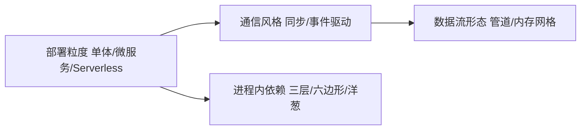

# 架构模式

> 📌 **导航**：本文是 **架构模式** 词条，属于 architecture 术语集。相关枢纽：[[SaaS产品技术架构]]、[[事件驱动架构]]、[[云原生与多云架构实战指南]]、[[分布式系统设计完全指南]]、[[微服务架构]]。

## 定义

**一句话定义：** 架构模式是系统设计里反复出现的结构性问题的命名解法，按部署粒度、通信风格、进程内依赖方向、数据流形态四条轴各给一种取舍，是选型菜单而非先进程度排行榜。

**通俗类比：** 像装修前先看四张图纸：房子砌不砌隔墙（粒度）、房间之间怎么传话（通信）、承重结构朝哪边受力（依赖）、水电走明管还是暗管（数据流）——每张图独立选，选错互相拖累。

## 为什么需要它

没有命名模式时，架构讨论退化成经验之争：争"要不要拆"，却没人回答"拆是为了解决什么"。模式提供三样东西——共同语言、可复用的取舍结构、"选择即代价"的提示。把常见模式按轴排开，选型讨论就从背名词变成对信号。

## 核心机制

四条轴各自选型、彼此正交；下表负责"有什么"（详见列给出归口），下面五条只讲"为什么这样选"：

| 模式 | 本质一句话 | 最划算的信号 | 主要代价 | 详见 |
|---|---|---|---|---|
| 单体 | 全部模块一个部署单元 | 小团队、原型期 | 扩容与发布牵动全站 | [[微服务拆分与选型]] |
| 微服务 | 按业务能力拆独立服务 | 多团队交付耦合、容量错配 | 分布式复杂度、事务变补偿 | [[微服务架构]] |
| Serverless | 函数化全托管按量付费 | 尖峰流量、胶水任务 | 冷启动、时长上限、厂商锁定 | [[云服务详解]] |
| 事件驱动 EDA | 以事件通信松耦合 | 多消费者扇出、要削峰 | 最终一致、调试难 | [[事件驱动架构]] |
| CQRS | 读写两套模型 | 读写负载悬殊、查询复杂 | 双模型同步成本 | [[事件驱动架构]] |
| 六边形/洋葱 | 领域居中、依赖朝内 | 领域复杂、技术栈常换 | 抽象样板税 | [[六边形与洋葱架构]] |
| Space-Based | 数据入内存网格并行处理 | 极高并发读写、实时交易 | 内存成本、复制同步 | 本页内联 |
| 管道-过滤器 | 一串变换阶段处理数据 | 分步数据加工流水线 | 阶段僵化、延迟串联 | [[流处理与批处理]] |
| 微前端 | 前端拆分独立开发部署 | 多团队共改一个前端 | 隔离与运行时通信开销 | [[前端框架核心概念]] |

1. **粒度先于一切**：单体是默认最优解，只有组织互相等待、发布被迫捆绑、容量严重错配同时成立才拆微服务（三信号判据见 [[微服务拆分与选型]]）；Serverless 是"连进程都不想管"的极端形态，突发流量与胶水任务最划算，计费与限制见 [[云服务详解]]，进程形态约束另见 [[云原生十二要素]]。
2. **通信风格决定一致性账单**：同步请求-响应直观但强耦合，换成 [[事件驱动架构]] 买来扇出与削峰，事件溯源与 CQRS 作为它的配套模式在同一词条内讲清——先有事件流、再谈读写分离，顺序不要反过来，否则双模型同步会把你埋进补偿代码里。
3. **进程内依赖方向独立成题**：拆分管服务之间，[[六边形与洋葱架构]] 管一个服务之内——领域居中、端口与适配器把依赖掉个头，是 [[设计原则]] 里依赖倒置在架构尺度的展开；仓储接口放内层、实现放外层，正好由 DDD 的聚合概念给出划界依据。
4. **两个无专条模式就地归口**：Space-Based 把数据放上内存网格、处理单元并行读写，本质是"存储上移 + 计算横向复制"，选型信号与 [[高并发系统设计]]、[[分布式缓存]] 同源；管道-过滤器把数据串过有序变换阶段，现代对应物即 [[流处理与批处理]] 与 [[ETL]] 的作业链——两者单独成条都太薄，跟着母题学更划算。
5. **前端与后端同序拆分**：[[微服务架构]] 在前端的对应物是微前端——主应用壳加多团队子应用，qiankun 与 Module Federation 的选型对比由 [[前端框架核心概念]] 的微前端一节承载，本页不重复。

## 具体示例

电商演进史几乎是本页的沙盘：验证期用单体但留出模块边界；成长期按 [[微服务拆分与选型]] 先切营销这类读多写少的低危边界；主链路保持同步调用，通知、积分、风控走 [[事件驱动架构]] 扇出；每个服务内部用六边形式端口把库与消息隔在外圈；大促热点才引入内存网格——模式是叠着用的，不是换着用的。

## 何时用与何时不用

- **用**：架构评审与面试中"X 与 Y 怎么选"类问题，先用四轴定位候选，再跳专条看判据与代价。
- **不用**：为先进而堆叠——小团队同时上微服务 + CQRS + 事件驱动几乎必翻车；也别把本页当互斥分类表，模式常成对咬合。

## 优劣与代价

✅ 命名让决策可交流、可复盘、可回退，代价在选型当天就摆上桌面。
✅ "信号 → 模式"的映射免去每次从零推导，面试可迁移。
⚠️ 模式只答结构，不答领域边界与容量数字，仍需系统设计流程收口。
⚠️ 同名模式各家定义略有差异（如"管道"在图形渲染里是另一回事），引用时以归口专条口径为准。

## 与相关概念的区别

- **vs [[设计原则]]**：原则是价值观（依赖倒置、关注点分离），模式是价值观落地出来的结构形状。
- **vs [[系统设计]]**：系统设计讲容量、可用性、一致性的推导流程，本页讲结构骨架的候选集。
- **vs [[DDD领域驱动设计]]**：DDD 答"边界怎么划"，本页答"各个尺度怎么组装"，一个定界、一个定形。

## 常见误区

- 微服务比单体更先进，新项目应当直接按微服务起步。
- 模式叠得越多架构越好，最好一页 PPT 全用上。
- 上了 CQRS 就必须配事件溯源、读写必须落两套数据库。

## 面试速答

> 🎯 架构模式按四轴命名取舍：部署粒度（单体/微服务/Serverless）、通信风格（同步/事件驱动）、进程内依赖（六边形/洋葱）、数据流形态（管道/内存网格）；按要解决的问题选、不按新旧选，模式叠加使用是常态。
> 🔍 追问：什么样的团队信号说明该从单体往微服务走？
> 🔍 追问：CQRS 能不能只做读写分离、不上事件溯源？

## 相关术语

[[API设计]]、[[DDD领域驱动设计]]、[[SaaS产品技术架构]]、[[事件驱动架构]]、[[云原生与多云架构实战指南]]、[[分布式系统设计完全指南]]、[[微服务架构]]、[[微服务拆分与选型]]、[[六边形与洋葱架构]]、[[云原生十二要素]]、[[设计原则]]、[[系统设计]]

## 参考资料

建议人工核验：本词条内容建议对照相关技术官方文档、权威教材与论文做准确性复核；未编造文献编号、标准号或 URL，如需引用请补充具体出处。原稿十个模式小节的逐条散文与 ASCII 结构图已按主题归口到上表"详见"列词条，本页不重复承载；原稿无截断。
