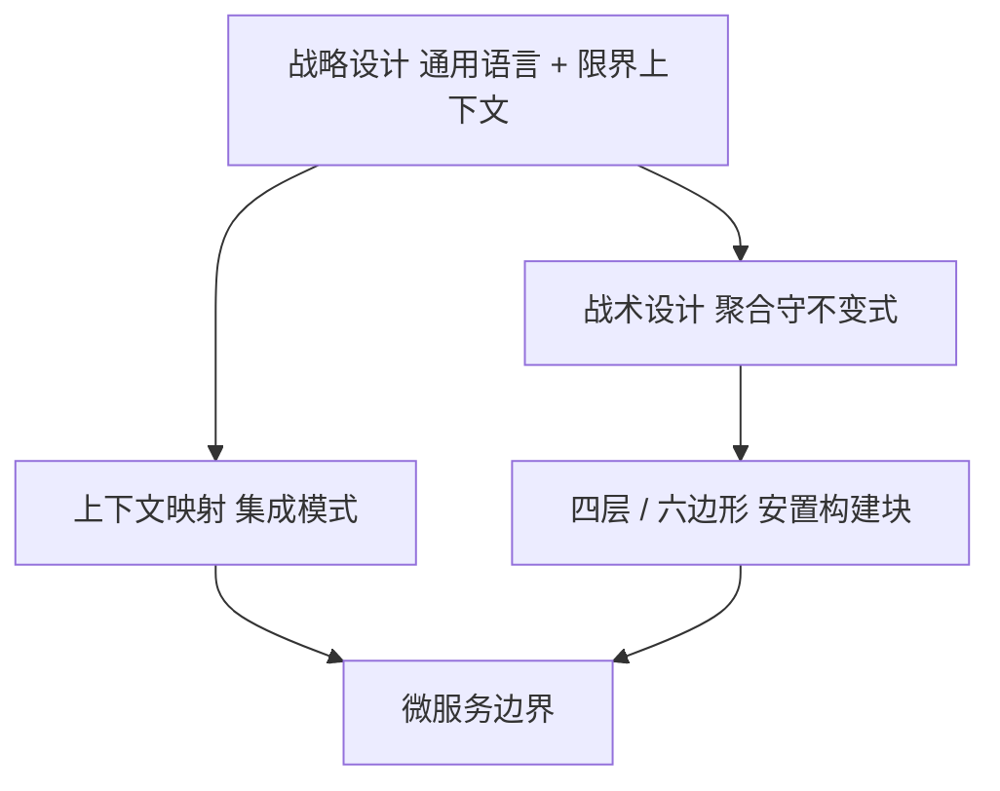

# 领域驱动设计DDD完全指南

> 📌 **导航**：本文是 **领域驱动设计DDD完全指南** 词条，属于 architecture 术语集。相关枢纽：[[SaaS产品技术架构]]、[[事件驱动架构]]、[[云原生与多云架构实战指南]]、[[分布式系统设计完全指南]]、[[微服务架构]]。

## 定义

**一句话定义：** DDD 是「先划业务边界、再在边界内建模」的方法论：战略设计产出通用语言、限界上下文与上下文映射，战术设计用聚合根守不变式、用领域事件做跨聚合的最终一致，分层与端口适配器负责安置构建块——本页给出这十部分的路标与不可颠倒的落地次序。

**通俗类比：** 像建一座城市：先定行政边界与官方语言（战略），再规定每栋楼的产权与承重墙（战术），最后决定水电管线从哪条街走（分层与端口）。本页是这套图纸的目录页，标好每一张图归哪个部门管。

## 为什么需要它

DDD 最常见的失败方式，恰恰是「学得最认真」的那种：把实体、值对象、聚合、仓储全套战术模式背熟，然后在一个从未划清边界的系统里精确建模，交付一个精美的错误模型——边界错了，边界内越精致返工越彻底。另一层原因是概念重复：同一套战术模式在库内已有速查专条，再抄一份只会让两处口径分叉。所以本页把可归口的部分全部交出去，只保留别处没有的三件事：落地次序、电商走查、避坑清单。

## 核心机制

| 部分 | 管什么 | 归口 |
|---|---|---|
| 一 核心思想 | 通用语言、限界上下文、领域模型 | [[DDD领域驱动设计]] |
| 二 战略设计 | 上下文映射与七种集成模式 | [[事件风暴与上下文映射]] |
| 三 战术设计 | 实体、值对象、聚合、领域服务、领域事件、仓储、工厂 | [[DDD领域驱动设计]] |
| 四 分层架构 | 经典四层、六边形、洋葱、整洁架构 | [[六边形与洋葱架构]] |
| 五 事件风暴 | 事件→命令→聚合→边界的六步工作坊 | [[事件风暴与上下文映射]] |
| 六 CQRS | 读写两套模型分别优化 | [[事件驱动架构]] |
| 七 事件溯源 | 存事件序列、重放得当前状态 | [[事件驱动架构]] |
| 八 与微服务关系 | 上下文是边界，服务是落地方式 | [[微服务拆分与选型]] |
| 九 实战案例 | 电商七个上下文与一次下单链路 | 本页「具体示例」 |
| 十 常见误区 | 八条避坑 | 本页「常见误区」与上文次序 |

1. **次序压倒名词**：十部分不是并列菜单，是一条流水线——先用通用语言与事件风暴划出限界上下文，再在单个上下文内谈聚合与仓储（见 [[事件风暴与上下文映射]]、[[DDD领域驱动设计]]）。反过来的代价是确定的：错误的模型往往已经渗进数据库表和对外接口契约，届时改的是迁移脚本而不只是类图。
2. **战术构建块只保证一致，不保证对齐**：聚合根是「一次事务只改一个聚合」的一致性边界，聚合之间靠领域事件达成最终一致（战术表见 [[DDD领域驱动设计]]）。划聚合的信号是业务不变式，不是「关系密切就装在一起」——把商品明细整个塞进订单聚合，等于给每次改价都上一把大锁，边界也再也拆不开。
3. **分层不是 DDD 的前置课**：经典四层只规定界面、应用、领域、基础设施各放什么，真正决定「谁可以依赖谁」的是端口与适配器（[[六边形与洋葱架构]]）。仓储接口在内层、JPA 实现在外层，应用层薄到只做用例编排与事务边界；把业务判断写进 Controller 或应用 Service 的那一刻，四层就退化成了带目录的三层贫血模型。
4. **CQRS 与事件溯源是可选外挂**：读写模型分离解决「查询要跨聚合拼数据」的性能问题，事件溯源解决「状态怎么来的」审计问题，两者的机制都归 [[事件驱动架构]]；只上 CQRS（读写两条路、两套存储）完全成立，为 CRUD 应用强配事件流换来的是事件版本演进的长期债。跨聚合发事件还有一致性账单要付：事务性发件箱（与聚合同一个事务落库、由独立进程轮询投递）优于事务提交后直接发布，后者必须自己配重试与幂等消费。
5. **业务边界先于技术边界**：一个限界上下文对应一个或少数强关联服务，但「先定服务、再分上下文」就是为微服务而微服务（拆法信号见 [[微服务拆分与选型]]）。上下文映射决定服务之间怎么连（REST、gRPC、事件），康威定律决定谁连得动——按上下文组建跨职能团队并让它对自己的上下文有完全所有权，是这套方法论能落地的组织前提，否则模型泄漏只是换了台机器发生。

## 具体示例

电商系统经事件风暴产出七个上下文：购物车（未完成的选购）、订单（从下单到完成或取消的生命周期）、支付（支付与退款）、库存（扣减与回补）、物流（发货）、商品目录（商品信息）、客户（账户与积分）。核心域是订单与库存，商品目录与客户属支撑域，通知与鉴权是通用域（直接买现成）。

订单上下文内部的构建块：聚合根 `Order`，实体 `OrderItem`，值对象 `Money`、`Quantity`、`ShippingAddress`、`OrderId`，领域事件 `OrderPlacedEvent`、`OrderPaidEvent`、`OrderCancelledEvent`，领域服务 `OrderPricingService`（折扣规则跨多个聚合），仓储接口 `OrderRepository` 只有 findById 与 save，复杂查询一律不往里塞。

一次下单的链路：`PlaceOrderCommand` 进来 → 应用服务加载聚合、调 `order.place()` 守住状态不变式 → `OrderRepository.save` → 发布 `OrderPlacedEvent`。事件处理器随后做三件事：经防腐层调用库存上下文预留（ACL 写法见 [[事件风暴与上下文映射]]）、发布 `OrderConfirmedEvent` 通知支付上下文发起扣款、把订单号 / 客户名 / 商品摘要 / 总价投影进 `OrderDetailsView` 读模型，查询端直接取这份扁平视图而不必加载完整聚合（[[事件驱动架构]]）。上下文之间从不直连改对方数据：支付完成后回抛 `PaymentCompletedEvent`，由订单上下文订阅并把状态推进到已支付。

## 何时用与何时不用

子域三分是取舍的唯一正确答案：精力只该花在**核心域**（别人没有、决定竞争力，如订单与风控）和**支撑域**（业务必需但不独特，如商品目录）；**通用域**（发邮件、生成 ID、鉴权）直接用现成库或外部服务，别为它建聚合。

- **用**：规则多变且需要领域专家深度参与；多团队共改一套模型、术语开始互相打架；微服务定界（[[微服务拆分与选型]]）。
- **不用**：CRUD 后台与原型探索期（取舍见 [[DDD领域驱动设计]]），此时全套战术只是预付抽象税；团队里没有业务方能对话时，先解决沟通再谈建模。

## 优劣与代价

✅ 代码结构与业务语义对齐，可维护性来自「读代码像读业务文档」。
✅ 边界显式化后，团队并行、故障隔离、独立扩缩都有了统一抓手。
⚠️ 学习曲线陡且高度依赖领域专家在场，专家没时间就退化成开发者自说自话。
⚠️ 构建块与抽象接口的样板量可观，收益要到系统演化到一定规模才回本。

## 与相关概念的区别

- **vs [[DDD领域驱动设计]]**：那条是术语与战术构件的速查词条，本页是把十部分串成落地次序的路标，并独家承载事件风暴、上下文映射、电商走查与避坑清单。
- **vs [[架构模式]]**：模式回答「结构骨架怎么选」，DDD 回答「骨架里的业务模型从哪来」；一个定形，一个定界。
- **vs [[微服务架构]]**：微服务是限界上下文的落地方式之一，不是 DDD 的前置条件；单体同样可以按上下文划分模块，先内后外更稳。

## 常见误区

- 把 DDD 等同于实体、值对象、聚合这套战术模式，跳过战略设计直接开始建模。
- 每个模块、每个服务都套完整 DDD，通用域也建聚合，为微服务而微服务。
- 领域逻辑写在应用服务或控制器里，聚合根退化成只带 getter 的数据袋。

## 面试速答

> 🎯 DDD = 战略定边界（通用语言、限界上下文、上下文映射）+ 战术建模型（聚合根守不变式、领域事件做跨聚合最终一致）+ 分层与端口安置代码；CQRS 和事件溯源是可选外挂，业务边界永远先于微服务的技术边界。

## 相关术语

[[DDD领域驱动设计]]、[[事件风暴与上下文映射]]、[[六边形与洋葱架构]]、[[架构模式]]、[[事件驱动架构]]、[[微服务拆分与选型]]、[[微服务架构]]、[[设计原则]]、[[分布式系统设计完全指南]]、[[API设计]]

## 参考资料

建议人工核验：本词条内容建议对照相关技术官方文档、权威教材与论文做准确性复核；未编造文献编号、标准号或 URL，如需引用请补充具体出处。原稿 §14 六边形架构、§15 洋葱架构 & 整洁架构两小节已删除并改双链指向 [[六边形与洋葱架构]]（二期先行立条的收敛，见 split-candidates.md 重叠去重队列第 10 对）；第六部分 CQRS、第七部分 Event Sourcing 收敛为指向已 done 的 [[事件驱动架构]]；第一至三部分的通用语言与战术构件（含 9 块 Java 示例、209 行代码）归口 [[DDD领域驱动设计]] 的战术表；第二、五部分的上下文映射与事件风暴另立 [[事件风暴与上下文映射]]。原稿无截断。
