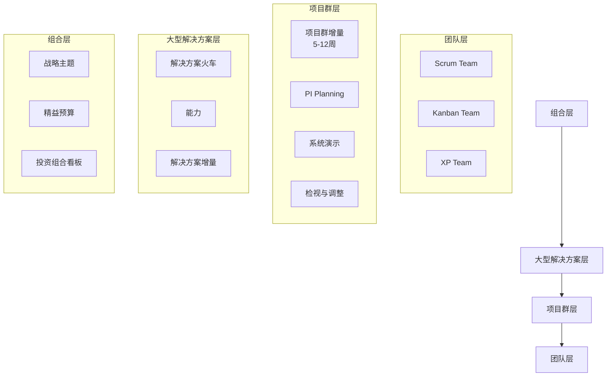

# 敏捷项目管理实战


> 📌 **导航**：本文是 **敏捷项目管理实战** 词条，属于 developer-skills 术语集。相关枢纽：[[开发者效率工具大全]]、[[敏捷项目管理实战]]。

## 敏捷项目管理终极指南

## 一、敏捷宣言与原则

### 1.1 敏捷宣言的四大核心价值

敏捷宣言于2001年由17位软件开发领域的思想领袖共同签署，提出了四个核心价值主张：

**个人和互动** 高于 流程和工具  
**可工作的软件** 高于 详尽的文档  
**客户协作** 高于 合同谈判  
**响应变化** 高于 遵循计划

> **实践案例**：某金融科技公司在开发移动支付应用时，最初坚持完整的PRD文档和UI设计稿必须经过三轮审批。改为敏捷后，产品负责人与开发团队每天进行15分钟协作会议，直接用白板绘制原型，两周后交付首个可用版本，比原计划提前三周。

### 1.2 敏捷十二原则

1. **最高优先级是通过尽早和持续交付有价值的软件来满足客户**
2. **欢迎需求变化，即使开发后期**
3. **频繁交付可工作的软件**（数周到数月，时间越短越好）
4. **业务人员和开发人员必须每天一起工作**
5. **围绕有动力的个人构建项目**，给予信任和支持环境
6. **面对面沟通**是最有效的信息传递方式
7. **可工作的软件是进度的首要度量标准**
8. **敏捷过程倡导可持续开发**，发起人、开发人员和用户应能长期保持稳定
9. **持续关注技术卓越和良好设计**
10. **简洁**——最大化未完成工作量的艺术
11. **最佳架构、需求和设计出自自组织团队**
12. **团队定期反思如何提高效率并调整行为**

```python
# 代码示例：敏捷原则在代码审查中的应用
class CodeReview:
    def __init__(self, developer, reviewer, deadline):
        self.developer = developer
        self.reviewer = reviewer
        self.deadline = deadline  # 24小时内必须完成
        
    def conduct_review(self, code_changes):
        """
        实践原则3：频繁交付
        - 小批量提交，每次不超过200行
        - 及时反馈，避免大规模返工
        """
        if len(code_changes) > 200:
            raise ValueError("违反敏捷原则3：单次提交应小于200行，便于快速审查")
            
        # 实践原则12：持续改进
        review_feedback = self.analyze_code(code_changes)
        improvement_suggestions = self.generate_suggestions(review_feedback)
        
        return {
            "passed": len(improvement_suggestions) < 3,
            "feedback": review_feedback,
            "improvements": improvement_suggestions,
            "metrics": self.calculate_code_metrics(code_changes)
        }
    
    def calculate_code_metrics(self, code_changes):
        """计算代码质量指标，实践原则7：可工作的软件是首要度量标准"""
        return {
            "test_coverage": self.calculate_test_coverage(code_changes),
            "cyclomatic_complexity": self.calculate_complexity(code_changes),
            "code_duplication": self.find_duplication(code_changes)
        }
```

## 二、Scrum框架深度解析

### 2.1 三大角色与职责矩阵

| 角色 | 核心职责 | 关键活动 | 常见误区 |
|------|----------|----------|----------|
| **产品负责人(PO)** | 最大化产品价值 | 管理Product Backlog、定义验收标准、决策优先级 | 不能同时担任Scrum Master；避免微观管理 |
| **Scrum Master(SM)** | 服务型领导，移除障碍 | 引导会议、保护团队、教练敏捷实践 | 不是项目经理；不分配任务 |
| **开发团队(Dev Team)** | 跨职能、自组织团队 | 每日站会、Sprint执行、技术决策 | 不可少于3人或多于9人；避免专业孤岛 |

**案例分析**：某电商团队最初由技术经理兼任SM和PO，导致职责冲突。拆分角色后，PO专注于用户反馈分析，SM专注于流程优化，团队速度提升40%。

### 2.2 五大事件详解

#### Sprint（冲刺）
- **时间盒**：1-4周（最常见为2周）
- **目标**：创建"完成"的增量产品
- **关键规则**：Sprint期间不能改变目标；范围可通过PO与团队协商调整

#### Sprint Planning
```javascript
// Sprint Planning议程模板
const sprintPlanning = {
  timebox: "2小时/周（2周Sprint则4小时）",
  agenda: [
    {
      part: "第一部分：为什么做？",
      duration: "1小时",
      activities: [
        "PO介绍Sprint目标",
        "团队讨论业务价值",
        "澄清需求疑问"
      ]
    },
    {
      part: "第二部分：如何做？",
      duration: "1-3小时",
      activities: [
        "从PB中选择高优先级项",
        "拆分为任务并估算",
        "制定Sprint Backlog",
        "确定每日站会时间"
      ]
    }
  ],
  outputs: [
    "Sprint目标",
    "Sprint Backlog",
    "任务分解"
  ]
};
```

#### Daily Scrum（每日站会）
- **时间盒**：15分钟
- **经典三问**：昨天做了什么？今天计划做什么？有什么障碍？
- **高级形式**：走板会议（Walk the Board），从右到左讨论看板卡片

**实际案例**：某远程团队使用"异步站会"：每人录制2分钟视频，使用Loom工具，次日上午集中讨论障碍。既尊重时区差异，又保持透明度。

### 2.3 三大工件

#### Product Backlog（产品待办列表）
```yaml
# PB条目示例（用户故事格式）
epic: 用户注册流程优化
  feature: 第三方登录集成
    story: 
      标题: 作为用户，我希望用微信快速登录
      描述: 减少注册步骤，提高转化率
      优先级: 高 (MoSCoW: Must Have)
      故事点: 5
      验收标准:
        - 给定: 用户在登录页
        - 当: 点击微信图标
        - 则: 跳转微信授权页面
        - 且: 授权后自动登录系统
        - 且: 首次登录自动创建账户
      技术备注: 需申请微信开放平台应用
      创建日期: 2024-01-15
      最后更新: 2024-01-20
```

#### Sprint Backlog
- 包含：Sprint目标 + 选中的PB条目 + 交付计划
- 可实时更新：任务完成状态
- 可视化：物理或电子看板

#### 增量（Increment）
- **定义**：所有已完成PB条目的总和
- **必须**：符合"完成的定义"（DoD）
- **可交付**：潜在可发布状态

## 三、看板方法实践

### 3.1 看板五大核心实践

1. **可视化工作流**（Visualize the Workflow）
2. **限制在制品**（Limit WIP）
3. **管理流动**（Manage Flow）
4. **明确流程策略**（Make Process Explicit）
5. **持续改进**（Improve Collaboratively）

```python
# 看板系统实现示例
class KanbanBoard:
    def __init__(self):
        self.columns = {
            "backlog": {"wip_limit": float('inf'), "items": []},
            "analysis": {"wip_limit": 3, "items": []},
            "development": {"wip_limit": 5, "items": []},
            "testing": {"wip_limit": 4, "items": []},
            "done": {"wip_limit": float('inf'), "items": []}
        }
        self.metrics = {
            "lead_time": [],  # 从请求到完成的时间
            "cycle_time": [],  # 从开始到完成的时间
            "throughput": 0    # 单位时间完成项数
        }
    
    def add_item(self, item, target_column):
        """添加工作项，检查WIP限制"""
        column = self.columns[target_column]
        if len(column["items"]) >= column["wip_limit"]:
            raise ValueError(f"WIP限制已达到: {target_column} 最大{column['wip_limit']}项")
        
        item["start_time"] = datetime.now() if target_column != "backlog" else None
        column["items"].append(item)
        
        # 计算流动指标
        if target_column == "done":
            self.calculate_flow_metrics(item)
            
    def calculate_flow_metrics(self, item):
        """计算流动效率指标"""
        lead_time = (datetime.now() - item["created"]).total_seconds()
        cycle_time = (datetime.now() - item["start_time"]).total_seconds()
        
        self.metrics["lead_time"].append(lead_time)
        self.metrics["cycle_time"].append(cycle_time)
        
        # 流动效率 = 价值时间 / 总时间
        value_time = item.get("value_add_time", 0)
        flow_efficiency = value_time / cycle_time if cycle_time > 0 else 0
        
        return {
            "lead_time_hours": lead_time / 3600,
            "cycle_time_hours": cycle_time / 3600,
            "flow_efficiency_percent": flow_efficiency * 100
        }
```

### 3.2 WIP限制的科学设定

**Little's Law应用**：
```
WIP = 吞吐率 × 周期时间
```

**实践案例**：某运维团队发现任务积压严重，应用WIP限制：
1. 测量当前周期时间：平均5天
2. 目标吞吐率：每天完成2项任务
3. 计算WIP限制：2 × 5 = 10项
4. 分阶段设置：分析≤3，开发≤4，测试≤3

**结果**：周期时间从5天降至3天，吞吐率提高60%，压力分布更均匀。

### 3.3 流动效率提升策略

1. **识别瓶颈**：使用累积流量图(CFD)
2. **减少批量大小**：小批量流动更快
3. **消除等待**：优化交接流程
4. **自动化**：减少手动步骤

## 四、用户故事编写艺术

### 4.1 INVEST原则详解

| 原则 | 含义 | 实践技巧 |
|------|------|----------|
| **Independent（独立）** | 故事间无依赖 | 通过重构减少耦合 |
| **Negotiable（可协商）** | 不是合同，是对话起点 | 保留细节到实现时讨论 |
| **Valuable（有价值）** | 对用户或业务有价值 | 避免技术故事（除非有明确用户价值） |
| **Estimable（可估算）** | 团队能大致估算工作量 | 拆分过大/模糊的故事 |
| **Small（小）** | 一个Sprint内可完成 | 按功能切片而非技术层 |
| **Testable（可测试）** | 有明确验收标准 | 使用Given-When-Then格式 |

```gherkin
# 优秀的用户故事示例（Gherkin格式）
Feature: 购物车商品管理
  
  @high-priority
  Scenario: 添加商品到购物车
    Given 我浏览商品列表
    And 我查看"无线耳机"的详情页
    When 我选择颜色"黑色"
    And 我选择数量"2"
    And 我点击"加入购物车"按钮
    Then 我应该看到购物车图标显示数字"2"
    And 购物车页面应该显示该商品
    And 价格计算应该正确（单价×数量）
    
  Scenario: 移除购物车中的商品
    Given 我的购物车中有"无线耳机" ×2
    And 我的购物车中有"手机壳" ×1
    When 我移除"无线耳机"
    Then 购物车中应该只剩"手机壳"
    And 总价应该重新计算
    And 购物车图标数字应该变为"1"

# 反模式（不好的故事）
反例: "重构支付模块" → 没有用户价值，不可测试
修正: "作为用户，我希望在支付失败时看到明确错误信息，以便我知道下一步该怎么做"
```

### 4.2 验收标准编写模式

**三种常用格式**：

1. **场景-动作-结果**
   ```
   场景: 用户忘记密码
   动作: 点击"忘记密码"链接，输入注册邮箱
   结果: 收到重置链接邮件，链接24小时内有效
   ```

2. **规则基线**（适用于复杂业务逻辑）
   ```
   规则1: 订单金额超过500元免运费
   规则2: 会员等级不同，折扣不同
   规则3: 使用优惠券后不可再叠加其他优惠
   ```

3. **示例表**（数据驱动）
   ```
   | 用户类型 | 购买金额 | 预期折扣 | 预期运费 |
   |----------|----------|----------|----------|
   | 普通会员 | 300元    | 无       | 10元     |
   | 金卡会员 | 300元    | 95折     | 免运费   |
   | 普通会员 | 600元    | 无       | 免运费   |
   ```

## 五、估算方法实践指南

### 5.1 故事点估算原理

**斐波那契数列**：1, 2, 3, 5, 8, 13, 21, 34...
- 代表相对复杂度，非小时数
- 包含：开发、测试、集成、文档等所有工作
- 基准故事：团队选定一个参考故事（如5点）

**估算三要素**：
1. **工作量**：需要多少工作？
2. **复杂性**：技术难度如何？
3. **不确定性**：需求或技术有多少未知？

```python
# 故事点到工时的转换模型
class EstimationConverter:
    def __init__(self, team_velocity, sprint_days=10):
        """
        初始化估算转换器
        :param team_velocity: 团队速率（每Sprint完成的故事点数）
        :param sprint_days: Sprint工作日数
        """
        self.velocity = team_velocity
        self.sprint_days = sprint_days
        
    def convert_to_hours(self, story_points):
        """
        将故事点转换为预估工时
        基于历史数据：每故事点平均工时
        """
        # 历史数据分析结果（需要团队校准）
        points_to_hours_map = {
            1: 4,    # 1点 ≈ 4小时
            2: 8,    # 2点 ≈ 8小时（1天）
            3: 16,   # 3点 ≈ 16小时（2天）
            5: 32,   # 5点 ≈ 32小时（4天）
            8: 64,   # 8点 ≈ 64小时（8天）
            13: 120  # 13点 ≈ 120小时（15天）
        }
        
        if story_points in points_to_hours_map:
            return points_to_hours_map[story_points]
        else:
            # 对于非标准点数，使用线性插值
            return story_points * (self.velocity / self.sprint_days) * 8
    
    def forecast_sprint_capacity(self, available_points):
        """
        预测Sprint容量
        """
        # 考虑假期、会议等扣除
        effective_hours = available_points * 0.8  # 80%专注时间
        return effective_hours / (self.velocity / self.sprint_days * 8)
```

### 5.2 T恤尺码估算法

**适用场景**：早期估算、特性级估算、跨团队对齐

**尺码映射**：
- **XS**：1-2点（几小时工作）
- **S**：3-5点（1-2天）
- **M**：5-8点（3-5天）
- **L**：8-13点（1-2周）
- **XL**：13-21点（2-3周）
- **XXL**：需要拆分

**实际案例**：某产品委员会使用T恤尺码评估新特性：
1. 每个特性负责人准备3分钟演示
2. 委员会成员匿名投票尺码
3. 讨论差异最大的估算
4. 达成共识并映射到故事点

### 5.3 计划扑克实战流程

**步骤**：
1. **展示故事**：PO描述用户故事
2. **澄清问题**：团队提问
3. **独立估算**：每人选一张牌（不讨论）
4. **同时亮牌**：所有人同时展示
5. **讨论分歧**：最高和最低估算者说明理由
6. **重新估算**：直到收敛
7. **记录共识**：作为最终估算

**常见情况处理**：
- **全票相同**：直接采用
- **轻微差异**（如3,3,5,5）：取较大值或平均值
- **巨大差异**（如3,13）：深入讨论，可能需要拆分故事

## 六、迭代管理全生命周期

### 6.1 Sprint Planning深度指南

**议程优化**：
```
Sprint Planning Part 1（产品视角）- 1小时
├── 回顾产品愿景和路线图
├── 确定Sprint目标（SMART原则）
├── 展示候选故事（PO讲解）
├── 团队提问和澄清
└── 初步选择故事

Sprint Planning Part 2（技术视角）- 1-3小时
├── 故事拆分为任务
├── 任务估算（小时级）
├── 容量计划（考虑假期、会议）
├── 确认Sprint Backlog
├── 创建Sprint燃尽图基线
└── 公开承诺Sprint目标
```

### 6.2 Daily Standup创新形式

**传统三问的变体**：

1. **走板会议**（Walk the Board）
   ```
   从右向左，聚焦看板上的卡片：
   "这块卡在测试阶段3天了，发生了什么？"
   "今天谁来处理这个阻碍？"
   ```

2. **焦点轮转**
   ```
   每天一个焦点主题：
   周一：集成风险
   周二：测试进展
   周三：技术债务
   周四：客户反馈
   周五：本周回顾准备
   ```

3. **能量检查**
   ```
   1-5分评估：你今天的工作能量如何？
   低分（1-2）的同事，团队可以如何支持？
   ```

### 6.3 Sprint Review展示策略

**展示清单**：
```
1. 演示"完成"的功能（5-7分钟/功能）
   - 真实环境演示，避免PPT
   - 展示用户旅程，而非技术细节
   - 强调业务价值和用户反馈

2. 收集反馈（10-15分钟）
   - 利益相关者提问和建议
   - 产品负责人记录反馈
   - 调整Product Backlog

3. 看板/燃尽图分析（5分钟）
   - 展示进度和预测
   - 讨论偏差原因
   - 调整后续计划

4. 未来展望（5分钟）
   - 下个Sprint的初步计划
   - 产品路线图更新
   - 重大决策公告
```

### 6.4 回顾会议创新方法

**帆船回顾法**：
```
场景：想象团队是一艘帆船

帆（动力）：哪些实践帮助我们前进？
锚（阻碍）：什么在拖慢我们？
风（机遇）：有哪些外部机会？
礁石（风险）：有哪些潜在威胁？

行动项格式：
- 具体、可执行
- 有负责人
- 有截止时间
- 可测量
```

**时间线回顾法**：
1. 绘制Sprint时间线（横轴）
2. 标记关键事件（上线、故障、庆祝）
3. 添加情绪曲线（纵轴：积极/消极）
4. 分析高点和低点的原因
5. 识别模式并制定改进计划

## 七、需求管理进阶实践

### 7.1 Product Backlog梳理会

**DEEP原则**：
- **Detailed Appropriately**（适度详细）
- **Emergent**（涌现式）
- **Estimated**（已估算）
- **Prioritized**（已排序）

**三层结构**：
```
层级1：主题/史诗（6-12个月）
层级2：特性（2-3个月）
层级3：用户故事（1-2周）
```

### 7.2 优先级排序技术

**MoSCoW方法**：
```
Must Have（必须有）- 60%容量
Should Have（应该有）- 20%容量
Could Have（可以有）- 15%容量
Won't Have（这次不会有）- 5%容量
```

**价值vs复杂度矩阵**：
```
         高价值
        ┌───────┬───────┐
        │ 快速收益 │ 战略投资 │
低复杂度│ (优先做) │ (计划做) │
        ├───────┼───────┤
        │ 填充项  │ 避免/重构│
高复杂度│ (有空做) │ (避免)   │
        └───────┴───────┘
         低价值
```

**Kano模型分析**：
1. **基本型**：没有会不满，有了不惊喜（登录功能）
2. **期望型**：越多越满意（性能优化）
3. **兴奋型**：没有不不满，有了很惊喜（个性化推荐）

### 7.3 需求拆分模式

**用户故事拆分技术**：
1. **按工作流步骤**：
   ```
   大故事：完整的结账流程
   拆分：
   - 输入收货地址
   - 选择配送方式
   - 输入支付信息
   - 确认订单
   ```

2. **按业务规则变化**：
   ```
   大故事：应用折扣
   拆分：
   - 应用会员折扣
   - 应用优惠券
   - 应用促销折扣
   - 计算总折扣上限
   ```

3. **按数据类型**：
   ```
   大故事：生成报告
   拆分：
   - 生成PDF报告
   - 生成Excel报告
   - 生成CSV报告
   ```

## 八、技术实践深度实践

### 8.1 测试驱动开发(TDD)

**红-绿-重构循环**：
```python
# 示例：实现一个购物车折扣计算类

# 1. 红：先写失败的测试
def test_basic_discount():
    cart = ShoppingCart()
    cart.add_item("T-shirt", price=100, quantity=1)
    
    # 测试：普通用户无折扣
    assert cart.calculate_total() == 100
    
    # 测试：VIP用户95折
    cart.user_type = "VIP"
    assert cart.calculate_total() == 95

# 2. 绿：编写最少代码使测试通过
class ShoppingCart:
    def __init__(self):
        self.items = []
        self.user_type = "normal"
        
    def add_item(self, name, price, quantity):
        self.items.append({"name": name, "price": price, "quantity": quantity})
    
    def calculate_total(self):
        total = sum(item["price"] * item["quantity"] for item in self.items)
        if self.user_type == "VIP":
            total *= 0.95
        return total

# 3. 重构：优化代码结构
class ShoppingCart:
    """重构后的购物车类"""
    
    DISCOUNT_RATES = {
        "normal": 1.0,
        "VIP": 0.95,
        "SVIP": 0.9
    }
    
    def __init__(self, user_type="normal"):
        self.items = []
        self.user_type = user_type
    
    def add_item(self, item):
        """添加商品到购物车"""
        self._validate_item(item)
        self.items.append(item)
        return self
    
    def _validate_item(self, item):
        """验证商品数据"""
        if item["price"] <= 0:
            raise ValueError("价格必须大于0")
        if item["quantity"] <= 0:
            raise ValueError("数量必须大于0")
    
    def calculate_subtotal(self):
        """计算小计"""
        return sum(
            item["price"] * item["quantity"] 
            for item in self.items
        )
    
    def calculate_discount(self):
        """计算折扣金额"""
        subtotal = self.calculate_subtotal()
        discount_rate = self.DISCOUNT_RATES.get(self.user_type, 1.0)
        return subtotal * (1 - discount_rate)
    
    def calculate_total(self):
        """计算总价"""
        subtotal = self.calculate_subtotal()
        discount = self.calculate_discount()
        return subtotal - discount
```

### 8.2 持续集成/持续部署(CI/CD)

**Jenkins Pipeline示例**：
```groovy
// Jenkinsfile 示例
pipeline {
    agent any
    
    environment {
        DOCKER_REGISTRY = 'registry.company.com'
        APP_NAME = 'ecommerce-app'
    }
    
    stages {
        stage('Checkout') {
            steps {
                checkout scm
                script {
                    env.GIT_COMMIT_MSG = sh(returnStdout: true, script: 'git log -1 --pretty=%B').trim()
                }
            }
        }
        
        stage('单元测试') {
            parallel {
                stage('前端测试') {
                    steps {
                        sh 'npm test -- --coverage'
                    }
                }
                stage('后端测试') {
                    steps {
                        sh 'mvn test'
                    }
                }
            }
        }
        
        stage('代码质量') {
            steps {
                sh 'sonar-scanner'
            }
        }
        
        stage('构建Docker镜像') {
            steps {
                script {
                    def imageTag = "${env.BUILD_NUMBER}-${env.GIT_COMMIT.take(8)}"
                    sh "docker build -t ${DOCKER_REGISTRY}/${APP_NAME}:${imageTag} ."
                    
                    // 推送到私有仓库
                    sh "docker push ${DOCKER_REGISTRY}/${APP_NAME}:${imageTag}"
                }
            }
        }
        
        stage('部署到测试环境') {
            when {
                branch 'develop'
            }
            steps {
                sh "kubectl apply -f k8s/test-deployment.yaml"
                sh "kubectl set image deployment/${APP_NAME} ${APP_NAME}=${DOCKER_REGISTRY}/${APP_NAME}:${env.BUILD_NUMBER}"
            }
        }
        
        stage('集成测试') {
            when {
                branch 'develop'
            }
            steps {
                sh 'npm run test:integration'
            }
        }
        
        stage('部署到生产环境') {
            when {
                branch 'main'
                tag pattern: "v\\d+\\.\\d+\\.\\d+", comparator: "REGEXP"
            }
            input {
                message "确认部署到生产环境？"
                ok "是的，部署"
            }
            steps {
                sh "kubectl apply -f k8s/production-deployment.yaml"
            }
        }
    }
    
    post {
        always {
            cleanWs()
        }
        success {
            slackSend channel: '#deployment',
                     color: 'good',
                     message: "部署成功: ${env.JOB_NAME} #${env.BUILD_NUMBER}"
        }
        failure {
            slackSend channel: '#deployment',
                     color: 'danger',
                     message: "部署失败: ${env.JOB_NAME} #${env.BUILD_NUMBER}"
        }
    }
}
```

### 8.3 结对编程最佳实践

**驾驶员-导航员模式**：
- **驾驶员**：编写代码
- **导航员**：审查代码、思考策略、查阅文档
- **角色切换**：每25分钟交换角色

**远程结对工具栈**：
```yaml
工具推荐:
  实时协作:
    - VS Code Live Share
    - JetBrains Code With Me
    - Tuple (专为结对设计)
  
  沟通:
    - Discord语音频道
    - Slack Huddle
  
  白板:
    - Miro
    - FigJam
  
  最佳实践:
    - 使用单独的虚拟显示器
    - 开启摄像头增加人际连接
    - 定期休息（番茄工作法）
    - 记录决策和学习点
```

## 九、规模化敏捷框架对比

### 9.1 主流框架比较

| 框架 | 核心理念 | 适用规模 | 组织结构 | 治理复杂度 |
|------|----------|----------|----------|------------|
| **SAFe** | 企业级敏捷 | 50-1000+人 | 层级式（团队-项目群-大型解决方案-组合） | 高 |
| **LeSS** | 精简扩展 | 2-8个团队 | 扁平化（多个团队共享一个PO） | 中低 |
| **Nexus** | Scrum扩展 | 3-9个团队 | 集成团队协调 | 中 |
| **Spotify模型** | 文化驱动 | 任意规模 | 部落-小队-分会-协会 | 中 |

### 9.2 SAFe实施路线图

**SAFe 6.0核心配置**：



**实施步骤**：
1. **培训与准备**：SAFe Agilist认证，识别变革代理人
2. **设计实施**：定制SAFe配置，创建实施计划
3. **启动敏捷发布火车(ART)**：识别价值流，组建ART
4. **执行PI**：第一次PI Planning，建立节奏
5. **执行与改进**：持续检视与调整，优化流程

### 9.3 LeSS框架实践

**LeSS规则要点**：
1. 一个Product Backlog，一个产品负责人
2. 多个团队工作在同一个产品上
3. 跨团队协调通过"多团队PBR"和"开放空间"
4. 所有团队同步Sprint开始和结束

**案例研究**：某电信公司实施LeSS：
- **挑战**：8个团队维护同一个计费系统，版本冲突严重
- **解决方案**：
  - 1个PO管理统一的Backlog
  - 建立"组件社区"解决技术一致性
  - 使用"旅行者"角色促进知识共享
- **成果**：发布周期从6个月缩短到2个月，缺陷减少70%

## 十、远程团队敏捷实践

### 10.1 远程敏捷工具栈

```yaml
协作矩阵:
  实时沟通:
    - Slack (频道组织)
    - Microsoft Teams (企业集成)
    - Discord (开发者社区)
  
  异步沟通:
    - Loom (视频消息)
    - Twist (主题式讨论)
    - GitHub Discussions (代码相关)
  
  项目管理:
    - Jira + Advanced Roadmaps
    - Azure DevOps
    - ClickUp
  
  白板与协作:
    - Miro (无限画布)
    - FigJam (设计协作)
    - Google Jamboard
  
  文档:
    - Confluence (知识库)
    - Notion (全能工作区)
    - GitBook (技术文档)
  
  开发协作:
    - VS Code Live Share
    - GitHub Codespaces
    - GitPod (云IDE)
```

### 10.2 远程仪式优化

**异步每日站会模板**：
```markdown
# 每日站会 - 2024年1月20日

## 张三 (前端开发)
**昨天完成**:
- [x] 用户登录页面响应式适配
- [ ] 第三方登录集成 (进行中)

**今天计划**:
- [ ] 完成微信登录对接
- [ ] 开始支付宝登录开发

**障碍**:
- 微信开放平台文档不清晰，需要申请权限

## 李四 (后端开发)
**昨天完成**:
- [x] 用户认证API开发
- [x] 数据库迁移脚本

**今天计划**:
- [ ]
```

## 相关术语

[[开发者效率工具大全]]

## 参考资料

建议人工核验：本词条内容建议对照相关技术官方文档、权威教材与论文做准确性复核；未编造文献编号、标准号或 URL，如需引用请补充具体出处。
