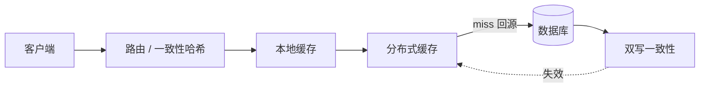

# 分布式ID与缓存术语百科

> 📌 **导航**：本文是 **分布式ID与缓存术语百科** 枢纽页，属于 distributed 术语集。各子问题已拆到专门词条，本页只做索引与关系。

## 定义

**一句话定义：** 本页是"分布式 ID 生成"与"缓存设计"两大读路径主题的枢纽索引——把如何生成全局唯一 ID、缓存最常见的稳定性 / 一致性 / 分片问题，分别归口到各自专条，正文只保留判断依据与概念关系，不复述子词条细节。

**通俗类比：** 像这一主题的门厅索引牌：每个子问题一句话定位、并指向对应专条，具体解法翻到该专条细看。

## 为什么需要它

缓存与全局 ID 是分布式读路径的高频考点，但它们的解答散在多个专条里。本页把"遇到什么问题去哪个词条"串成一张图，让复习能快速定位，并避免同一份解法在多份文档里重复维护。

## 核心机制

各子概念及其归口词条（本页只列"有什么"，"怎么做"在专条里）：

| 子概念 | 一句话定位 | 深入词条 |
|---|---|---|
| 分布式 ID 生成 | UUID / 号段 / Redis / 雪花 / Leaf 的选型 | [[分布式 ID]] |
| 缓存三大问题 | 穿透·击穿·雪崩的成因与对策 | [[缓存三大问题]] |
| 缓存双写一致性 | 先更库再删缓存 / 延迟双删 / Canal 监听 | [[缓存双写一致性]] |
| 读写姿势与层级 | Cache-Aside 等模型、多级缓存层级 | [[缓存策略]] |
| 分布式缓存系统 | 分片、路由、集群与故障转移 | [[分布式缓存]] |
| 一致性哈希 | 扩缩容时最小化迁移的分片算法 | [[一致性哈希]] |
| 缓存重建互斥 | 跨节点抢锁重建、防击穿与超卖 | [[分布式锁]] |

一次缓存读请求如何牵动这些概念：

## 具体示例

"缓存未命中该不该回源"分两层看：单个热点 key 失效用互斥锁 / 逻辑过期（[[缓存三大问题]]），大批 key 同时失效要叠 TTL 抖动 + 高可用集群（[[分布式缓存]]）；而"写之后读到的值新不新"是另一个维度，见 [[缓存双写一致性]]。

## 何时用与何时不用

- **用：** 作为缓存 / ID 主题的入口，先按本表定位问题类别，再跳到对应专条深入；复习时逐条自检。
- **不用：** 本页只有索引与关系，不含各子问题的解法细节——要落地请进专条。

## 优劣与代价

✅ 一屏看清"问题 ↔ 归口"，把分散在各专条的解法组织成一张地图，避免重复维护。
⚠️ 只有指针与判据，不能替代专条；须与子词条的链接保持同步。

## 与相关概念的区别

vs 各专条（[[缓存策略]]、[[分布式缓存]]、[[分布式 ID]]）：本页是横向索引、它们是纵向深讲；vs [[分布式基础术语百科]]：那张地图覆盖分布式系统全貌，本张只聚焦"缓存 + ID"这条读路径。

## 常见误区

- 把本页当成缓存 / ID 各问题的完整讲解来复习。
- 以为"读会不会绕过缓存"和"写后读到旧值"是同一个问题。

## 面试速答

> 🎯 本页是"分布式 ID + 缓存"读路径的枢纽索引：ID 生成、缓存三大问题、双写一致性、读写姿势与层级、分片路由各有专条，本页只做"问题 ↔ 归口"的地图与一次读请求的关系串联，不复述解法。
> 🔍 追问：一次缓存读请求会牵动本页哪几个子问题？
> 🔍 追问：缓存三大问题和双写一致性分别解决什么？

## 相关术语

[[分布式 ID]]、[[缓存三大问题]]、[[缓存双写一致性]]、[[缓存策略]]、[[分布式缓存]]、[[一致性哈希]]、[[分布式锁]]、[[分布式基础术语百科]]
