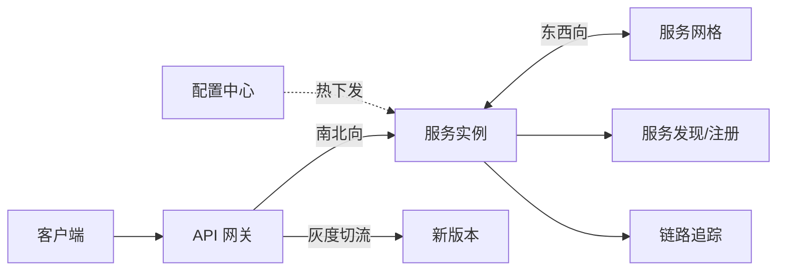

# 微服务治理术语百科

> 📌 **导航**：本文是 **微服务治理术语百科** 枢纽页，属于 distributed 术语集。各治理主题已拆到专门词条，本页只做索引与关系。

## 定义

**一句话定义：** 本页是微服务"服务治理"概念族的枢纽索引——把请求进入系统后依次会遇到的注册发现、负载均衡、熔断限流降级、网关、网格、配置中心、链路追踪与灰度发布，分别归口到各自专条，正文只讲它们的关系与"遇到什么问题去哪个词条"。

**通俗类比：** 像微服务这套系统的组织架构图：每个部门（治理主题）一句话职责 + 指向其详情文档，本页负责画出部门之间怎么协作。

## 为什么需要它

微服务治理的知识点分散在网关、网格、注册中心、限流、可观测性等多个专条里。本页把它们按"一次请求的生命周期"串成一张地图，方便建立全局认知并按需跳转，避免同一内容在多份文档重复维护。

## 核心机制

各治理主题及其归口词条（本页只列"有什么"，"怎么实现"在专条里）：

| 治理主题 | 一句话定位 | 深入词条 |
|---|---|---|
| 服务注册与发现 | 实例自动登记、健康检查、供调用方发现 | [[服务发现]] |
| 负载均衡 | 把请求按策略分摊到多个等价实例 | [[负载均衡]] |
| 熔断与降级 | 下游故障时快速失败 / 舍弃非核心保核心 | [[熔断与降级]] |
| 限流 | 控制入口速率、防过载 | [[限流]] |
| API 网关 | 南北向统一入口：路由 / 认证 / 限流 / 日志 | [[API网关]] |
| 服务网格 | 东西向服务间流量与 mTLS 的基础设施层 | [[服务网格]] |
| 配置中心 | 配置集中管理、热更新、版本与灰度回滚 | [[配置中心]] |
| 链路追踪 | Trace / Span 串联全链路、定位慢点错点 | [[可观测性工程实战]] |
| 灰度发布 | 金丝雀 / 蓝绿 / 滚动，渐进放量控风险 | [[灰度发布]] |

一次外部请求穿过这些组件的顺序：

## 具体示例

排"某接口偶发 502"：先在网关与链路追踪看请求落在哪、耗时卡在哪（[[API网关]] / [[可观测性工程实战]]），若某下游服务故障则查熔断降级是否触发（[[熔断与降级]]）、实例是否被发现摘除（[[服务发现]]），若是新版本引入则回看灰度放量（[[灰度发布]]）——治理全貌正是这条排查链。

## 何时用与何时不用

- **用：** 建立微服务治理全局地图、按"问题属于哪一环"跳转到对应专条、复习时逐主题自检。
- **不用：** 需要某主题的代码与参数细节时——本页只做索引，深讲在专条。

## 优劣与代价

✅ 一屏看清治理组件在请求路径上的分工与协作，组织分散知识、避免重复维护。
⚠️ 只有指针与关系，不替代专条；须与子词条的链接保持同步。

## 与相关概念的区别

vs 各专条（[[API网关]]、[[服务网格]]、[[配置中心]] 等）：本页是横向索引、它们是纵向深讲；南北向入口治理归网关、东西向服务间归网格，勿混（详见二词条）。

## 常见误区

- 把本页当成熔断 / 限流 / 网关等主题的完整讲解来复习。
- 认为熔断、限流、降级是同一件事。

## 面试速答

> 🎯 微服务治理枢纽：请求经 API 网关(南北向)进服务、服务间靠服务网格(东西向)，配合服务发现/负载均衡、熔断降级限流、配置中心热下发、链路追踪观测、灰度发布控风险；本页按请求生命周期索引到各专条。
> 🔍 追问：网关和服务网格分别管哪向流量？
> 🔍 追问：熔断、限流、降级各解决什么？

## 相关术语

[[服务发现]]、[[负载均衡]]、[[熔断与降级]]、[[限流]]、[[API网关]]、[[服务网格]]、[[配置中心]]、[[灰度发布]]、[[可观测性工程实战]]、[[高并发系统设计]]
