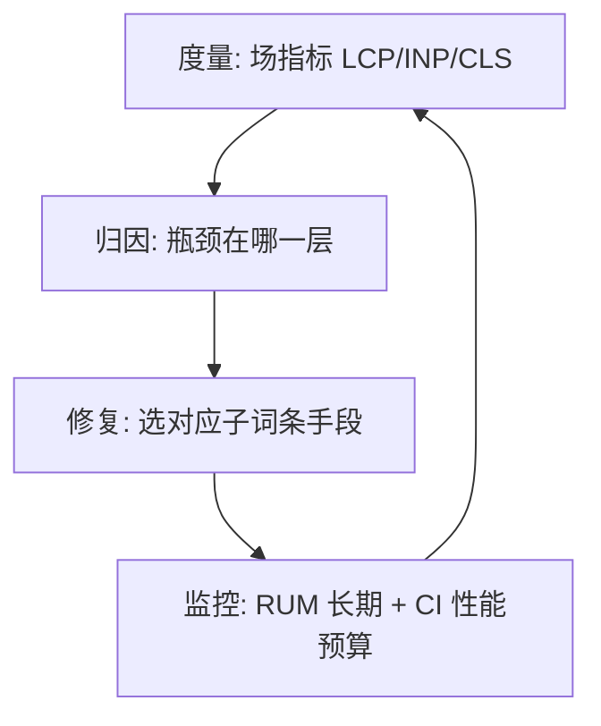

# Web性能优化

> 📌 **导航**：本文是 **Web性能优化** 枢纽，属于 frontend-frameworks 术语集。子词条：[[Core Web Vitals]]、[[资源加载优化]]、[[图片优化]]、[[字体优化]]、[[CSS渲染性能]]、[[JS执行性能]]。相关枢纽：[[现代前端工程化完全指南]]、[[WebAssembly完全指南]]。

## 定义

**一句话定义：** Web性能优化是以"加载更快、交互更响应、视觉更稳定"为目标，按度量→归因→修复→监控循环推进的一系列工程手段。

**通俗类比：** 给页面做健康管理——先量体征看哪项指标异常，再治对应系统，乱吃补品没用。

本词条是枢纽：只讲"怎么归因、怎么选手段"，各手段族细节在六个子词条。

## 为什么需要它

延迟每多一秒都在折损转化与留存；Google 又将 Core Web Vitals 纳入搜索排名因素，性能从"体验加分项"变成"与 SEO 挂钩的硬指标"。而前端应用逐年变重（SPA、三方脚本、高清图），浏览器默认加载顺序与真实首屏需求越来越不一致——优化就是对这种不一致的纠正。

## 核心机制

优化 = 先归因到层，再选手段。四层地图：

① **度量层**：用 Core Web Vitals 等真实用户指标定义"好"；
② **网络传输层**：压缩、缓存、CDN、HTTP/2——让同样的内容字节更小、到得更快；
③ **资源加载层**：预载、代码分割、懒加载、关键 CSS——让浏览器先拿首屏要的；
④ **渲染与执行层**：重排重绘范围、长任务、主线程预算——让拿到的东西渲染得快、响应得快。

最常见的浪费是"不诊断就治"：不知道瓶颈在哪层就乱上懒加载和 Worker。

## 具体示例

某电商详情页场指标 LCP 4.2s：归因发现首图 3MB 未压缩（②③层）+ 主 bundle 阻塞渲染（③层）→ 图片换 WebP + srcset 按尺寸 + preload，路由级代码分割 → LCP 1.9s。一周后 INP 报警：加购卡 800ms → 归因到一段同步算价长任务（④层）→ 切块+闲时执行 → INP 120ms。全程每步先归因再动手。

## 何时用 / 何时不用

- **用**：场指标不达标或业务敏感（转化/留存/SEO）；大改版前立性能预算当红线。
- **不用**：产品未验证期的过早优化；无度量数据的"感觉慢"；瓶颈在服务端时（该优化后端）。

## 优劣与代价

✅ 直接挂钩转化、留存、SEO，是回报最明确的投资之一。
✅ 常规手段（压缩/缓存/懒加载/代码分割）风险低、可叠加。
⚠️ 隐性成本：没有长期监控与 CI 性能预算，性能会悄悄退化且无人知晓。
⚠️ 过度优化反噬：全量 preload 浪费带宽甚至挤占关键资源，合成层滥用吃内存。

## 与相关概念的区别

- **vs 前端工程化**：工程化是交付手段（构建/部署/质量），性能是它的目标之一；代码分割等手段需工程化能力落地。
- **vs Core Web Vitals**：指标是尺子，优化是动作；先有尺子再有动作。

## 常见误区

- 性能优化就是让页面打开更快。
- preload、懒加载等手段叠得越多越快。
- 实验室跑分好，真实用户体验就一定好。

## 面试速答

> 🎯 Web性能优化 = 度量→网络→加载→渲染执行 四层地图；先度量归因到层再选手段；北极星是场指标 Core Web Vitals（LCP/INP/CLS），保障是长期监控与性能预算。
> 🔍 追问：页面首屏慢，你的排查思路是什么？
> 🔍 追问：实验室指标与场指标不一致时信哪个，为什么？

## 相关术语

[[Core Web Vitals]]、[[资源加载优化]]、[[图片优化]]、[[字体优化]]、[[CSS渲染性能]]、[[JS执行性能]]、[[现代前端工程化完全指南]]、[[WebAssembly完全指南]]

## 参考资料

- Google web.dev：Core Web Vitals 文档（指标定义与阈值）。
- MDN Web Docs：Performance 章节（关键渲染路径、渲染管线）。
