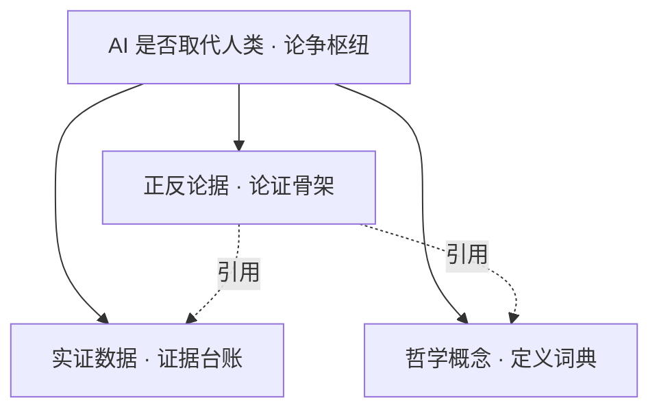

# AI是否会取代人类辩论

> 📌 **导航**：本文是 **AI是否会取代人类辩论** 词条（论争枢纽）。三面入口：[[AI 取代就业的正反论据]]、[[AI 就业影响的实证数据]]、[[AI 与人类独特性的哲学概念]]。

## 定义

**一句话定义：** 本篇原是一场六人模拟辩论的实录，现已收敛为"AI 是否会取代人类"主题的枢纽索引——把论争拆成正反论据、实证数据、哲学概念三个子词条，并串出它们之间的引用关系。

**通俗类比：** 从"一整场两小时辩论录像"变成"三张分类卡片 + 一张关系图"——想听哪条论点、找哪个数据、弄哪个概念，各点各的入口。

## 为什么需要它

原稿一万三千余字、六人长篇，把大量数字与哲学术语混在对话里，既超词条预算又难按需检索。拆成论证骨架、证据台账、概念词典三个子词条后，每个入口都能独立复习与引用，父页只保留"这场争论是什么、三部分如何咬合"。

## 核心机制

论争的三块拼图，由父枢纽按"骨架引用证据与定义"的关系组织：

- **正反论据**：把控辩双方拆成正方四论与反方四论，并点明"双方都承认 AI 会替代大量任务、真正的分歧是替代任务是否等于取代人的价值"这一枢纽判断，是整场论争的骨架。详 [[AI 取代就业的正反论据]]。
- **实证数据**：集中登记麦肯锡、高盛、世界经济论坛、OpenAI、Autor、Nature、JAMA 等双方常引研究的出处，标注"机构预测 / 同行评审 / 个案"性质并给出判读三原则，防止把预测当事实。详 [[AI 就业影响的实证数据]]。
- **哲学概念**：逐条定义感质、具身认知、中文房间、阿伦特"行动"、康德目的、本雅明灵韵、戈夫曼反身性、罗杰斯共情、博登创造力三型等，把含混立场还原为可检验的定义之争。详 [[AI 与人类独特性的哲学概念]]。

至于"哪些岗位易被取代、哪些新职业兴起"的产业与岗位类型学，已由 [[《AI时代生存指南》第二章]] 承载，本枢纽不重复。

## 具体示例

被问"你怎么看 AI 取代工作"：先用正反论据搭好立场框架 → 引用实证数据区分"预测 vs 实测" → 一旦触及"意识 / 创造 / 真实性"，再用哲学概念界定分歧到底是事实之争还是定义之争。三篇各司其职，父页负责指路。

## 何时用 / 何时不用

- **用**：作为进入这一主题的总入口，按需跳转子词条。
- **不用**：把父页当全部内容——论据、数据、概念的细节都在子词条；完整辩论实录（含质询）已不在本篇。

## 优劣与代价

✅ 把超长、戏剧化的辩论收敛为可按需检索的结构化入口。
⚠️ 拆分后失去了对话现场的论战细节（如质询回合的交锋）。
⚠️ 原稿在质询环节被截断，本枢纽仅基于现存文本拆分，未据推测补写缺失内容。

## 与相关概念的区别

- **vs [[《AI时代生存指南》第二章]]**：那篇讲各行业现状与岗位类型学，本枢纽讲"是否等于取代人"的论争结构。
- **vs [[2026年AI技术全景图]]**：那是技术版图的总览，本篇是就业与存在论争的专题枢纽。

## 常见误区

- 本篇仍完整保留着六人辩论的对话与质询实录。
- 论争双方对"AI 会不会替代大量任务"存在根本的事实分歧。
- 哪些岗位易被取代的类型学清单在本篇枢纽里详细展开。

## 面试速答

> 🎯 本词条已从六人辩论实录收敛为"AI 是否取代人类"的枢纽，拆出正反论据（论证骨架）、实证数据（按预测 / 研究 / 个案标注的出处台账）、哲学概念（感质 / 灵韵 / 具身认知等定义词典）三个子词条。核心判断：双方都承认 AI 会替代大量任务，真正分歧在"替代任务是否等于取代人的价值"。
> 🔍 追问：这场论争最容易被偷换的概念是什么？（把"替代任务"悄悄等同于"取代人的价值与角色"）
> 🔍 追问：为什么把数据单独成篇？（区分机构预测、同行评审与个案，防止引用时把前瞻估算当既成事实）

## 相关术语

[[AI 取代就业的正反论据]]、[[AI 就业影响的实证数据]]、[[AI 与人类独特性的哲学概念]]、[[《AI时代生存指南》第二章]]、[[《AI时代生存指南》第一章]]、[[2026年AI技术全景图]]

## 参考资料

建议人工核验：本词条内容建议对照相关技术官方文档、权威教材与论文做准确性复核；未编造文献编号、标准号或 URL，如需引用请补充具体出处。
