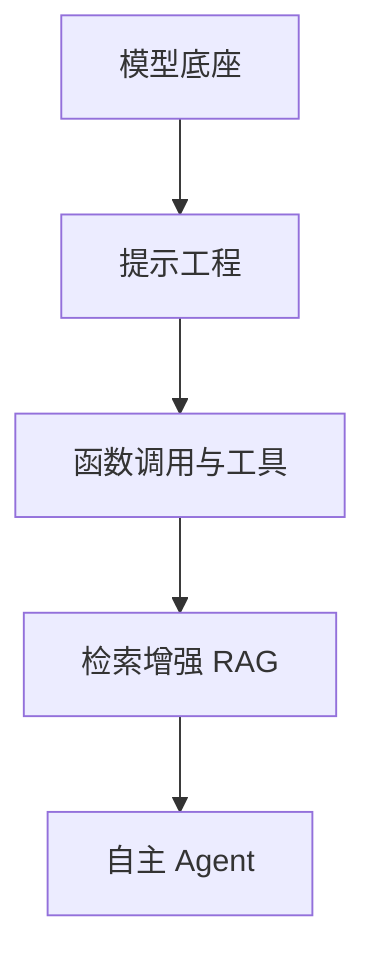

# LLM应用开发完全指南

> 📌 **导航**：本文是 **LLM应用开发完全指南** 词条（分层装配枢纽）。五层入口：[[Transformer架构深度解析]]、[[Prompt 工程与 Agent 详解]]、[[Function Calling 与 Tool Use]]、[[RAG 检索增强生成]]、[[AI Agent 概述与核心架构]]。

## 定义

**一句话定义：** 本词条把"从零构建 LLM 应用"拆成一张五层装配地图——模型底座、提示工程、函数调用与工具、检索增强（RAG）、自主 Agent——每层双链指向已有专条，为应用开发者提供"该读哪篇、如何拼装"的全局导航。

**通俗类比：** 像搭一台机器的装配图：先有发动机（底座模型），再装操纵面板（提示）、外接工具臂（函数调用）、资料仓（RAG），最后接上会自主决策的控制器（Agent）。本篇只画装配顺序，不重造每个零件。

## 为什么需要它

LLM 应用不是单个模型，而是多层的组合；初学者常困于"这些概念怎么拼成一个能跑的系统"。一个分层导航枢纽把散落在各专条里的能力按"应用装配顺序"串起来，让你按需下钻到对应层的深入词条，而不是在几十篇里迷路。

## 核心机制

自底向上的五层，逐层索引到各自的专题词条：

- **模型底座层**：应用的地基是 Transformer 与自注意力（详 [[Transformer架构深度解析]]、[[注意力机制]]）；分词由 [[Tokenizer 技术]] 承载，容量扩展靠 [[MoE 混合专家模型]]，落地时的延迟与显存由 [[LLM 推理优化]]、[[长上下文技术]] 解决。选型看成本、上下文长度与是否需私有部署。
- **提示工程层**：用角色 / 示例 / 思维链等塑造单轮质量（详 [[Prompt Engineering 高级技巧]]、[[Prompt 工程与 Agent 详解]]），并用结构化输出约束格式。它是成本最低的一层优化，应最先尝试。
- **函数调用与工具层**：让模型"会说"变"会做"，模型只产出"调哪个函数 + 参数"、执行在应用侧（详 [[Function Calling 与 Tool Use]]），跨厂商标准化暴露工具则由 [[MCP（Model Context Protocol）]]。这一层是 Agent 行动力的来源。
- **检索增强层**：用"先查后答"补知识时效与私有数据（详 [[RAG 与检索技术详解]]、[[RAG 检索增强生成]]），依赖 [[向量数据库技术]] 存储召回，复杂关系可叠 [[知识图谱与 LLM 结合]]。多模态、混合检索、重排等实现级细节见专门工程词条。
- **自主 Agent 层**：把上述能力当工具自主编排，按感知—规划—行动—记忆闭环运转（详 [[AI Agent 概述与核心架构]]、[[Agent 架构模式详解]]）；训练与定制底座另见 [[微调与训练技术详解]]。

## 具体示例

搭一个企业知识库问答：底座选一个可私有部署的开源模型 → 检索增强层把文档分块嵌入向量库 → 函数调用层接工单 / 邮件 API → 提示层用结构化输出约束答复格式 → 复杂请求交给 Agent 层拆解调度。五层按需拼装，每层回指自己的专条即可深入。

## 何时用 / 何时不用

- **用**：作为"如何把能力拼成应用"的分层导航，快速定位每层该读的专条。
- **不用**：把本篇当技术手册——原文的 2026 具体型号（如某版注意力内核、动态词表、表格结构嵌入）是其**前瞻举例**，须以权威来源核验；实现级 RAG / 提示细节归各自专条，且原文第五章已截断，本篇不据推测补写。

## 优劣与代价

✅ 一张分层装配图串起应用栈，直达各层专条，建立"先提示、再检索 / 工具、后 Agent"的优化次序。
⚠️ 仅作导航，不含原文的伪代码与实现细节（那属各专题词条）。
⚠️ 原文明显未写完（第五章中断），本篇只保留可核验的结构化索引。

## 与相关概念的区别

- **vs [[2026年AI技术全景图]]**：那是按技术板块的产业版图，本篇是按"应用装配顺序"的工程视角。
- **vs [[大模型基础术语详解]]**：那是名词层枢纽，本篇是"如何组装成应用"的装配层枢纽。

## 常见误区

- 本篇列举的 2026 年各类模型 / 内核 / 分词器型号都是已确认的公开标准。
- LLM 应用的各层彼此独立，可以任意省略而不影响整体效果。
- 想深入 RAG 的工程实现细节，应当在本篇装配图内查找。

## 面试速答

> 🎯 将 LLM 应用开发拆成五层装配图：底座（Transformer / 注意力 / 分词 / MoE / 推理与长上下文）→ 提示工程 → 函数调用与工具 → 检索增强 RAG → 自主 Agent，每层双链指向对应专条。本篇仅做分层导航：文中 2026 型号属前瞻举例须核验，实现级细节留给专门词条，第五章原文已截断未补写。
> 🔍 追问：优化一个 LLM 应用通常按什么次序？（先提示层，再检索 / 工具，最后才考虑微调与 Agent 化）
> 🔍 追问：为什么说函数调用层是 Agent 行动力的来源？（模型据此产出结构化调用，应用侧执行后才谈得上自主行动）

## 相关术语

[[Transformer架构深度解析]]、[[注意力机制]]、[[Tokenizer 技术]]、[[MoE 混合专家模型]]、[[LLM 推理优化]]、[[长上下文技术]]、[[Prompt 工程与 Agent 详解]]、[[Prompt Engineering 高级技巧]]、[[Function Calling 与 Tool Use]]、[[MCP（Model Context Protocol）]]、[[RAG 与检索技术详解]]、[[RAG 检索增强生成]]、[[向量数据库技术]]、[[知识图谱与 LLM 结合]]、[[AI Agent 概述与核心架构]]、[[Agent 架构模式详解]]、[[微调与训练技术详解]]、[[2026年AI技术全景图]]、[[大模型基础术语详解]]

## 参考资料

建议人工核验：本词条内容建议对照相关技术官方文档、权威教材与论文做准确性复核；未编造文献编号、标准号或 URL，如需引用请补充具体出处。
