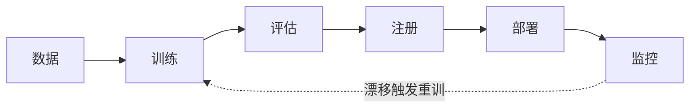

# MLOps机器学习工程化

> 📌 **导航**：本文是 **MLOps机器学习工程化** 词条（体系枢纽）。支柱入口：[[MLOps实践]]、[[MLflow 与 W&B 实验跟踪]]、[[构建流水线与 CI-CD 工具]]。

## 定义

**一句话定义：** 本篇是 MLOps 机器学习工程化的体系总览，按成熟度（0 手动 / 1 管道自动化 / 2 CI-CD-CT）组织从数据、训练、实验跟踪、模型注册到部署监控的自动化闭环，各支柱双链到对应专条。

**通俗类比：** MLOps 是"把模型从 notebook 养到生产、并持续照看"的流水线；成熟度模型像工厂自动化等级——从手工搬料到全流程流水线。本篇给分级地图，零件见各专条。

## 为什么需要它

模型上线只是开始：数据在漂、分布在变、还要复现与回滚。MLOps 用工程化把"一次性训练"变成"可持续、可复现、可监控"的自动流水线，而成熟度分级帮团队定位"该先补哪一环"。

## 核心机制

按成熟度逐级抬升，每一级都调用下游专条的能力：

- **级别 0（手动）**：实验散落在 notebook 与不同服务器、手工跑训练脚本、把模型文件手动复制到生产、几乎没有监控。代价是不可复现、部署易错、问题发现滞后——这是多数团队的起点，也是痛点。
- **级别 1（ML 管道自动化）**：把"数据准备→特征→训练→评估→部署"串成自动管道，支持定期或触发式重训（CT 雏形），并用 [[MLflow 与 W&B 实验跟踪]] 系统化记录参数 / 指标 / 产物、配基础监控。关键收益是可复现与自动重训。
- **级别 2（CI/CD/CT 全自动化）**：在 1 之上补齐持续集成 / 部署 / 训练、数据与模型测试（准确率 / 延迟 / 公平性）、实时漂移监控与自动告警、基础设施即代码；工具链与流水线细节见 [[构建流水线与 CI-CD 工具]]。

而 MLOps 的概念、组件与"做法"总纲（角色、监控指标体系、反模式）以 [[MLOps实践]] 为准，本篇不重复承载。

## 具体示例

一支团队从级别 0（手动搬 pkl）升级到级别 1：接入 MLflow 记录实验、把训练做成定时自动重训管道；再到级别 2：GitHub Actions 每日校验数据质量→自动训练→测试达标才注册→灰度上线→用 Prometheus 监控漂移、超阈触发重训。

## 何时用 / 何时不用

- **用**：模型要长期在线、需要复现 / 回滚 / 合规、或多人团队协作时。
- **不用**：单发实验或一次性交付不上线的模型——过度工程反而拖慢节奏。

## 优劣与代价

✅ 分级清晰，把工程化拆成可落地台阶，并指路到各支柱专条。
⚠️ 原文是超长实操教程（大量 MLflow / W&B / GH Actions / 监控代码），本篇只保留框架与索引，不复制其代码与 2026 细节。
⚠️ 原文部分章节被截断，本篇仅据现存文本处理、未据推测补写。

## 与相关概念的区别

- **vs [[MLOps实践]]**：那是概念与做法总纲，本篇按成熟度分级组织工程化闭环并索引到工具。
- **vs [[构建流水线与 CI-CD 工具]]**：后者专讲 CI/CD 工具链，本篇把 CT（持续训练）与漂移监控纳入更大闭环。

## 常见误区

- MLOps 成熟度越高越好，任何团队都应一步到位上 CI/CD/CT 全自动化。
- 上了 MLOps 就等于模型不会再出问题，不必再监控数据漂移。
- 实验跟踪和 CI/CD 是同一件事，装了其一就不用另一个。

## 面试速答

> 🎯 MLOps 工程化按成熟度分级：0 手动（实验散落、无监控）→ 1 管道自动化（自动训练重训 + MLflow/W&B 跟踪 + 基础监控）→ 2 CI/CD/CT（系统化测试、实时漂移监控、IaC）。价值是把一次性训练变成可复现、可回滚、可监控的持续流水线；各支柱双链到实验跟踪、CI/CD 工具与 MLOps 总纲。
> 🔍 追问：级别 1 与级别 2 的核心差别？（1 是训练管道自动化，2 再加 CI/CD/CT、系统化测试与实时漂移监控）
> 🔍 追问：为什么成熟度要"逐级"上？（每级解决前一级的痛点、成本与收益匹配团队规模，避免过度工程）

## 相关术语

[[MLOps实践]]、[[MLflow 与 W&B 实验跟踪]]、[[构建流水线与 CI-CD 工具]]、[[LLM应用开发完全指南]]、[[机器学习基础]]、[[深度学习从零到精通]]

## 参考资料

建议人工核验：本词条内容建议对照相关技术官方文档、权威教材与论文做准确性复核；未编造文献编号、标准号或 URL，如需引用请补充具体出处。
