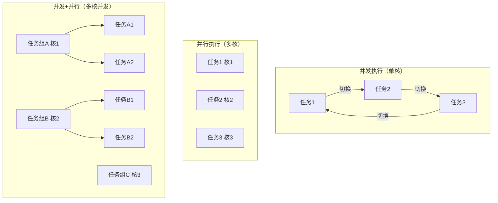

# 并发编程模式与实践

# 并发编程完全指南：从原理到实战

## 1. 并发 vs 并行：理解核心差异

### 1.1 概念辨析

**并发（Concurrency）** 是指多个任务在逻辑上同时处理的能力，它们可以在重叠的时间段内开始、运行和完成。并不要求物理上的同时执行，重点在于任务的调度和切换。

**并行（Parallelism）** 是指多个任务在物理上同时执行，需要多核处理器等硬件支持。

**关键区别**：并发是设计结构，并行是执行状态。一个程序可以是并发但非并行的（单核CPU上的多任务交替执行），也可以是并行的（多核CPU上真正同时执行）。

### 1.2 实例说明

```python
# 并发示例 - 单线程协作式调度（异步IO）
import asyncio

async def fetch_data(url):
    print(f"开始获取 {url}")
    await asyncio.sleep(1)  # 模拟IO操作
    print(f"完成获取 {url}")
    return f"{url} 的数据"

async def concurrent_example():
    # 三个任务并发执行，但可能是交替执行（单线程）
    tasks = [
        fetch_data("api.example.com"),
        fetch_data("db.example.com"),
        fetch_data("cache.example.com")
    ]
    results = await asyncio.gather(*tasks)
    return results

# 并行示例 - 多进程真正并行
from multiprocessing import Pool
import time

def parallel_task(x):
    time.sleep(1)
    return x * x

def parallel_example():
    with Pool(processes=4) as pool:  # 使用4个进程并行
        results = pool.map(parallel_task, [1, 2, 3, 4])
    return results
```

### 1.3 可视化对比



## 2. 线程模型深度解析

### 2.1 1:1 模型（内核级线程）

每个用户线程对应一个内核线程，操作系统直接管理。

**优点**：
- 真正并行，多核优势明显
- 一个线程阻塞不影响其他线程
- 利用操作系统调度器

**缺点**：
- 线程创建/切换开销大（用户态↔内核态切换）
- 每个线程需要独立栈空间

**实现**：Linux的pthread，Java的Thread

```c
// C语言 pthread 示例
#include <pthread.h>
#include <stdio.h>
#include <unistd.h>

void* thread_function(void* arg) {
    int id = *(int*)arg;
    printf("线程 %d 开始执行\n", id);
    sleep(1);
    printf("线程 %d 执行完成\n", id);
    return NULL;
}

int main() {
    pthread_t threads[3];
    int thread_args[3];
    
    for (int i = 0; i < 3; i++) {
        thread_args[i] = i;
        pthread_create(&threads[i], NULL, thread_function, &thread_args[i]);
    }
    
    for (int i = 0; i < 3; i++) {
        pthread_join(threads[i], NULL);
    }
    
    return 0;
}
```

### 2.2 N:1 模型（用户级线程）

多个用户线程映射到单个内核线程，由用户空间库调度。

**优点**：
- 线程切换在用户态完成，非常快
- 内存开销小
- 可定制调度策略

**缺点**：
- 一个线程阻塞导致所有线程阻塞
- 无法利用多核CPU
- 与系统调用兼容性差

**实现**：早期Green Threads，用户空间线程库

```go
// Go语言早期的N:1 M:N混合模型演示
package main

import (
    "fmt"
    "runtime"
    "sync"
    "time"
)

func main() {
    // 设置只使用单个OS线程
    runtime.GOMAXPROCS(1)
    
    var wg sync.WaitGroup
    wg.Add(2)
    
    // 两个goroutine在单个OS线程上交替执行
    go func() {
        defer wg.Done()
        for i := 0; i < 5; i++ {
            fmt.Println("Goroutine 1:", i)
            time.Sleep(10 * time.Millisecond)
        }
    }()
    
    go func() {
        defer wg.Done()
        for i := 0; i < 5; i++ {
            fmt.Println("Goroutine 2:", i)
            time.Sleep(10 * time.Millisecond)
        }
    }()
    
    wg.Wait()
}
```

### 2.3 M:N 模型（混合模型）

M个用户线程映射到N个内核线程（通常N ≤ CPU核数），结合了1:1和N:1的优点。

**实现复杂**：
- 需要用户空间调度器
- 线程阻塞处理复杂
- 栈管理和上下文切换复杂

**代表语言**：
- Go（Goroutine：M:N）
- Erlang（轻量级进程：M:N）
- Haskell（GHC Runtime：M:N）

```go
// Go的M:N调度模型
package main

import (
    "fmt"
    "runtime"
    "sync"
    "time"
)

func main() {
    // 使用所有可用CPU核心
    runtime.GOMAXPROCS(runtime.NumCPU())
    fmt.Printf("CPU核心数: %d\n", runtime.NumCPU())
    
    var wg sync.WaitGroup
    numGoroutines := 1000 // 创建1000个goroutine
    
    wg.Add(numGoroutines)
    
    start := time.Now()
    
    for i := 0; i < numGoroutines; i++ {
        go func(id int) {
            defer wg.Done()
            // 模拟一些计算
            sum := 0
            for j := 0; j < 1000000; j++ {
                sum += j
            }
            if id%100 == 0 {
                fmt.Printf("Goroutine %d 完成，结果: %d\n", id, sum)
            }
        }(i)
    }
    
    wg.Wait()
    elapsed := time.Since(start)
    fmt.Printf("1000个goroutine完成，耗时: %v\n", elapsed)
}
```

## 3. 互斥与同步机制详解

### 3.1 Mutex（互斥锁）

最基本的同步原语，保证同一时刻只有一个线程访问共享资源。

```rust
// Rust Mutex 示例
use std::sync::{Arc, Mutex};
use std::thread;

fn main() {
    let counter = Arc::new(Mutex::new(0));
    let mut handles = vec![];
    
    for _ in 0..10 {
        let counter = Arc::clone(&counter);
        let handle = thread::spawn(move || {
            let mut num = counter.lock().unwrap();
            *num += 1;
            println!("当前值: {}", *num);
            // 锁在作用域结束时自动释放
        });
        handles.push(handle);
    }
    
    for handle in handles {
        handle.join().unwrap();
    }
    
    println!("最终结果: {}", *counter.lock().unwrap());
}
```

### 3.2 Semaphore（信号量）

允许多个线程同时访问共享资源，控制并发数量。

```java
// Java Semaphore 示例 - 数据库连接池
import java.util.concurrent.Semaphore;
import java.util.concurrent.ExecutorService;
import java.util.concurrent.Executors;

public class ConnectionPool {
    private final Semaphore semaphore;
    private final int maxConnections;
    
    public ConnectionPool(int maxConnections) {
        this.maxConnections = maxConnections;
        this.semaphore = new Semaphore(maxConnections, true); // 公平信号量
    }
    
    public Connection getConnection() throws InterruptedException {
        semaphore.acquire(); // 获取许可，可能阻塞
        return createConnection();
    }
    
    public void releaseConnection(Connection conn) {
        if (conn != null) {
            conn.close();
            semaphore.release(); // 释放许可
        }
    }
    
    private Connection createConnection() {
        // 模拟创建连接
        return new Connection();
    }
    
    public static void main(String[] args) {
        ConnectionPool pool = new ConnectionPool(3); // 最多3个并发连接
        ExecutorService executor = Executors.newFixedThreadPool(10);
        
        for (int i = 0; i < 10; i++) {
            executor.submit(() -> {
                try {
                    Connection conn = pool.getConnection();
                    System.out.println(Thread.currentThread().getName() + " 获取连接");
                    Thread.sleep(1000); // 使用连接
                    pool.releaseConnection(conn);
                    System.out.println(Thread.currentThread().getName() + " 释放连接");
                } catch (InterruptedException e) {
                    Thread.currentThread().interrupt();
                }
            });
        }
        
        executor.shutdown();
    }
    
    static class Connection {
        public void close() {
            // 关闭连接
        }
    }
}
```

### 3.3 Condition Variable（条件变量）

允许线程等待特定条件成立，通常与互斥锁配合使用。

```cpp
// C++ 条件变量 - 生产者消费者模式
#include <iostream>
#include <queue>
#include <thread>
#include <mutex>
#include <condition_variable>

template<typename T>
class ConcurrentQueue {
private:
    std::queue<T> queue_;
    mutable std::mutex mutex_;
    std::condition_variable cond_;
    size_t max_size_;
    
public:
    ConcurrentQueue(size_t max_size) : max_size_(max_size) {}
    
    void push(T value) {
        std::unique_lock<std::mutex> lock(mutex_);
        
        // 等待直到队列有空间
        cond_.wait(lock, [this] {
            return queue_.size() < max_size_;
        });
        
        queue_.push(std::move(value));
        std::cout << "生产: " << value << ", 队列大小: " << queue_.size() << std::endl;
        
        // 通知消费者
        cond_.notify_one();
    }
    
    T pop() {
        std::unique_lock<std::mutex> lock(mutex_);
        
        // 等待直到队列非空
        cond_.wait(lock, [this] {
            return !queue_.empty();
        });
        
        T value = std::move(queue_.front());
        queue_.pop();
        std::cout << "消费: " << value << ", 队列大小: " << queue_.size() << std::endl;
        
        // 通知生产者
        cond_.notify_one();
        return value;
    }
};

int main() {
    ConcurrentQueue<int> queue(5);
    
    // 生产者线程
    std::thread producer([&queue] {
        for (int i = 0; i < 10; ++i) {
            queue.push(i);
            std::this_thread::sleep_for(std::chrono::milliseconds(100));
        }
    });
    
    // 消费者线程
    std::thread consumer([&queue] {
        for (int i = 0; i < 10; ++i) {
            int value = queue.pop();
            std::this_thread::sleep_for(std::chrono::milliseconds(200));
        }
    });
    
    producer.join();
    consumer.join();
    
    return 0;
}
```

### 3.4 RWLock（读写锁）

允许多个读线程并发访问，但写线程独占访问。

```go
// Go 读写锁示例 - 缓存实现
package main

import (
    "fmt"
    "sync"
    "time"
)

type Cache struct {
    data  map[string]string
    rwLock sync.RWMutex
}

func NewCache() *Cache {
    return &Cache{
        data: make(map[string]string),
    }
}

func (c *Cache) Get(key string) (string, bool) {
    c.rwLock.RLock()         // 读锁，允许多个并发读
    defer c.rwLock.RUnlock()
    
    value, exists := c.data[key]
    return value, exists
}

func (c *Cache) Set(key, value string) {
    c.rwLock.Lock()          // 写锁，独占访问
    defer c.rwLock.Unlock()
    
    c.data[key] = value
    fmt.Printf("设置缓存: %s = %s\n", key, value)
}

func (c *Cache) Delete(key string) {
    c.rwLock.Lock()
    defer c.rwLock.Unlock()
    
    delete(c.data, key)
    fmt.Printf("删除缓存: %s\n", key)
}

func main() {
    cache := NewCache()
    var wg sync.WaitGroup
    
    // 模拟多个读线程
    for i := 0; i < 5; i++ {
        wg.Add(1)
        go func(id int) {
            defer wg.Done()
            for j := 0; j < 3; j++ {
                key := fmt.Sprintf("key%d", j)
                if value, exists := cache.Get(key); exists {
                    fmt.Printf("读线程%d: %s = %s\n", id, key, value)
                }
                time.Sleep(50 * time.Millisecond)
            }
        }(i)
    }
    
    // 模拟写线程
    wg.Add(1)
    go func() {
        defer wg.Done()
        for i := 0; i < 3; i++ {
            key := fmt.Sprintf("key%d", i)
            value := fmt.Sprintf("value%d", i)
            cache.Set(key, value)
            time.Sleep(100 * time.Millisecond)
        }
    }()
    
    wg.Wait()
}
```

## 4. 无锁编程技术

### 4.1 CAS（Compare-And-Swap）

无锁编程的基础操作，通过原子比较并交换实现乐观锁。

```java
// Java CAS 示例 - 无锁计数器
import java.util.concurrent.atomic.AtomicInteger;

public class CASCounter {
    private AtomicInteger value = new AtomicInteger(0);
    
    public int increment() {
        int oldValue, newValue;
        do {
            oldValue = value.get();
            newValue = oldValue + 1;
        } while (!value.compareAndSet(oldValue, newValue)); // CAS操作
        return newValue;
    }
    
    public int get() {
        return value.get();
    }
    
    public static void main(String[] args) throws InterruptedException {
        CASCounter counter = new CASCounter();
        Thread[] threads = new Thread[10];
        
        for (int i = 0; i < 10; i++) {
            threads[i] = new Thread(() -> {
                for (int j = 0; j < 1000; j++) {
                    counter.increment();
                }
            });
            threads[i].start();
        }
        
        for (Thread thread : threads) {
            thread.join();
        }
        
        System.out.println("最终结果: " + counter.get()); // 10000
    }
}
```

### 4.2 原子操作

现代CPU提供的原子指令，保证操作的原子性。

```cpp
// C++ 原子操作示例
#include <atomic>
#include <thread>
#include <vector>
#include <iostream>

std::atomic<int> atomic_counter(0);
int non_atomic_counter = 0;

void increment_atomic() {
    for (int i = 0; i < 100000; ++i) {
        atomic_counter.fetch_add(1, std::memory_order_relaxed);
    }
}

void increment_non_atomic() {
    for (int i = 0; i < 100000; ++i) {
        non_atomic_counter++; // 竞态条件！
    }
}

int main() {
    {
        // 测试原子操作
        std::vector<std::thread> threads;
        for (int i = 0; i < 10; ++i) {
            threads.emplace_back(increment_atomic);
        }
        
        for (auto& t : threads) {
            t.join();
        }
        
        std::cout << "原子操作结果: " << atomic_counter << std::endl; // 1000000
    }
    
    {
        // 测试非原子操作（竞态条件）
        std::vector<std::thread> threads;
        for (int i = 0; i < 10; ++i) {
            threads.emplace_back(increment_non_atomic);
        }
        
        for (auto& t : threads) {
            t.join();
        }
        
        std::cout << "非原子操作结果: " << non_atomic_counter << std::endl; // 不确定，通常 < 1000000
    }
    
    return 0;
}
```

### 4.3 内存序（Memory Order）

控制内存访问的可见性和顺序性，影响性能和正确性。

```rust
// Rust 内存序示例
use std::sync::atomic::{AtomicBool, AtomicI32, Ordering};
use std::sync::Arc;
use std::thread;

fn main() {
    let data = Arc::new(AtomicI32::new(0));
    let ready = Arc::new(AtomicBool::new(false));
    
    let data_clone = Arc::clone(&data);
    let ready_clone = Arc::clone(&ready);
    
    // 生产者线程
    let producer = thread::spawn(move || {
        data_clone.store(42, Ordering::Relaxed);
        ready_clone.store(true, Ordering::Release); // Release保证之前的写操作对消费者可见
    });
    
    let data_clone = Arc::clone(&data);
    let ready_clone = Arc::clone(&ready);
    
    // 消费者线程
    let consumer = thread::spawn(move || {
        while !ready_clone.load(Ordering::Acquire) {} // Acquire保证看到生产者的写入
        
        let value = data_clone.load(Ordering::Relaxed);
        println!("读取到数据: {}", value); // 保证输出42
    });
    
    producer.join().unwrap();
    consumer.join().unwrap();
}
```

## 5. 并发数据结构

### 5.1 ConcurrentHashMap

分段锁实现的高并发哈希表。

```java
// Java ConcurrentHashMap 使用示例
import java.util.concurrent.ConcurrentHashMap;
import java.util.concurrent.CountDownLatch;

public class ConcurrentHashMapDemo {
    public static void main(String[] args) throws InterruptedException {
        ConcurrentHashMap<String, Integer> map = new ConcurrentHashMap<>();
        CountDownLatch latch = new CountDownLatch(10);
        
        // 多线程并发写入
        for (int i = 0; i < 10; i++) {
            final int threadId = i;
            new Thread(() -> {
                for (int j = 0; j < 1000; j++) {
                    String key = "key-" + threadId + "-" + j;
                    map.put(key, j);
                }
                latch.countDown();
            }).start();
        }
        
        latch.await();
        System.out.println("Map大小: " + map.size()); // 10000
        
        // 并发读取
        int sum = 0;
        for (int value : map.values()) {
            sum += value;
        }
        System.out.println("值总和: " + sum);
        
        // 原子操作示例
        map.computeIfAbsent("total", k -> 0);
        map.merge("total", 100, Integer::sum);
        System.out.println("Total值: " + map.get("total"));
    }
}
```

### 5.2 无锁队列（Lock-Free Queue）

基于CAS的无锁数据结构。

```cpp
// C++ 无锁队列实现
#include <atomic>
#include <memory>
#include <iostream>
#include <thread>
#include <vector>

template<typename T>
class LockFreeQueue {
private:
    struct Node {
        T data;
        std::atomic<Node*> next;
        
        Node(T val) : data(std::move(val)), next(nullptr) {}
    };
    
    std::atomic<Node*> head;
    std::atomic<Node*> tail;
    
public:
    LockFreeQueue() : head(nullptr), tail(nullptr) {
        // 创建一个哨兵节点
        Node* sentinel = new Node(T());
        head.store(sentinel);
        tail.store(sentinel);
    }
    
    ~LockFreeQueue() {
        while (Node* node = head.load()) {
            head.store(node->next);
            delete node;
        }
    }
    
    void enqueue(T value) {
        Node* new_node = new Node(std::move(value));
        Node* current_tail;
        
        while (true) {
            current_tail = tail.load();
            Node* next = current_tail->next.load();
            
            if (current_tail == tail.load()) { // 再次检查tail是否改变
                if (next == nullptr) {
                    // 尝试将新节点链接到当前尾部
                    if (current_tail->next.compare_exchange_weak(next, new_node)) {
                        break; // 成功链接
                    }
                } else {
                    // 尝试推进tail指针
                    tail.compare_exchange_weak(current_tail, next);
                }
            }
        }
        
        // 尝试将tail指向新节点
        tail.compare_exchange_weak(current_tail, new_node);
    }
    
    bool dequeue(T& result) {
        Node* current_head;
        
        while (true) {
            current_head = head.load();
            Node* current_tail = tail.load();
            Node* next = current_head->next.load();
            
            if (current_head == head.load()) {
                if (current_head == current_tail) {
                    if (next == nullptr) {
                        return false; // 队列为空
                    }
                    // tail指针落后，尝试推进
                    tail.compare_exchange_weak(current_tail, next);
                } else {
                    // 读取数据（在CAS之前，避免ABA问题）
                    result = next->data;
                    
                    // 尝试移动head指针
                    if (head.compare_exchange_weak(current_head, next)) {
                        delete current_head; // 安全删除旧节点
                        return true;
                    }
                }
            }
        }
    }
};

int main() {
    LockFreeQueue<int> queue;
    std::vector<std::thread> threads;
    
    // 生产者线程
    for (int i = 0; i < 4; i++) {
        threads.emplace_back([&queue, i] {
            for (int j = 0; j < 1000; j++) {
                queue.enqueue(i * 1000 + j);
            }
        });
    }
    
    // 消费者线程
    std::vector<int> results[4];
    for (int i = 0; i < 4; i++) {
        threads.emplace_back([&queue, &results, i] {
            int value;
            while (queue.dequeue(value)) {
                results[i].push_back(value);
            }
        });
    }
    
    for (auto& t : threads) {
        t.join();
    }
    
    // 验证结果
    int total = 0;
    for (int i = 0; i < 4; i++) {
        total += results[i].size();
    }
    
    std::cout << "总消费元素数: " << total << std::endl;
    
    return 0;
}
```

## 6. 协程（Coroutine）详解

### 6.1 Goroutine（Go）

轻量级协程，由Go运行时管理。

```go
// Go 协程示例 - 并发爬虫
package main

import (
    "fmt"
    "sync"
    "time"
)

type Result struct {
    URL  string
    Data string
    Err  error
}

func fetchURL(url string, ch chan<- Result) {
    // 模拟HTTP请求
    time.Sleep(time.Duration(100+len(url)*10) * time.Millisecond)
    
    if url == "http://invalid.example.com" {
        ch <- Result{URL: url, Err: fmt.Errorf("连接失败")}
        return
    }
    
    ch <- Result{
        URL:  url,
        Data: fmt.Sprintf("<html>%s的内容</html>", url),
    }
}

func main() {
    urls := []string{
        "http://example.com",
        "http://golang.org",
        "http://github.com",
        "http://invalid.example.com",
        "http://rust-lang.org",
    }
    
    results := make(chan Result, len(urls))
    var wg sync.WaitGroup
    
    start := time.Now()
    
    // 为每个URL启动一个goroutine
    for _, url := range urls {
        wg.Add(1)
        go func(u string) {
            defer wg.Done()
            fetchURL(u, results)
        }(url)
    }
    
    // 等待所有goroutine完成
    go func() {
        wg.Wait()
        close(results)
    }()
    
    // 收集结果
    for result := range results {
        if result.Err != nil {
            fmt.Printf("错误 %s: %v\n", result.URL, result.Err)
        } else {
            fmt.Printf("成功 %s: %s\n", result.URL, result.Data[:30]+"...")
        }
    }
    
    elapsed := time.Since(start)
    fmt.Printf("总耗时: %v\n", elapsed)
}
```

### 6.2 Kotlin Coroutines

结构化并发，支持挂起函数和协程作用域。

```kotlin
// Kotlin 协程示例 - 并发数据处理
import kotlinx.coroutines.*
import kotlin.system.measureTimeMillis

suspend fun fetchUser(userId: Int): String {
    delay(100) // 模拟网络请求
    return "用户$userId"
}

suspend fun fetchOrders(userId: String): List<Int> {
    delay(150) // 模拟数据库查询
    return List(3) { userId.hashCode() + it }
}

suspend fun processOrder(orderId: Int): String {
    delay(50) // 模拟处理逻辑
    return "订单$orderId已处理"
}

fun main() = runBlocking {
    val userIds = listOf(1, 2, 3, 4, 5)
    
    val time = measureTimeMillis {
        val userJobs = userIds.map { userId ->
            async {
                // 并发获取用户信息
                val user = fetchUser(userId)
                
                // 并发获取该用户的订单
                val orders = fetchOrders(user)
                
                // 并发处理每个订单
                val processedOrders = orders.map { orderId ->
                    async { processOrder(orderId) }
                }.awaitAll()
                
                "$user 的 ${processedOrders.size} 个订单处理完成"
            }
        }
        
        // 等待所有任务完成
        val results = userJobs.awaitAll()
        results.forEach { println(it) }
    }
    
    println("总耗时: ${time}ms")
}
```

### 6.3 Python asyncio

基于事件循环的异步编程。

```python
# Python asyncio 示例 - 并发API调用
import asyncio
import aiohttp
import time

async def fetch(session, url):
    async with session.get(url) as response:
        return await response.text()

async def process_data(data, url):
    # 模拟数据处理
    await asyncio.sleep(0.1)
    return f"处理 {url}: {len(data)} 字符"

async def main():
    urls = [
        'http://httpbin.org/delay/1',
        'http://httpbin.org/delay/2',
        'http://httpbin.org/delay/1',
    ]
    
    async with aiohttp.ClientSession() as session:
        # 并发获取所有URL
        fetch_tasks = [fetch(session, url) for url in urls]
        results = await asyncio.gather(*fetch_tasks)
        
        # 并发处理数据
        process_tasks = [process_data(data, url) for data, url in zip(results, urls)]
        processed = await asyncio.gather(*process_tasks)
        
        for result in processed:
            print(result)

# 使用信号量控制并发数
async def limited_main():
    semaphore = asyncio.Semaphore(3)  # 最多3个并发请求
    
    async def limited_fetch(session, url):
        async with semaphore:
            return await fetch(session, url)
    
    urls = [f'http://httpbin.org/delay/{i%3}' for i in range(10)]
    
    async with aiohttp.ClientSession() as session:
        tasks = [limited_fetch(session, url) for url in urls]
        return await asyncio.gather(*tasks)

if __name__ == "__main__":
    start = time.time()
    asyncio.run(main())
    print(f"耗时: {time.time() - start:.2f}秒")
```

## 7. Channel和CSP模型

### 7.1 Go Channel实现

Channel是Go中goroutine间通信的主要方式。

```go
// Go Channel高级用法
package main

import (
    "fmt"
    "sync"
    "time"
)

// 多路复用 - 同时监听多个Channel
func multiplexing() {
    ch1 := make(chan string)
    ch2 := make(chan string)
    
    go func() {
        time.Sleep(1 * time.Second)
        ch1 <- "来自ch1"
    }()
    
    go func() {
        time.Sleep(2 * time.Second)
        ch2 <- "来自ch2"
    }()
    
    for i := 0; i < 2; i++ {
        select {
        case msg := <-ch1:
            fmt.Println(msg)
        case msg := <-ch2:
            fmt.Println(msg)
        }
    }
}

// 带缓冲的Channel
func bufferedChannel() {
    ch := make(chan int, 3) // 缓冲大小为3
    
    go func() {
        for i := 0; i < 5; i++ {
            fmt.Printf("发送: %d\n", i)
            ch <- i // 前3个不会阻塞，第4个会阻塞
        }
        close(ch)
    }()
    
    time.Sleep(100 * time.Millisecond) // 让goroutine有机会发送
    
    for v := range ch {
        fmt.Printf("接收: %d\n", v)
    }
}

// Fan-out/Fan-in模式
func fanOutFanIn() {
    input := make(chan int)
    
    // Fan-out: 多个worker从同一个channel读取
    workers := 3
    chans := make([]chan int, workers)
    for i := 0; i < workers; i++ {
        chans[i] = make(chan int)
    }
    
    // 启动workers
    var wg sync.WaitGroup
    for i := 0; i < workers; i++ {
        wg.Add(1)
        go func(id int, out chan<- int) {
            defer wg.Done()
            for n := range input {
                result := n * n // 模拟计算
                fmt.Printf("Worker %d: %d -> %d\n", id, n, result)
                out <- result
            }
            close(out)
        }(i, chans[i])
    }
    
    // Fan-in: 合并多个channel到一个
    merged := make(chan int)
    go func() {
        var innerWg sync.WaitGroup
        for _, ch := range chans {
            innerWg.Add(1)
            go func(c <-chan int) {
                defer innerWg.Done()
                for v := range c {
                    merged <- v
                }
            }(ch)
        }
        innerWg.Wait()
        close(merged)
    }()
    
    // 发送数据
    go func() {
        for i := 0; i < 10; i++ {
            input <- i
        }
        close(input)
    }()
    
    // 接收结果
    for result := range merged {
        fmt.Printf("结果: %d\n", result)
    }
    
    wg.Wait()
}

func main() {
    fmt.Println("=== 多路复用 ===")
    multiplexing()
    
    fmt.Println("\n=== 带缓冲的Channel ===")
    bufferedChannel()
    
    fmt.Println("\n=== Fan-out/Fan-in ===")
    fanOutFanIn()
}
```

### 7.2 CSP（Communicating Sequential Processes）

"不要通过共享内存来通信，而要通过通信来共享内存"。

```go
// CSP模式实现 - 银行账户系统
package main

import (
    "fmt"
    "sync"
)

type Command struct {
    Action  string // "deposit", "withdraw", "balance"
    Amount  int
    Reply   chan int
}

type BankAccount struct {
    balance    int
    commands   chan Command
}

func NewBankAccount(initialBalance int) *BankAccount {
    acc := &BankAccount{
        balance:  initialBalance,
        commands: make(chan Command),
    }
    go acc.run()
    return acc
}

func (a *BankAccount) run() {
    for cmd := range a.commands {
        switch cmd.Action {
        case "deposit":
            a.balance += cmd.Amount
            cmd.Reply <- a.balance
        case "withdraw":
            if a.balance >= cmd.Amount {
                a.balance -= cmd.Amount
                cmd.Reply <- a.balance
            } else {
                cmd.Reply <- -1 // 表示余额不足
            }
        case "balance":
            cmd.Reply <- a.balance
        }
    }
}

func (a *BankAccount) Deposit(amount int) int {
    reply := make(chan int)
    a.commands <- Command{Action: "deposit", Amount: amount, Reply: reply}
    return <-reply
}

func (a *BankAccount) Withdraw(amount int) int {
    reply := make(chan int)
    a.commands <- Command{Action: "withdraw", Amount: amount, Reply: reply}
    return <-reply
}

func (a *BankAccount) Balance() int {
    reply := make(chan int)
    a.commands <- Command{Action: "balance", Reply: reply}
    return <-reply
}

func main() {
    account := NewBankAccount(1000)
    var wg sync.WaitGroup
    
    // 并发操作账户
    for i := 0; i < 10; i++ {
        wg.Add(1)
        go func(id int) {
            defer wg.Done()
            
            // 存款
            balance := account.Deposit(100)
            fmt.Printf("用户%d存入100，余额: %d\n", id, balance)
            
            // 取款
            if id%2 == 0 {
                balance = account.Withdraw(50)
                if balance >= 0 {
                    fmt.Printf("用户%d取出50，余额: %d\n", id, balance)
                } else {
                    fmt.Printf("用户%d取出50失败，余额不足\n", id)
                }
            }
        }(i)
    }
    
    wg.Wait()
    fmt.Printf("最终余额: %d\n", account.Balance())
    
    // 关闭账户（实际上会一直运行）
    // close(account.commands)
}
```

## 8. Actor模型

### 8.1 Akka（JVM）

基于消息传递的并发模型。

```java
// Java Akka Actor示例
import akka.actor.AbstractActor;
import akka