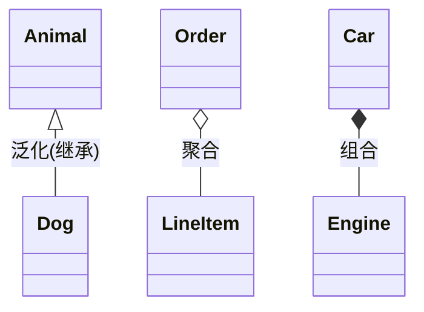

# UML

> 📌 **导航**：本文是 **UML** 词条，属于 software-engineering 术语集。相关枢纽：[[01-开发流程]]、[[02-版本控制]]、[[03-代码质量]]、[[04-CI CD]]、[[05-项目管理]]。

## 定义

**一句话定义：** UML（Unified Modeling Language，统一建模语言）是一种通用的、可视化的建模语言，用一组标准的图形化记号来描述软件系统的结构与行为，帮助在编码前及开发过程中沟通设计、记录架构与分析系统。

**通俗类比：** 像建筑的图纸与示意图——施工前先用统一图例画出平面结构、水电走向、施工流程，让设计师、工人、业主看同一套图就能理解，而不必等房子盖好才知道长啥样。

## 为什么需要它

软件是抽象的，团队对"系统长什么样、交互怎么走"各脑补一套，就会在编码后才发现分歧。UML 提供一套行业标准图形语言，把结构与行为可视化，让需求方、设计者、实现者在写代码前就能就同一张图讨论、评审、留档，降低沟通歧义与设计返工。

## 核心机制

- **两大类图**：
  - 结构图（静态）：类图、对象图、组件图、部署图、包图等，描述系统的静态组成。
  - 行为图（动态）：用例图、活动图、状态机图，以及交互图（时序图、通信图），描述系统的动态行为。
- **关系记号**：关联、聚合、组合、泛化（继承）、依赖——用不同箭头表达耦合强弱。
- **常用图**：类图、时序图、用例图、状态图、活动图。
- UML 由 OMG 维护，有 UML 2.x 等版本；它是建模语言，不限定开发模型。

## 具体示例

类图最核心的价值在于用箭头方向与形状区分关系强弱——泛化、聚合、组合一目了然：

## 何时用与何时不用

- **用**：面向对象分析与设计、复杂交互/状态梳理、架构文档、需求沟通与设计评审、逆向工程、教学。
- **不用**：简单到口头就能说清的逻辑、敏捷小团队里"够用即可"——别为画图而画图，避免过度建模让文档与代码脱节。

## 优劣与代价

✅ 标准化可视化、促进沟通与文档化，覆盖结构与行为，工具支持广。
✅ 统一记号降低团队沟通歧义。
⚠️ 图种类多，易陷入重文档轻代码的过度建模。
⚠️ 有学习成本；模型若不随代码更新会失效，敏捷中常作轻量使用。

## 与相关概念的区别

- **UML vs 方法学/流程**：UML 只规定"用什么图表达"，不规定"怎么开发"（瀑布/敏捷是方法学）。
- **聚合 vs 组合**：聚合（o--）是"整体可脱离部分"、部分可共享；组合（*--）是强拥有、整体销毁部分随之销毁。
- **结构图 vs 行为图**：前者刻画静态组成，后者刻画随时间发生的交互与状态变化。

## 常见误区

- UML 是一套软件开发方法或流程，规定了该怎么开发。
- 用 UML 就等于只画类图。
- 图画得越全越多，文档化就越到位。

## 面试速答

> 🎯 UML = 通用可视化建模语言，用标准图形记号描述软件系统的结构与行为，分结构图（类/组件/部署）与行为图（用例/活动/状态/时序）两大类，用于需求、设计沟通与文档化。
> 🔍 追问：UML 是方法学吗？和开发流程有何区别？
> 🔍 追问：类图里关联、聚合、组合怎么区分？

## 相关术语

[[设计原则]]、[[面向对象编程（OOP）概念]]、[[需求工程]]、[[架构模式]]、[[领域驱动设计DDD完全指南]]

## 参考资料

建议人工核验：UML 由 OMG（Object Management Group）维护，统一了 Booch、OMT、OOSE 等方法；可参考《UML 用户指南》（Booch 等）与 UML 2.x 规范。
