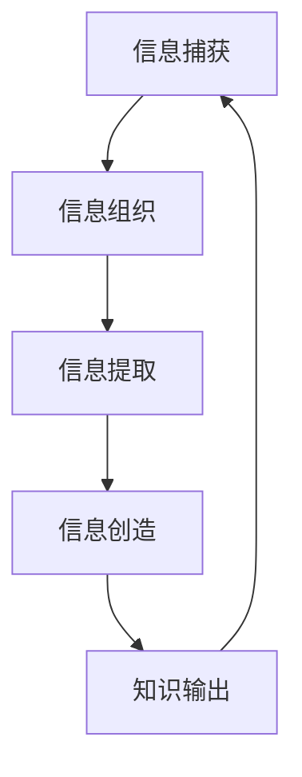
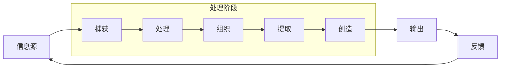

# 构建个人知识管理系统

# 构建个人知识管理系统（PKM）终极指南

## 一、 知识管理：为什么你需要一个“第二大脑”

在信息爆炸的时代，我们每天被海量的信息所淹没：文章、视频、播客、会议记录、灵感碎片...这些信息如果不经处理，会在几天内被遗忘90%以上。个人知识管理系统（Personal Knowledge Management, PKM）正是为了解决这一现代人核心痛点而生的系统化方法论。

**知识管理的核心价值体现在三个维度：**

1. **认知效率维度**
   - **减少重复劳动**：通过系统化存储，避免“我好像在哪里看过这个”的无效搜索
   - **增强记忆深度**：通过主动加工（笔记、链接、总结）将短期记忆转化为长期知识
   - **加速学习曲线**：新知识可以快速与已有知识网络建立连接，实现指数级理解增长

2. **创造力维度**
   - **激发意外连接**：通过双向链接、图谱可视化，让不同领域的想法产生碰撞
   - **支持渐进式写作**：积累的原子笔记成为未来创作的原材料库
   - **构建个人理论体系**：将碎片信息整合为结构化的个人知识框架

3. **职业发展维度**
   - **形成知识资产**：多年积累的知识库成为独特的竞争优势
   - **提升问题解决能力**：面对复杂问题时，能够快速调用相关知识和过往经验
   - **建立专业影响力**：持续输出高质量内容的基础

**案例研究**：一位产品经理通过PKM系统，将日常阅读的行业报告、用户反馈、竞品分析和自身产品数据建立连接，三年后自然形成了对所在领域的深刻洞察，成为团队中的“智囊”角色，并在内部分享中逐步建立了个人品牌。

---

## 二、 主流PKM工具深度对比

选择工具是构建PKM系统的起点，每种工具都有其哲学理念和适用场景。以下是对五大主流工具的深入分析：

### 工具特性对比矩阵

| 特性 | Obsidian | Notion | Logseq | Roam Research | Heptabase |
|------|----------|--------|--------|---------------|-----------|
| **核心理念** | 本地优先、双向链接 | 全能工作空间 | 大纲式、块级引用 | 网络化思维 | 可视化知识图谱 |
| **数据存储** | 本地Markdown文件 | 云端数据库 | 本地Markdown+Org | 云端数据库 | 云端数据库 |
| **双向链接** | 强大原生支持 | 有限支持 | 块级链接 | 核心特性 | 支持且可视化 |
| **图谱视图** | 优秀原生支持 | 无 | 基础支持 | 优秀 | 核心特性 |
| **离线使用** | 完全支持 | 有限支持 | 完全支持 | 有限支持 | 有限支持 |
| **扩展性** | 极强（社区插件） | 较强（模板、集成） | 较强（插件） | 有限 | 较弱 |
| **学习曲线** | 中等 | 低 | 中等 | 高 | 中等 |
| **适合人群** | 研究者、开发者 | 团队协作者 | 大纲爱好者 | 思想实验者 | 视觉思维者 |
| **定价模式** | 免费（同步服务收费） | 免费+付费订阅 | 完全免费 | $15/月 | 付费订阅 |

### 详细分析与选择建议

**1. Obsidian - 技术爱好者的瑞士军刀**
```markdown
# Obsidian核心优势
- **本地优先哲学**：所有笔记以纯文本Markdown存储在本地，你拥有完全的数据控制权
- **双向链接实现**：使用`[[双向链接]]`语法，构建知识网络
- **强大的插件生态**：400+社区插件，覆盖从日程管理到AI辅助的方方面面
- **图谱可视化**：直观展示笔记间的连接关系

# 典型使用场景
学术研究、软件开发文档、长期知识积累、隐私敏感内容
```

**2. Notion - 全能型数字化工作空间**
- **数据库驱动**：表格、看板、日历、画廊等多种视图
- **协作友好**：实时协作、评论、权限管理完善
- **模板丰富**：从项目管理到个人日记都有现成模板
- **局限**：本地化支持弱，深度双向链接能力有限

**3. Logseq - 大纲式思维的实践者**
- **块级引用**：每个段落都是一个独立块，可单独引用
- **每日笔记流**：以日期为中心，自然形成时间线
- **本地存储**：基于本地Markdown和Org文件
- **适合人群**：喜欢大纲结构、每日笔记习惯的用户

**4. Roam Research - 知识网络的先锋**
- **块级引用的开创者**：每个段落都有唯一ID，可任意引用
- **意外发现**：通过查询、块引用，轻松发现隐藏连接
- **缺点**：价格较高，学习曲线陡峭，云端存储

**5. Heptabase - 视觉化知识管理**
- **白板思维**：在可视化画布上组织卡片笔记
- **空间化思考**：通过空间布局表达想法关系
- **适合视觉思维者**：喜欢用图形化方式整理思路的用户

### 选择决策树

```
开始选择PKM工具
  ├── 数据隐私是否关键？
  │   ├── 是 → Obsidian/Logseq
  │   └── 否 → 继续评估
  ├── 是否需要团队协作？
  │   ├── 是 → Notion（首选）
  │   └── 否 → 继续评估
  ├── 你的思维模式是什么？
  │   ├── 网络化思维 → Roam/Obsidian
  │   ├── 大纲式思维 → Logseq
  │   ├── 数据库思维 → Notion
  │   └── 视觉化思维 → Heptabase
  └── 技术能力如何？
      ├── 低 → Notion/Heptabase
      ├── 中 → Obsidian/Logseq
      └── 高 → Roam（愿意接受高学习曲线）
```

---

## 三、 知识组织方法论

### 1. PARA方法 - 项目驱动的组织框架

PARA由Tiago Forte提出，将所有信息分为四个顶级类别：

```markdown
# PARA结构示例
Projects/          # 有明确目标和截止日期
  ├── 写一篇关于AI的文章
  ├── 开发个人网站
  └── 筹备产品发布会

Areas/             # 需要长期关注的责任领域
  ├── 健康管理
  ├── 职业发展
  └── 财务规划

Resources/         # 感兴趣但无立即义务的主题
  ├── 机器学习
  ├── 历史哲学
  └── 投资理财

Archives/          # 不再活跃的项目/已完成的内容
  ├── 旧项目文档
  └── 历史笔记
```

**PARA核心理念**：根据**可行动性**而非主题分类。最紧急、最相关的放在前面，保证系统的实用导向。

**实施技巧**：
- 每周回顾项目列表，决定是否归档
- 每个笔记必须归属于一个PARA类别
- 定期（季度）清理归档文件夹

### 2. Zettelkasten卡片笔记法 - 原子化知识构建

由德国社会学家卢曼实践并系统化的方法论，核心原则：

```markdown
# 卢曼卡片笔记法的三条规则
1. **原子性**：一张卡片只写一个想法
2. **用自己的话**：不是摘抄，而是理解后重述
3. **连接性**：每张卡片都要与其他卡片建立连接

# 卡片类型示例
## 文献笔记（Literature Notes）
- 来源：《思考，快与慢》第五章
- 原文摘要：人类决策系统分为系统1（快速、直觉）和系统2（缓慢、理性）
- 我的理解：这解释了为什么我们会做出后悔的决策，因为系统1常常主导

## 永久笔记（Permanent Notes）
- 概念：双系统决策模型
- 内容：认知心理学表明人类决策受两个系统影响...
- 连接：← 损失厌恶（卡片ID：20231015001）
        ← 认知偏见分类（卡片ID：20231010003）

## 索引笔记（Index Notes）
- 主题：认知心理学
- 相关卡片：[20231015001]双系统模型，[20231010003]认知偏见...
```

**Zettelkasten的现代实现**：
- 使用唯一ID作为卡片地址（如时间戳：202310151030）
- 通过双向链接建立非层级化连接
- 用标签系统实现多重分类

### 3. MOC（Map of Content） - 内容地图

MOC是连接笔记与主题的桥梁，不是传统的文件夹分类，而是动态的内容导航页：

```markdown
# 机器学习MOC示例

## 核心概念
- [[监督学习]] - 有标签数据的训练方式
- [[神经网络基础]] - 人工智能的基础架构
- [[特征工程]] - 数据预处理的关键步骤

## 实践应用
- [[图像分类实战]] - CNN在计算机视觉中的应用
- [[自然语言处理]] - 文本数据的处理方法

## 学习资源
- [[吴恩达机器学习课程笔记]]
- [[Python机器学习库Scikit-learn]]

## 最近学习
- 2023-10-15: 学习了[[Transformer架构]]的核心思想
- 2023-10-10: 实践了[[随机森林算法]]的参数调优

## 待探索
- [[强化学习基础]]
- [[生成对抗网络]]
```

**MOC的动态特性**：
- 随着知识增长不断扩展
- 提供多个入口点浏览同一主题
- 可以包含摘要、链接和思考，不只是链接列表

### 方法论融合实践

在实践中，这三种方法可以融合使用：

1. **用PARA管理项目流程**（顶层结构）
2. **用Zettelkasten原则处理具体知识**（底层操作）
3. **用MOC组织特定领域的知识网络**（中间层连接）

---

## 四、 构建你的第二大脑

### 第二大脑的核心隐喻

“第二大脑”（Second Brain）由Tiago Forte提出，不是简单地存储信息，而是构建一个**增强的外部认知系统**。它包含四个阶段：



### 构建第二大脑的七个步骤

**步骤1：明确你的“为什么”**
- 你的PKM要解决什么具体问题？
- 是为了学术研究、职业发展还是个人成长？
- 设定清晰的使用场景和成功标准

**步骤2：设计你的输入系统**
```markdown
# 输入源清单
- RSS订阅：Feedly、Inoreader
- 社交媒体：Twitter收藏、微信收藏
- 阅读应用：Kindle高亮、Pocket稍后读
- 会议记录：Notion会议模板、Obsidian会议笔记
- 灵感捕捉：手机便签、语音备忘录
- 学习平台：Coursera笔记、播客笔记
```

**步骤3：建立捕获协议**
- **即时捕获**：遇到有价值的信息，立即保存到收件箱
- **统一入口**：所有信息先进入单一收件箱，避免分散
- **最小化处理**：捕获时不做深度处理，只做简单标记

**步骤4：设计组织系统**
```python
# 组织系统配置示例
organization_system = {
    "PARA": {
        "Projects": "进行中项目",
        "Areas": "责任领域", 
        "Resources": "参考资料",
        "Archives": "归档内容"
    },
    "tagging": {
        "context": ["@work", "@home", "@reading"],
        "status": ["#todo", "#in-progress", "#done"],
        "type": ["#concept", "#tool", "#case-study"]
    },
    "linking": {
        "bidirectional": True,
        "backlinks": True,
        "unlinked_mentions": True
    }
}
```

**步骤5：设计输出管道**
- **日常回顾**：每周笔记整理和连接
- **项目输出**：将积累的知识转化为文章、报告、演示
- **定期分享**：通过博客、社交媒体、演讲输出知识

**步骤6：建立例行程序**
```markdown
# PKM例行程序示例
每日（5分钟）：
- 清空收件箱，快速分类
- 记录当日关键想法

每周（30分钟）：
- 整理本周笔记
- 建立新的双向链接
- 更新项目进展

每月（1小时）：
- 回顾PARA结构
- 清理归档内容
- 规划下月输入重点

每季度（2小时）：
- 评估系统有效性
- 调整组织方法
- 设定新学习目标
```

**步骤7：持续迭代优化**
- 每月尝试1-2个新功能或新流程
- 记录什么有效，什么无效
- 根据实际需求调整系统

### 第二大脑的神经科学基础

为什么第二大脑有效？因为它模拟了人脑的工作方式：
- **分布式存储**：像大脑的神经网络，信息分布式存储
- **连接优先**：连接比分类更重要，符合联想记忆原理
- **外部化减轻认知负荷**：将记忆负担转移给外部系统
- **主动检索强化记忆**：主动搜索和连接比被动复习更有效

---

## 五、 笔记最佳实践：原子化、链接与标签

### 1. 原子笔记原则

**什么是原子笔记**：
- 一个笔记只包含一个核心概念或想法
- 可以独立理解，不依赖上下文
- 通常200-500字为宜

**为什么需要原子化**：
```markdown
# 非原子化笔记的问题
## 学习机器学习笔记
今天学习了监督学习和无监督学习的区别。监督学习需要标签数据，无监督学习不需要。
神经网络是深度学习的基础，由多层神经元组成。
（这种笔记混合了多个概念，难以独立使用）

# 原子化解决方案
## 监督学习与无监督学习对比
- 核心区别：是否需要带标签的训练数据
- 典型算法：监督-回归、分类；无监督-聚类、降维
- 应用场景：监督-预测、识别；无监督-客户分群、异常检测
- 连接：← [[机器学习基础]]，→ [[数据标注方法]]

## 神经网络基本结构
- 组成：输入层、隐藏层、输出层
- 训练：通过反向传播调整权重
- 类型：前馈神经网络、循环神经网络
- 连接：← [[生物神经元模拟]]，→ [[深度学习框架]]
```

**原子化实践技巧**：
1. **写作时问自己**：“这个笔记如果被移动到完全不同的上下文，还能理解吗？”
2. **限制范围**：如果发现自己写了“并且”、“另外”、“同时”，考虑拆分笔记
3. **使用标题**：清晰标题本身就是原子化的体现

### 2. 双向链接的深度使用

双向链接是现代PKM系统的核心特性，超越简单的“引用”关系：

```markdown
# 高级链接策略

## 隐式链接（Unlinked Mentions）
许多PKM工具能识别提及但未创建链接的笔记
- Obsidian的Unlinked Mentions功能
- 可以发现潜在的知识连接

## 链接密度优化
- **关键概念**：高链接密度（被10+笔记链接）
- **一般概念**：中链接密度（被3-10笔记链接）
- **具体事实**：低链接密度（被0-2笔记链接）

## 链接类型区分
虽然语法相同，但链接意图不同：
- [[因果关系]]：A导致B
- [[对比关系]]：A与B的区别
- [[应用场景]]：A在B中的应用
- [[学习路径]]：学习A前应了解B

## 链接注释
使用特殊格式表达链接意图：
- 因为 → [[需求层次理论]] → 所以 [[产品设计原则]]
- 类似 → [[敏捷开发]] → 对比 → [[瀑布模型]]
```

**链接密度的可视化分析**：
```python
# 概念分析示例代码
def analyze_concept_density(vault_path):
    """分析笔记库中的概念密度和连接情况"""
    
    import os
    from collections import defaultdict
    
    concept_links = defaultdict(int)
    concept_backlinks = defaultdict(set)
    
    # 遍历所有笔记
    for root, dirs, files in os.walk(vault_path):
        for file in files:
            if file.endswith('.md'):
                with open(os.path.join(root, file), 'r') as f:
                    content = f.read()
                    
                    # 提取双向链接
                    import re
                    links = re.findall(r'\[\[(.*?)\]\]', content)
                    
                    for link in links:
                        concept_links[link] += 1
                        concept_backlinks[link].add(file)
    
    # 分析高连接度概念
    high_density = {k: v for k, v in concept_links.items() if v > 5}
    print("高密度概念（被多次链接）：")
    for concept, count in sorted(high_density.items(), key=lambda x: x[1], reverse=True)[:10]:
        print(f"  {concept}: 被 {count} 个笔记链接")
    
    # 分析孤立概念
    all_concepts = set(concept_links.keys())
    low_density = [c for c in all_concepts if concept_links[c] == 1]
    print(f"\n孤立概念数量: {len(low_density)}")
    
    return concept_links, concept_backlinks
```

### 3. 标签体系设计

标签是超越文件夹的另一种分类维度，好的标签系统应该是**多层次的、有语义的**：

```markdown
# 分层标签体系设计

## 一级标签：领域分类
- #science
- #technology  
- #philosophy
- #business
- #art

## 二级标签：主题细分
- #science/physics
- #science/biology
- #technology/programming
- #technology/ai

## 三级标签：具体内容
- #science/physics/quantum-mechanics
- #technology/programming/python
- #technology/ai/machine-learning

## 特殊功能标签
### 状态标签
- #status/todo
- #status/in-progress
- #status/done
- #status/waiting

### 类型标签  
- #type/concept
- #type/case-study
- #type/tool
- #type/reference

### 时间标签
- #time/urgent
- #time/this-week
- #time/someday

## 标签使用原则
1. **一致性**：同一概念始终使用相同标签
2. **具体性**：避免过于宽泛的标签如#important
3. **可维护性**：定期清理和合并相似标签
4. **工具支持**：利用工具的标签管理功能
```

**标签与链接的协同**：
- **标签**：用于“是什么类型”的分类
- **链接**：用于“与其他什么相关”的关系
- **两者结合**：实现多维度的知识发现

---

## 六、 知识的输入、处理、输出流程

### 完整知识工作流



### 1. 输入阶段：高质量信息源管理

**信息源评估矩阵**：
```markdown
| 信息源类型 | 信息质量 | 时间成本 | 维护成本 | 推荐频率 |
|-----------|----------|----------|----------|----------|
| 学术论文   | 高       | 高       | 低       | 深度研究时 |
| 专业书籍   | 高       | 中       | 中       | 每月1-2本 |
| 行业报告   | 中高     | 中       | 低       | 关键报告时 |
| 精选博客   | 中       | 低       | 中       | 每日浏览 |
| 社交媒体   | 低中     | 低       | 高       | 严格过滤后 |
| 播客/视频  | 中       | 中       | 低       | 通勤/锻炼时 |
```

**信息源优化策略**：
1. **多元化但不过度**：覆盖主要领域，但不追逐每个热点
2. **质量高于数量**：关注少数高质量源，而非众多低质源
3. **定期评估清理**：每季度评估信息源的价值，移除低效源
4. **主动发现**：通过引文网络发现高质量新源

### 2. 处理阶段：信息转化为知识的四步法

```python
# 信息处理四步法实现
class InformationProcessor:
    def __init__(self):
        self.inbox = []  # 收件箱
        self.processed = []  # 已处理
        self.output_ready = []  # 可输出
        
    def capture(self, item, source, context):
        """捕获阶段：快速保存，最小化处理"""
        captured_item = {
            'content': item,
            'source': source,
            'context': context,
            'timestamp': datetime.now(),
            'processed': False
        }
        self.inbox.append(captured_item)
        return captured_item
        
    def process_item(self, item):
        """处理阶段：深度理解，建立连接"""
        
        # 步骤1：理解与提取
        understanding = self.extract_key_points(item['content'])
        
        # 步骤2：连接与组织
        connections = self.find_connections(understanding)
        
        # 步骤3：原子化与重述
        atomic_notes = self.create_atomic_notes(understanding, connections)
        
        # 步骤4：整合与存储
        for note in atomic_notes:
            self.store_note(note)
            
        # 标记为已处理
        item['processed'] = True
        self.processed.append(item)
        
        return atomic_notes
        
    def extract_key_points(self, content):
        """提取核心观点，非简单摘抄"""
        # 使用费曼技巧：用简单语言解释复杂概念
        key_points = []
        
        # 提取主要论点
        # 识别证据和支持细节
        # 找出独特见解或新颖观点
        
        return key_points
        
    def find_connections(self, key_points):
        """查找与现有知识的连接"""
        connections = []
        
        for point in key_points:
            # 1. 搜索相关笔记
            related_notes = self.search_related(point)
            
            # 2. 识别概念重叠
            overlapping_concepts = self.find_overlaps(point, related_notes)
            
            # 3. 发现矛盾或补充
            conflicts_supports = self.analyze_relationships(point, related_notes)
            
            connections.append({
                'point': point,
                'related': related_notes,
                'overlaps': overlapping_concepts,
                'relationships': conflicts_supports
            })
            
        return connections
```

### 3. 输出阶段：知识的创造性输出

**输出类型金字塔**：
```
高原创性 ↑
        | 深度文章、研究报告
        | 系统课程、专著章节  
        | 分析报告、解决方案
        | 总结笔记、会议纪要
        | 摘要整理、资料汇编
低原创性 ↓
```

**渐进式输出策略**：
1. **微输出**（日常）：每日社交媒体分享、笔记整理
2. **小输出**（每周）：博客文章、内部分享
3. **中输出**（每月）：深度文章、案例研究
4. **大输出**（每季/年）：系列课程、研究报告、书籍章节

---

## 七、 AI辅助知识管理

### AI在PKM中的五大应用场景

**1. 智能信息捕获与预处理**
```python
# AI辅助的内容摘要和标签生成
import openai

def ai_summarize_and_tag(content):
    """使用AI自动生成摘要和标签"""
    
    prompt = f"""
    请为以下内容：
    1. 生成3-5个关键词标签
    2. 写一个简短摘要（100字内）
    3. 识别主要概念和观点
    4. 建议可能的相关链接
    
    内容：
    {content[:2000]}  # 限制输入长度
    
    请以JSON格式返回结果。
    """
    
    response = openai.ChatCompletion.create(
        model="gpt-4",
        messages=[
            {"role": "system", "content": "你是一位知识管理专家，擅长提取和组织信息。"},
            {"role": "user", "content": prompt}
        ],
        temperature=0.3  # 较低的随机性确保一致性
    )
    
    return parse_ai_response(response.choices[0].message.content)
```

**2. 知识图谱增强与连接发现**
```python
# 使用AI发现潜在知识连接
def discover_connections(note_content, existing_notes):
    """分析新笔记与现有知识库的潜在连接"""
    
    analysis_prompt = f"""
    新笔记内容：
    {note_content}
    
    现有笔记标题列表（部分）：
    {existing_notes[:50]}
    
    请分析：
    1. 这个新笔记与哪些现有笔记最相关？为什么？
    2. 是否存在跨领域的概念映射机会？
    3. 有哪些隐含的假设或前提可以进一步探讨？
    
    请列出前5个最有价值的潜在连接，并解释连接理由。
    """
    
    # 调用AI分析
    connections = ai_analyze(analysis_prompt)
    
    return connections
```

**3. 个性化学习路径推荐**
```python
# 基于知识图谱的个性化学习路径生成
def generate_learning_path(goal, current_knowledge, time_budget):
    """根据学习目标生成个性化路径"""
    
    prompt = f"""
    学习目标：{goal}
    
    当前知识状态：
    {current_knowledge}
    
    可用时间：每周{time_budget}小时
    
    请生成一个渐进式学习路径：
    1. 按逻辑顺序排列主题
    2. 标注每个主题的预计学习时间
    3. 推荐具体资源（书籍、课程、文章）
    4. 设计实践练习和项目
    
    路径应从当前状态平滑过渡到目标，避免跳跃过大。
    """
    
    return ai_generate_path(prompt)
```

**4. 创造性灵感激发**
```markdown
# AI辅助创意生成模板
## 随机概念组合
输入：从知识库中随机选择3-5个不相关概念
AI任务：生成这些概念之间的创新连接或应用场景

## 反向思维训练
输入：一个常见假设或原则
AI任务：生成反对观点或边界条件

## 跨域类比
输入：一个领域的问题
AI任务：从完全不同领域寻找类似问题的解决方案

## 未来情景构建
输入：当前趋势和技术发展
AI任务：预测5-10年后可能的场景和影响
```

**5. 知识质量与一致性检查**
```python
# 知识库质量检查
def quality_audit(vault_path):
    """定期知识库质量审计"""
    
    checks = {
        'orphan_notes': find_orphan_notes(vault_path),
        'weak_connections': identify_weak_links(vault_path),
        'inconsistent_tags': check_tag_consistency(vault_path),
        'outdated_content': find_outdated_notes(vault_path),
        'coverage_gaps': analyze_coverage_gaps(vault_path)
    }
    
    # 生成改进建议
    improvement_plan = generate_improvement_plan(checks)
    
    return improvement_plan
```

### AI集成的最佳实践

1. **保持人类在环**：AI提供建议，人类做最终决策
2. **明确AI边界**：AI适合处理模式识别、关联发现，人类负责深度思考和创新
3. **数据隐私考虑**：敏感信息避免发送到云端AI服务
4. **渐进式集成**：从简单功能开始，逐步扩展AI使用场景
5. **质量监控**：定期评估AI辅助的效果，避免依赖陷阱

### Obsidian中的AI插件示例

```yaml
# Obsidian + AI 配置示例
plugins:
  - name: "Obsidian AI Assistant"
    settings:
      openai_key: "your-api-key"
      features:
        - auto_summarize: true
        - tag_suggestions: true  
        - connection_discovery: true
        - content_expansion: true
      
  - name: "Text Generator"
    templates:
      daily_review: "分析今天的笔记，识别关键主题和未解决问题"
      knowledge_gap: "基于当前笔记库，推荐应探索的新领域"
      content_refinement: "改进这段文字的表达清晰度和逻辑性"
```

---

## 八、 实战：用Obsidian搭建完整PKM系统

### 第一步：基础架构设置

**文件夹结构**：
```
Vault/
├── 00-Inbox/            # 临时捕获，待处理
├── 01-Projects/         # 进行中的项目（PARA-P）
├── 02-Areas/            # 长期责任领域（PARA-A）
├── 03-Resources/        # 知识参考资料（PARA-R）
├── 04-Archives/         # 归档内容（PARA-A）
├── 05-MOC/              # 内容地图
├── 06-Templates/        # 模板库
├── 07-Daily/            # 每日笔记
└── 08-Attachments/      # 附件文件
```

**核心插件配置**：
```javascript
// .obsidian/app.json 核心配置
{
  "alwaysUpdateLinks": true,  // 自动更新链接
  "newLinkFormat": "shortest",  // 链接格式
  "useMarkdownLinks": false,  // 使用wiki链接
  "showFrontmatter": true,  // 显示前置信息
  "defaultViewMode": "source",  // 默认视图
  "strictLineBreaks": false
}
```

### 第二步：模板系统设计

**原子笔记模板**：
```markdown
---
title: {{title}}
tags: []
created: {{date:YYYY-MM-DD}}
updated: {{date:YYYY-MM-DD}}
type: concept
status: draft
---

## 核心概念
{{ }}

## 详细说明
{{ }}

## 关键点
- {{ }}

## 相关概念
- [[ ]]
- [[ ]]

## 来源
{{ }}

## 应用场景
{{ }}

## 待探索问题
- [ ] {{ }}
```

**项目模板**：
```markdown
---
title: {{title}}
type: project
priority: P1-P4
deadline: {{date}}
status: active
created: {{date:YYYY-MM-DD}}
---

## 项目目标
{{ }}

## 关键成果（OKR）
1. {{ }}
2. {{ }}
3. {{ }}

## 任务分解
### 阶段1：{{阶段名称}}
- [ ] 任务1
- [ ] 任务2

### 阶段2：{{阶段名称}}
- [ ] 任务1
- [ ] 任务2

## 资源需求
- 人力：{{ }}
- 时间：{{ }}
- 工具：{{ }}

## 相关笔记
- [[需求分析笔记]]
- [[技术方案笔记]]
- [[会议记录]]

## 进展更新
### {{date}}
- {{进展}}
```

### 第三步：工作流实现

**每日工作流脚本**：
```python
# Obsidian Python脚本示例（需安装Python插件）
import datetime
import os
from pathlib import Path

def daily_review_workflow(vault_path):
    """每日回顾工作流"""
    
    today = datetime.date.today().strftime("%Y-%m-%d")
    
    # 1. 清空收件箱
    inbox_path = Path(vault_path) / "00-Inbox"
    process_inbox(inbox_path)
    
    # 2. 更新每日笔记
    daily_template = Path(vault_path) / "06-Templates/daily.md"
    daily_note = Path(vault_path) / f"07-Daily/{today}.md"
    
    create_from_template(daily_template, daily_note, {
        'date': today,
        'inbox_count': count_files(inbox_path),
        'projects_update': get_active_projects(vault_path)
    })
    
    # 3. 自动生成连接建议
    generate_connection_suggestions(vault_path)
    
    # 4. 知识图谱维护
    update_knowledge_graph(vault_path)
    
    print(f"每日回顾完成: {today}")

def process_inbox(inbox_path):
    """处理收件箱"""
    for file in inbox_path.glob("*.md"):
        content = file.read_text()
        
        # AI辅助分类建议
        category = ai_suggest_category(content)
        
        # 移动到适当位置
        target_folder = get_target_folder(category)
        new_path = target_folder / file.name
        file.rename(new_path)
        
        # 更新链接
        update_links(file, new_path)
```

### 第四步：自定义CSS和界面优化

```css
/* .obsidian/snippets/knowledge-theme.css */
/* 知识图谱优化样式 */
.graph-view.color-fill-tag {
  /* 标签颜色配置 */
  background: var(--text-faint);
}

.graph-view.color-fill-attachment {
  /* 附件颜色 */
  background: var(--color-blue);
}

/* 双向链接样式 */
.cm-link {
  color: var(--color-accent);
  text-decoration: none;
}

.cm-link:hover {
  text-decoration: underline;
  background: var(--background-modifier-hover);
}

/* 前置信息美化 */
.frontmatter-container {
  background: var(--background-secondary);
  border-radius: 8px;
  padding: 12px;
  margin-bottom: 16px;
  border: 1px solid var(--background-modifier-border);
}

/* 知识卡片样式 */
.knowledge-card {
  background: var(--background-primary);
  border-left: 3px solid var(--color-ac