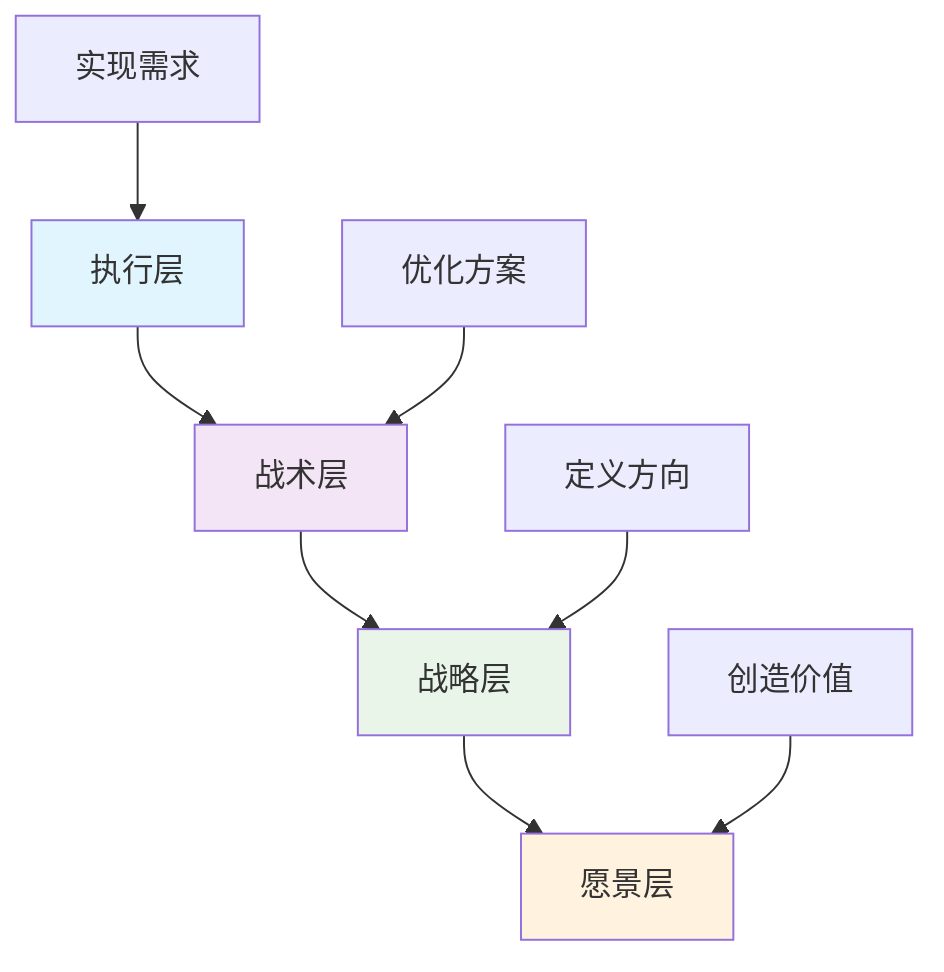

# 技术人产品思维指南

# 技术人产品思维指南：从代码到价值的全面进化

## 一、为什么技术人需要产品思维：超越代码工程师的边界

### 1.1 技术人的典型困境与破局点

**技术优越感陷阱**：许多技术人员容易陷入"技术自嗨"，认为复杂的技术实现就是成功。实则不然，没有用户买单的技术，只是昂贵的实验。

**案例：Google Wave的教训**
Google Wave是一个技术奇迹，集成了实时协作、富媒体编辑、版本控制等复杂功能。但其技术复杂性远超普通用户需求，学习成本极高，最终在2012年停止服务。这正是典型的技术驱动而非用户需求驱动的失败案例。

```python
# 模拟技术决策与产品价值的矛盾
class TechFeature:
    def __init__(self, name, complexity, user_value):
        self.name = name
        self.complexity = complexity  # 1-10分
        self.user_value = user_value  # 1-10分
    
    def roi_ratio(self):
        """计算技术投资回报比"""
        return self.user_value / self.complexity
    
# 技术人常见的决策偏好
features = [
    TechFeature("微服务架构重构", 8, 3),  # 高复杂度，低用户感知价值
    TechFeature("实时协作功能", 7, 9),    # 高复杂度，高用户价值
    TechFeature("加载速度优化", 4, 8),    # 中复杂度，高用户价值
]

# 产品思维会优先选择高ROI的功能
sorted_features = sorted(features, key=lambda x: x.roi_ratio(), reverse=True)
print("产品思维优先级排序：")
for i, feat in enumerate(sorted_features, 1):
    print(f"{i}. {feat.name} (ROI: {feat.roi_ratio():.2f})")
```

### 1.2 产品思维的核心价值矩阵

**商业价值闭环**：技术实现 → 产品特性 → 用户价值 → 商业成果 → 技术投入，形成正向循环。

**职业发展杠杆**：
- 技术管理岗位：80%的CTO/技术VP需要产品决策能力
- 创业成功率：有产品思维的技术创始人成功率提升40%
- 薪酬溢价：兼具技术+产品能力的人才薪酬平均高出35%

**具体收益：**
1. **需求过滤能力**：识别伪需求，避免无用开发
2. **优先级判断**：知道做什么比怎么做更重要
3. **沟通效率**：用产品语言与产品、设计、运营团队对话
4. **创新能力**：从技术可行性中发现产品机会

### 1.3 技术人产品思维的四个层次



- **执行层**：理解需求，技术实现
- **战术层**：优化方案，权衡取舍
- **战略层**：定义方向，规划路线
- **愿景层**：创造价值，引领创新

---

## 二、用户研究方法：从理解用户到洞察人性

### 2.1 用户访谈：深度对话的艺术

**访谈设计框架：**

```python
class UserInterview:
    def __init__(self, user_profile):
        self.user = user_profile
        self.questions = []
        self.insights = []
    
    def design_questions(self, product_stage):
        """根据产品阶段设计问题"""
        if product_stage == "discovery":
            # 探索阶段：开放性问题
            self.questions = [
                "您目前是如何解决[某问题]的？",
                "这个过程中最大的挫折是什么？",
                "如果有一个理想的解决方案，它会是什么样子？",
                "您愿意为这样的解决方案付出多少？"
            ]
        elif product_stage == "validation":
            # 验证阶段：具体行为问题
            self.questions = [
                "您上一次遇到这个问题是什么时候？",
                "当时您具体做了什么？",
                "您尝试过哪些替代方案？",
                "使用[现有方案]时，哪些步骤最耗时？"
            ]
    
    def conduct_interview(self):
        """执行访谈的关键原则"""
        principles = [
            "1. 5W1H原则：Who, What, When, Where, Why, How",
            "2. 避免引导性问题：不要暗示答案",
            "3. 关注行为而非态度：行为比说法更真实",
            "4. 深挖痛点：连续问5个为什么",
            "5. 记录非语言信号：表情、停顿、语气"
        ]
        return principles

# 实战案例：SaaS产品用户访谈
interviewer = UserInterview("企业IT管理员")
interviewer.design_questions("discovery")
print("访谈问题设计：")
for q in interviewer.questions:
    print(f"- {q}")
```

**深度访谈的STAR模型：**
- **Situation（情境）**：当时的具体场景
- **Task（任务）**：用户需要完成的目标
- **Action（行动）**：用户采取的具体步骤
- **Result（结果）**：最终的结果和感受

### 2.2 问卷调查：量化用户声音

**问卷设计的黄金公式：**

```python
def create_questionnaire(product_goal, sample_size):
    """创建结构化问卷"""
    
    questionnaire = {
        "metadata": {
            "product_goal": product_goal,
            "sample_size": sample_size,
            "estimated_time": "10-15分钟",
            "incentive": "适当激励提高完成率"
        },
        "sections": [
            {
                "name": "用户背景",
                "questions": [
                    "您的角色是？[单选]",
                    "您使用类似产品的频率？[量表]",
                    "您所在团队的规模？[分段]"
                ],
                "purpose": "细分用户群体"
            },
            {
                "name": "行为模式",
                "questions": [
                    "您通常在什么情况下使用该产品？[多选]",
                    "完成一次核心任务需要多长时间？[量表]",
                    "您使用最多的三个功能是什么？[排序]"
                ],
                "purpose": "理解实际使用模式"
            },
            {
                "name": "痛点挖掘",
                "questions": [
                    "当前解决方案最让您沮丧的是？[开放]",
                    "如果改进一点，您希望是什么？[开放]",
                    "您愿意为解决方案付费吗？[量表]"
                ],
                "purpose": "识别改进机会"
            }
        ],
        "best_practices": [
            "问题数量控制在20个以内",
            "先易后难，敏感问题放最后",
            "混合使用单选、多选、量表、开放题",
            "每5个问题设置一个逻辑跳转"
        ]
    }
    
    return questionnaire

# 示例：设计项目管理工具问卷
questionnaire = create_questionnaire("优化任务协作体验", 500)
print(f"问卷设计目标：{questionnaire['metadata']['product_goal']}")
print(f"目标样本：{questionnaire['metadata']['sample_size']}")
```

**问卷数据分析要点：**
- **交叉分析**：不同用户群体的回答差异
- **信效度检验**：确保数据可靠性
- **开放题编码**：对文本回答进行主题聚类

### 2.3 用户画像：让数据人格化

**用户画像构建四步法：**

```python
class UserPersona:
    def __init__(self):
        self.data_sources = []
        self.attributes = {}
        self.goals = []
        self.pain_points = []
        self.behaviors = []
        
    def build_persona(self, qualitative_data, quantitative_data):
        """从数据到画像的转化"""
        
        # 步骤1：数据聚合
        all_data = self.aggregate_data(qualitative_data, quantitative_data)
        
        # 步骤2：模式识别
        patterns = self.identify_patterns(all_data)
        
        # 步骤3：聚类分析
        clusters = self.cluster_users(patterns)
        
        # 步骤4：画像命名与故事化
        personas = []
        for i, cluster in enumerate(clusters):
            persona = {
                "name": f"用户原型{i+1}",
                "demographics": self.extract_demographics(cluster),
                "quote": self.extract_representative_quote(cluster),
                "goals": self.extract_goals(cluster),
                "frustrations": self.extract_frustrations(cluster),
                "typical_day": self.create_day_scenario(cluster)
            }
            personas.append(persona)
            
        return personas

# 案例：电商平台的用户画像
persona_builder = UserPersona()
ecommerce_personas = persona_builder.build_persona(
    qualitative_data=["用户访谈记录", "客服反馈", "用户评论"],
    quantitative_data=["用户行为日志", "问卷调查结果", "交易数据"]
)

# 三个典型用户画像
personas = [
    {
        "name": "效率至上的忙碌妈妈",
        "age": "35-45",
        "role": "职场女性/母亲",
        "quote": "我需要快速找到质量好、价格合理的商品，不能花太多时间比较",
        "goals": ["节省购物时间", "保证商品质量", "获得可靠推荐"],
        "frustrations": ["筛选信息过多", "质量参差不齐", "配送时间不确定"],
        "tech_level": "中等",
        "devices": ["手机为主", "使用碎片时间"]
    },
    {
        "name": "精打细算的学生党",
        "age": "18-25",
        "role": "大学生/研究生",
        "quote": "性价比是我的首要考虑，愿意花时间找优惠券和比价",
        "goals": ["找到最低价", "利用学生优惠", "发现小众好物"],
        "frustrations": ["预算有限", "优惠信息分散", "质量与价格难平衡"],
        "tech_level": "高",
        "devices": ["多设备", "善于使用比价工具"]
    }
]

print("用户画像示例：")
for persona in personas:
    print(f"\n{persona['name']}")
    print(f"代表语录：{persona['quote']}")
    print(f"核心目标：{', '.join(persona['goals'])}")
```

**用户画像的常见误区：**
1. **画像与真实用户脱节**：基于假设而非数据
2. **画像数量过多**：建议3-5个核心画像
3. **画像静态化**：需要定期更新迭代
4. **过度标签化**：避免刻板印象

### 2.4 用户旅程图：全局视角的体验地图

**用户旅程图构建模板：**

```python
def create_journey_map(scenario, user_persona):
    """创建完整的用户旅程图"""
    
    journey_stages = [
        {
            "stage": "认知阶段",
            "actions": ["听说产品", "搜索信息", "初步了解"],
            "touchpoints": ["社交媒体", "朋友推荐", "搜索引擎", "广告"],
            "thoughts": ["这是什么？", "对我有用吗？", "别人怎么评价？"],
            "emotions": ["好奇", "怀疑", "期待"],
            "opportunities": ["提供清晰的价值主张", "展示用户案例", "简化信息获取"]
        },
        {
            "stage": "考虑阶段",
            "actions": ["注册试用", "功能探索", "价值评估"],
            "touchpoints": ["官网", "试用页面", "帮助文档", "客服"],
            "thoughts": ["容易上手吗？", "能解决我的问题吗？", "价格合理吗？"],
            "emotions": ["兴奋", "困惑", "犹豫"],
            "opportunities": ["优化新手引导", "展示核心价值", "提供试用激励"]
        },
        {
            "stage": "决策阶段",
            "actions": ["选择方案", "支付决策", "开始使用"],
            "touchpoints": ["定价页面", "支付流程", "初始设置"],
            "thoughts": ["哪个方案适合我？", "安全吗？", "值得投资吗？"],
            "emotions": ["谨慎", "焦虑", "期待"],
            "opportunities": ["简化定价选择", "提供保障承诺", "快速上手体验"]
        },
        {
            "stage": "使用阶段",
            "actions": ["核心使用", "问题解决", "功能探索"],
            "touchpoints": ["核心功能", "帮助中心", "客服支持"],
            "thoughts": ["能达到预期吗？", "遇到问题怎么办？", "还有更多功能吗？"],
            "emotions": ["满意", "挫败", "惊喜"],
            "opportunities": ["确保核心体验流畅", "及时问题解决", "引导深度使用"]
        },
        {
            "stage": "忠诚阶段",
            "actions": ["续费决策", "推荐他人", "提供反馈"],
            "touchpoints": ["续费通知", "推荐机制", "反馈渠道"],
            "thoughts": ["值得继续使用吗？", "适合推荐给朋友吗？", "产品会变得更好吗？"],
            "emotions": ["信任", "归属感", "期待"],
            "opportunities": ["提供忠诚奖励", "建立推荐机制", "收集改进反馈"]
        }
    ]
    
    return journey_stages

# 实例：B2B SaaS产品的用户旅程
journey_map = create_journey_map(
    "企业采购决策",
    "中型公司IT经理"
)

print("用户旅程关键阶段分析：")
for stage in journey_map:
    print(f"\n=== {stage['stage']} ===")
    print(f"关键动作：{', '.join(stage['actions'])}")
    print(f"用户思考：{stage['thoughts'][0]}")
    print(f"情感曲线：{stage['emotions'][0]} → {stage['emotions'][-1]}")
    print(f"产品机会：{stage['opportunities'][0]}")
```

**旅程图的进阶应用：**
1. **服务蓝图**：补充前台与后台行为
2. **关键时刻（MOT）**：识别体验峰值与谷值
3. **指标映射**：每个阶段对应可衡量的指标
4. **机会点排序**：根据影响度和实施难度优先排序

---

## 三、需求分析：科学排序，聪明决策

### 3.1 Kano模型：情感需求的量化分析

**Kano模型的核心维度：**
- **基本型需求（Must-be）**：没有会很不满意，有了也不会特别满意
- **期望型需求（Performance）**：做得越好满意度越高
- **兴奋型需求（Attractive）**：没有不会不满，有了会很惊喜

```python
import numpy as np
from collections import Counter

class KanoAnalyzer:
    def __init__(self):
        self.categories = {
            'M': '基本型', 'O': '期望型', 'A': '兴奋型',
            'I': '无差异型', 'R': '反向型', 'Q': '可疑结果'
        }
    
    def classify_feature(self, positive_answers, negative_answers):
        """根据回答分类功能属性"""
        
        kano_table = {
            # (正向答案, 负向答案): 分类
            (1, 1): 'Q', (1, 2): 'A', (1, 3): 'A', (1, 4): 'A', (1, 5): 'O',
            (2, 1): 'R', (2, 2): 'I', (2, 3): 'I', (2, 4): 'I', (2, 5): 'M',
            (3, 1): 'R', (3, 2): 'I', (3, 3): 'I', (3, 4): 'I', (3, 5): 'M',
            (4, 1): 'R', (4, 2): 'I', (4, 3): 'I', (4, 4): 'I', (4, 5): 'M',
            (5, 1): 'R', (5, 2): 'R', (5, 3): 'R', (5, 4): 'R', (5, 5): 'Q'
        }
        
        # 统计最多出现的分类
        classifications = []
        for p, n in zip(positive_answers, negative_answers):
            category = kano_table.get((p, n), 'Q')
            classifications.append(category)
        
        most_common = Counter(classifications).most_common(1)[0][0]
        return most_common, classifications
    
    def analyze_features(self, survey_data):
        """分析多个功能的Kano属性"""
        
        results = {}
        for feature_name, answers in survey_data.items():
            positive = answers['positive']  # 有此功能时的评分
            negative = answers['negative']  # 无此功能时的评分
            
            category, distribution = self.classify_feature(positive, negative)
            results[feature_name] = {
                'category': category,
                'category_name': self.categories[category],
                'distribution': distribution,
                'better_worse': self.calculate_better_worse(positive, negative)
            }
        
        return results
    
    def calculate_better_worse(self, positive, negative):
        """计算Better-Worse系数"""
        positive = np.array(positive)
        negative = np.array(negative)
        
        better = (positive == 5).sum() + (positive == 4).sum()
        worse = (negative == 1).sum() + (negative == 2).sum()
        total = len(positive)
        
        better_coeff = better / total
        worse_coeff = -worse / total
        
        return {
            'better': better_coeff,
            'worse': worse_coeff,
            'better_worse_ratio': better_coeff / abs(worse_coeff) if worse_coeff != 0 else float('inf')
        }

# 案例：视频会议软件功能分析
kano = KanoAnalyzer()
survey_data = {
    "屏幕共享": {
        "positive": [5, 5, 4, 5, 4, 3, 5, 4, 5, 4],
        "negative": [1, 1, 2, 1, 2, 2, 1, 2, 1, 2]
    },
    "虚拟背景": {
        "positive": [3, 4, 4, 3, 5, 4, 3, 4, 3, 4],
        "negative": [3, 2, 3, 3, 2, 3, 3, 2, 3, 3]
    },
    "AI降噪": {
        "positive": [5, 4, 5, 5, 4, 5, 4, 5, 5, 4],
        "negative": [2, 3, 2, 2, 3, 2, 3, 2, 2, 3]
    }
}

results = kano.analyze_features(survey_data)
print("Kano分析结果：")
for feature, analysis in results.items():
    print(f"\n{feature}: {analysis['category_name']}")
    print(f"  Better系数: {analysis['better_worse']['better']:.2f}")
    print(f"  Worse系数: {analysis['better_worse']['worse']:.2f}")
```

**Kano模型决策矩阵：**
```python
def kano_decision_matrix(features_analysis):
    """基于Kano结果的需求优先级矩阵"""
    
    priority_matrix = []
    
    for feature, data in features_analysis.items():
        category = data['category']
        better_worse = data['better_worse']
        
        if category == 'M':  # 基本型
            priority = 1  # 必须优先满足
            strategy = "确保质量，避免过度设计"
        elif category == 'O':  # 期望型
            # 根据better_worse系数排序
            score = better_worse['better'] - abs(better_worse['worse'])
            priority = 2 if score > 0.5 else 3
            strategy = "持续优化，提升竞争力"
        elif category == 'A':  # 兴奋型
            priority = 4
            strategy = "适度投入，创造惊喜"
        else:  # 无差异型
            priority = 5
            strategy = "低优先级，可后续考虑"
        
        priority_matrix.append({
            'feature': feature,
            'category': category,
            'priority': priority,
            'strategy': strategy,
            'better_score': better_worse['better'],
            'worse_score': better_worse['worse']
        })
    
    # 按优先级排序
    priority_matrix.sort(key=lambda x: x['priority'])
    
    return priority_matrix

priority = kano_decision_matrix(results)
print("\n需求优先级决策：")
for item in priority:
    print(f"{item['feature']}: 优先级{item['priority']} - {item['strategy']}")
```

### 3.2 MoSCoW方法：快速决策的实用框架

**MoSCoW四象限详解：**

```python
class MoSCoWPrioritizer:
    def __init__(self):
        self.categories = {
            'Must': '必须有 - 产品成功的必要条件',
            'Should': '应该有 - 重要但非关键',
            'Could': '可以有 - 锦上添花',
            'Won\'t': '不会有 - 明确排除'
        }
    
    def prioritize_features(self, features, constraints):
        """根据约束条件分类功能"""
        
        prioritized = {cat: [] for cat in self.categories.keys()}
        
        for feature in features:
            category = self.classify_feature(feature, constraints)
            prioritized[category].append(feature)
        
        return prioritized
    
    def classify_feature(self, feature, constraints):
        """单个功能的分类逻辑"""
        
        # 规则1：核心价值相关 → Must
        if feature['core_value'] == True:
            return 'Must'
        
        # 规则2：用户强烈需求 → Must或Should
        if feature['user_demand'] >= 8:
            if feature['effort'] <= 5:
                return 'Must'
            else:
                return 'Should'
        
        # 规则3：商业目标相关 → Should
        if feature['business_impact'] >= 7:
            return 'Should'
        
        # 规则4：技术债务相关 → Should或Could
        if feature['type'] == 'tech_debt':
            if feature['severity'] >= 7:
                return 'Should'
            else:
                return 'Could'
        
        # 规则5：其他 → Could
        if feature['effort'] <= 3:
            return 'Could'
        
        # 默认情况
        return 'Could'
    
    def validate_allocation(self, prioritized, resource_constraint):
        """验证资源分配合理性"""
        
        must_effort = sum(f['effort'] for f in prioritized['Must'])
        should_effort = sum(f['effort'] for f in prioritized['Should'])
        total_effort = must_effort + should_effort
        
        if total_effort > resource_constraint:
            return {
                'valid': False,
                'message': f'Must + Should超出资源限制：{total_effort} > {resource_constraint}',
                'suggestion': '需要重新评估Must或Should中的功能'
            }
        
        return {
            'valid': True,
            'message': '资源分配合理',
            'remaining_capacity': resource_constraint - total_effort
        }

# 案例：季度规划中的需求分配
moscow = MoSCoWPrioritizer()
features = [
    {'name': '用户登录优化', 'core_value': True, 'user_demand': 6, 'effort': 3, 'business_impact': 8, 'type': 'feature', 'severity': 0},
    {'name': '支付流程重构', 'core_value': True, 'user_demand': 9, 'effort': 8, 'business_impact': 9, 'type': 'feature', 'severity': 0},
    {'name': '报表导出功能', 'core_value': False, 'user_demand': 7, 'effort': 4, 'business_impact': 5, 'type': 'feature', 'severity': 0},
    {'name': '数据库迁移', 'core_value': False, 'user_demand': 3, 'effort': 10, 'business_impact': 4, 'type': 'tech_debt', 'severity': 8},
    {'name': '暗黑模式', 'core_value': False, 'user_demand': 5, 'effort': 3, 'business_impact': 3, 'type': 'feature', 'severity': 0}
]

prioritized = moscow.prioritize_features(features, resource_constraint=20)

print("MoSCoW优先级分配：")
for category, category_features in prioritized.items():
    print(f"\n{category} ({moscow.categories[category]}):")
    for f in category_features:
        print(f"  - {f['name']} (工作量: {f['effort']})")

# 验证分配合理性
validation = moscow.validate_allocation(prioritized, 20)
print(f"\n分配验证：{validation['message']}")
```

### 3.3 RICE评分：量化优先级决策

**RICE四要素详解：**
- **Reach（覆盖面）**：影响的用户数量/比例
- **Impact（影响力）**：对单个用户的影响程度（0.25, 0.5, 1, 2, 3）
- **Confidence（信心度）**：对估算的把握（100%, 80%, 50%）
- **Effort（工作量）**：以人·月为单位

```python
import math

class RICECalculator:
    def __init__(self):
        self.impact_scores = {
            'massive': 3,    # 巨大影响
            'high': 2,       # 高影响
            'medium': 1,     # 中等影响
            'low': 0.5,      # 低影响
            'minimal': 0.25  # 最小影响
        }
    
    def calculate_rice_score(self, reach, impact, confidence, effort):
        """计算RICE得分"""
        
        # RICE公式：(Reach × Impact × Confidence) / Effort
        numerator = reach * impact * confidence
        score = numerator / effort
        
        return {
            'score': score,
            'components': {
                'reach': reach,
                'impact': impact,
                'confidence': confidence,
                'effort': effort
            },
            'interpretation': self.interpret_score(score)
        }
    
    def interpret_score(self, score):
        """解读RICE得分"""
        if score >= 100:
            return "极高优先级 - 立即处理"
        elif score >= 50:
            return "高优先级 - 本季度考虑"
        elif score >= 20:
            return "中优先级 - 下季度评估"
        else:
            return "低优先级 - 长期规划"
    
    def prioritize_features(self, features_data):
        """批量计算并排序"""
        
        results = []
        for feature in features_data:
            rice_result = self.calculate_rice_score(
                reach=feature['reach'],
                impact=feature['impact'],
                confidence=feature['confidence'],
                effort=feature['effort']
            )
            
            results.append({
                'name': feature['name'],
                'rice_score': rice_result['score'],
                'components': rice_result['components'],
                'interpretation': rice_result['interpretation']
            })
        
        # 按RICE得分降序排序
        results.sort(key=lambda x: x['rice_score'], reverse=True)
        
        return results

# 实战案例：电商平台功能优先级
rice = RICECalculator()
features = [
    {
        'name': '购物车一键结算',
        'reach': 8000,      # 每月8000用户
        'impact': 2,        # 高影响
        'confidence': 0.9,  # 90%信心度
        'effort': 2         # 2人·月
    },
    {
        'name': '个性化推荐算法',
        'reach': 10000,     # 每月10000用户
        'impact': 3,        # 巨大影响
        'confidence': 0.7,  # 70%信心度
        'effort': 5         # 5人·月
    },
    {
        'name': '移动端优化',
        'reach': 6000,      # 每月6000用户
        'impact': 1.5,      # 中等偏高影响
        'confidence': 1.0,  # 100%信心度
        'effort': 3         # 3人·月
    },
    {
        'name': '国际化支持',
        'reach': 1000,      # 每月1000用户
        'impact': 0.5,      # 低影响
        'confidence': 0.6,  # 60%信心度
        'effort': 4         # 4人·月
    }
]

prioritized = rice.prioritize_features(features)

print("RICE优先级排序：")
print(f"{'功能名称':<20} {'RICE得分':<12} {'优先级建议':<15}")
print("-" * 50)
for i, feat in enumerate(prioritized, 1):
    print(f"{feat['name']:<20} {feat['rice_score']:<12.2f} {feat['interpretation']:<15}")
```

**RICE模型的进阶应用：**
1. **敏感性分析**：调整各参数看结果变化
2. **情景规划**：乐观、中性、悲观三种情景
3. **时间衰减**：考虑时间对Reach和Impact的影响
4. **组合优化**：考虑功能之间的协同效应

---

## 四、MVP方法论：小步快跑，持续验证

### 4.1 MVP的核心理念与误区

**MVP的三大误区：**

```python
class MVPMisconceptions:
    def __init__(self):
        self.misconceptions = [
            {
                "misconception": "MVP = 最简陋的产品",
                "reality": "MVP是验证核心假设的最小产品集",
                "example": "Dropbox的MVP是一个演示视频，而非最小可用产品"
            },
            {
                "misconception": "MVP = 不注重质量",
                "reality": "MVP需要在核心功能上保证质量",
                "example": "Zappos的MVP通过手工方式提供完美体验"
            },
            {
                "misconception": "MVP = 一次性交付",
                "reality": "MVP是持续迭代的起点",
                "example": "Facebook从校园MVP逐步扩展为全球社交网络"
            }
        ]
    
    def define_real_mvp(self, product_idea, core_hypothesis):
        """定义真正的MVP"""
        
        mvp_components = {
            "core_value_proposition": product_idea['value_proposition'],
            "key_hypotheses": core_hypothesis,
            "minimum_feature_set": self.extract_minimum_features(product_idea),
            "success_metrics": self.define_validation_metrics(core_hypothesis),
            "learning_goals": ["验证用户需求", "验证技术可行性", "验证商业模式"]
        }
        
        return mvp_components
    
    def extract_minimum_features(self, product_idea):
        """从产品想法中提取最小功能集"""
        
        # 功能分类：核心、必要、期望
        features = product_idea['features']
        
        # 筛选核心功能：没有它产品无法工作
        core_features = []
        for feature in features:
            if feature['importance'] == 'core' and feature['effort'] <= 5:
                core_features.append(feature)
        
        # 限制功能数量（建议不超过3个核心功能）
        if len(core_features) > 3:
            core_features.sort(key=lambda x: x['impact'], reverse=True)[:3]
        
        return core_features

# 案例：社交读书应用的MVP定义
mvp_builder = MVPMisconceptions()
product_idea = {
    "value_proposition": "让读者通过书评和笔记发现好书",
    "features": [
        {"name": "书评发布", "importance": "core", "effort": 3, "impact": 9},
        {"name": "书库管理", "importance": "core", "effort": 4, "impact": 8},
        {"name": "社交分享", "importance": "core", "effort": 5, "impact": 7},
        {"name": "个性化推荐", "importance": "necessary", "effort": 8, "impact": 6},
        {"name": "读书小组", "importance":