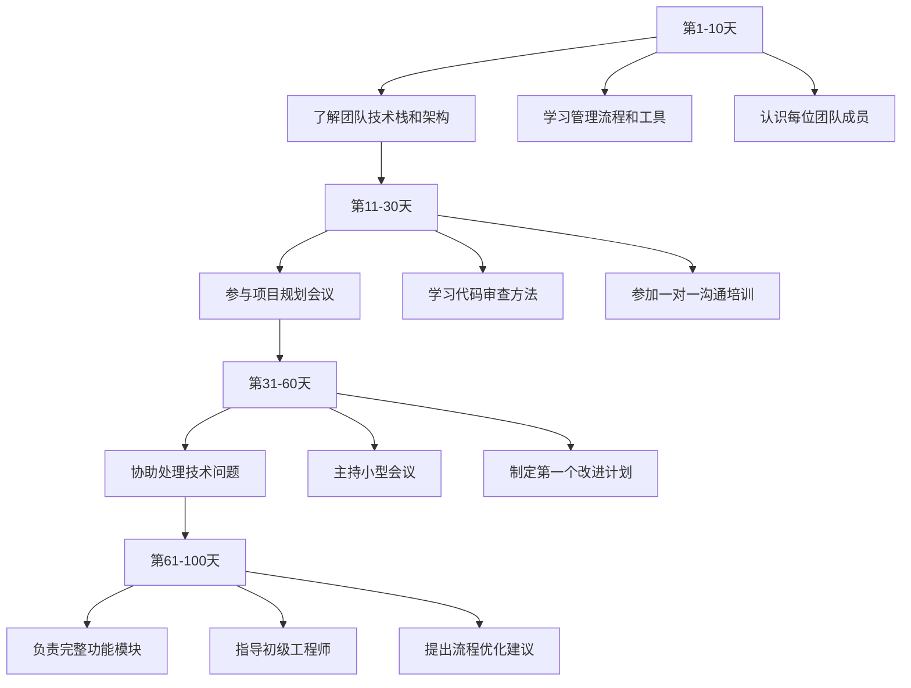

# 技术人职业转型完全指南

# 技术人职业转型完全指南

## 第一章：什么时候该考虑转型——识别信号与把握时机

### 1.1 职业倦怠的八大信号

作为一名有15年技术从业经验的专业人士，我见证过无数技术人的职业转折点。转型不是因为失败，而是为了更好成长。以下是需要认真考虑转型的信号：

**信号一：技术学习曲线趋于平缓**
```python
# 模拟技术成长曲线
import matplotlib.pyplot as plt
import numpy as np

years = np.arange(0, 15)
learning_curve = 100 * (1 - np.exp(-0.3 * years))
plateau_curve = 80 * np.ones(15)

plt.figure(figsize=(10, 6))
plt.plot(years, learning_curve, label='典型学习曲线', linewidth=2)
plt.plot(years, plateau_curve, '--', label='平台期曲线', linewidth=2)
plt.axvline(x=8, color='r', linestyle=':', label='转型建议时机')
plt.xlabel('工作年限')
plt.ylabel('技术能力指数')
plt.title('技术能力成长曲线分析')
plt.legend()
plt.grid(True)
plt.show()
```

当你发现自己连续2-3年没有显著的技术突破，每天的工作变成了重复的CRUD操作，学习新技术的兴奋感消失，这就是第一个明确信号。

**信号二：职业天花板显现**
我曾在一家大型互联网公司目睹一位资深工程师的困境：他在P7级别停留了5年，虽然技术过硬，但公司架构决定了P8晋升名额极其有限。这种结构性瓶颈不是个人能改变的。

**信号三：兴趣点明显转移**
李明的故事很典型：他原本是Java后端专家，但逐渐对产品设计、用户体验产生浓厚兴趣，经常主动参与产品讨论，甚至自学了Figma和用户调研方法。

**信号四：价值感缺失**
当你感觉自己只是"功能实现工具"，而不是问题解决者或价值创造者时，需要重新思考职业定位。

**信号五：市场价值偏离**
定期进行市场价值评估很重要：
```
市场价值 = 技术稀缺性 × 市场需求 × 软技能溢价
```
如果你的技术栈市场价值持续下降，就需要考虑技能更新或方向转型。

**信号六：生活阶段变化**
家庭责任增加、健康考虑、地域限制等生活因素变化，可能要求更灵活或更稳定的工作模式。

**信号七：行业趋势洞察**
2018年，我注意到传统移动开发增长放缓，而云原生和AI工程化开始崛起，提前布局转型的开发者获得了先发优势。

**信号八：组织环境不适**
公司文化、管理风格、团队氛围等不匹配，且无法通过内部调整解决时。

### 1.2 最佳转型时机评估矩阵

| 评估维度 | 低风险时机 | 中等风险 | 高风险 |
|---------|-----------|----------|--------|
| 经济环境 | 经济扩张期 | 稳定期 | 衰退期 |
| 个人财务 | 有6个月以上储备 | 3-6个月储备 | 无储蓄 |
| 技能准备 | 已完成技能储备 | 部分准备 | 从零开始 |
| 家庭支持 | 完全支持 | 有条件支持 | 反对 |
| 年龄因素 | 28-35岁 | 35-42岁 | 42岁以上 |
| 行业时机 | 新兴领域早期 | 成长期 | 成熟期 |

**黄金公式：转型准备度 = (技能储备 × 0.3) + (财务准备 × 0.25) + (心理准备 × 0.2) + (机会成本评估 × 0.15) + (支持系统 × 0.1)**

## 第二章：转型方向深度分析与选择指南

### 2.1 技术管理方向

**能力要求金字塔：**
```
           ┌─────────────┐
           │   战略思维    │ (高层管理)
           ├─────────────┤
           │   组织能力    │ (中层管理)
           ├─────────────┤
           │  项目管理     │ (基层管理)
           ├─────────────┤
           │   技术深度    │ (技术基础)
           └─────────────┘
```

**具体能力清单：**
- 技术判断力：能评估技术方案的长期影响
- 沟通协调：跨部门、跨团队协作能力
- 人才识别：面试、评估、培养技术人员的能力
- 进度控制：风险管理、资源分配
- 技术视野：行业趋势、技术选型

**收入预期（2023年一线城市数据）：**
```json
{
  "技术经理": {
    "P7级": "40-60万/年",
    "P8级": "60-90万/年",
    "P9级": "90-130万/年"
  },
  "技术总监": {
    "中小型公司": "100-150万/年",
    "大型公司": "150-300万/年"
  },
  "CTO": {
    "A轮公司": "80-120万+期权",
    "上市公司": "200-500万+股权"
  }
}
```

**发展前景分析：**
技术管理路径清晰，但竞争激烈。需要持续提升管理能力，同时保持技术敏感度。35岁以上纯技术转型管理更具优势，年轻管理者需要更早建立权威。

**转型案例：** 张华从高级前端开发转型为技术总监，关键转折点是主动承担了一个跨部门重构项目，展现了技术决策和团队协调能力。

### 2.2 技术架构师方向

**核心能力模型：**

1. **抽象能力**：从业务需求到技术方案的抽象转化
2. **全局视野**：系统、业务、技术的全景认知
3. **技术深度**：至少精通1-2个技术领域
4. **演进设计**：系统可扩展、可维护的设计能力
5. **权衡艺术**：在性能、成本、时间之间做出最佳平衡

**收入与发展阶梯：**
```yaml
架构师发展路径:
  初级架构师 (3-5年经验):
    薪资范围: 40-60万
    关键能力: 单个系统架构设计
    
  中级架构师 (5-8年经验):
    薪资范围: 60-100万
    关键能力: 领域架构设计，跨系统协调
    
  高级架构师 (8年以上):
    薪资范围: 100-200万
    关键能力: 企业级架构，技术战略规划
    
  首席架构师:
    薪资范围: 200-500万+
    关键能力: 技术愿景规划，技术文化建设
```

**发展前景：**
云原生、大数据、AI等新兴领域对架构师需求旺盛。架构师越老越吃香，但需要持续学习，避免技术栈固化。

### 2.3 技术专家/科学家方向

**细分领域选择：**
- AI算法工程师
- 数据库内核专家
- 分布式系统专家
- 安全攻防专家
- 性能优化专家

**能力要求：**
深度 > 广度，需要持续深入某个技术领域，产出技术专利、论文、开源项目等成果。

**收入参考：**
- 初级专家：50-80万
- 中级专家：80-120万
- 顶级专家：120-300万+（含股票期权）

**发展挑战：** 路径狭窄，需要极致专注，市场职位相对较少。

### 2.4 技术创业方向

**能力矩阵分析：**
```python
class TechEntrepreneur:
    def __init__(self):
        self.technical_skills = 0.4  # 权重
        self.business_sense = 0.3
        self.leadership = 0.2
        self.risk_tolerance = 0.1
        
    def readiness_score(self):
        # 需要各项能力都达到阈值
        scores = {
            '技术': self._evaluate_tech(),
            '商业': self._evaluate_business(),
            '领导': self._evaluate_leadership(),
            '风险': self._evaluate_risk()
        }
        
        min_score = min(scores.values())
        if min_score < 0.6:
            return "不建议创业"
        
        total = sum(scores[k] * getattr(self, f'{k}_skills') 
                   for k in scores if hasattr(self, f'{k}_skills'))
        return f"创业准备度: {total:.2f}"
```

**成功率和收入预期：**
- 第1年：多数亏损，个人收入大幅下降
- 第2-3年：生死期，成功者开始盈利
- 第5年后：成功企业估值可达千万至亿级
- 统计数据：首次创业成功率约10%，技术背景创始人成功率略高

**适合人群：** 有商业嗅觉、能承受压力、有资源积累、年龄30-45岁最佳。

### 2.5 自由职业方向

**可行模式：**
1. **技术顾问**：按小时收费，300-1000元/小时
2. **独立开发者**：开发SaaS产品，收入波动大
3. **技术教练**：一对一辅导，500-2000元/小时
4. **远程合同工**：为海外公司远程工作，收入可达国内2-3倍

**收入参考：**
```
自由职业者年收入分布 (基于1000份样本):
- 初级 (<1年): 15-30万 (60%的自由职业者)
- 中级 (1-3年): 30-80万 (25%)
- 高级 (>3年): 80-200万 (10%)
- 顶尖: 200万+ (5%)
```

**关键成功因素：** 自律能力、个人品牌、客户网络、时间管理。

### 2.6 技术咨询方向

**能力要求：**
- 深厚的技术背景
- 出色的沟通和演示能力
- 快速学习新领域的能力
- 问题诊断和解决框架
- 项目管理和交付能力

**收入模式：**
- 按项目收费：中小型项目10-50万
- 按小时收费：高级顾问800-2000元/小时
- 顾问费+绩效奖金

**发展路径：** 从技术顾问到解决方案架构师，最终可创立咨询公司。

### 2.7 技术写作方向

**变现渠道：**
1. **技术博客**：广告、赞助、付费专栏
2. **技术书籍**：版税收入，通常10-30万/本（畅销书）
3. **技术文档**：为企业编写技术文档，项目制收费
4. **技术课程**：视频课程、训练营，收入可观
5. **技术翻译**：翻译收入50-200元/千字

**成功案例：** 某知名技术博主通过写作+课程，年收入超过200万，建立了个人品牌。

### 2.8 技术教育方向

**模式分析：**
- **在线教育**：录制课程、直播教学
- **企业培训**：为企业定制培训，日薪5000-20000元
- **高校/职校**：稳定性高，收入中等
- **训练营**：短期高强度培训，收入高但压力大

**收入预期：**
- 兼职讲师：20-50万/年
- 全职讲师：50-150万/年
- 培训机构创始人：百万级+

## 第三章：转型前的系统性准备

### 3.1 技能储备三维模型

**技术能力准备：**
```python
def skill_preparation(target_direction):
    """
    技能准备清单生成器
    """
    skills = {
        "技术管理": [
            "项目管理(PMP/Scrum认证)",
            "团队管理基础",
            "跨部门沟通技巧",
            "技术决策方法论",
            "人才培养体系"
        ],
        "架构师": [
            "架构设计模式深入",
            "分布式系统原理",
            "云原生技术栈",
            "技术选型方法论",
            "架构演进策略"
        ],
        "技术专家": [
            "所在领域深度研究",
            "开源项目贡献",
            "技术专利申请",
            "论文发表能力",
            "技术难点突破"
        ]
    }
    
    if target_direction in skills:
        return skills[target_direction]
    else:
        return ["通用技能：沟通能力、学习能力、解决问题能力"]

# 实施建议
def skill_learning_plan(target_skill):
    """
    制定学习计划
    """
    plan = {
        "第1-2个月": "基础理论学习",
        "第3-4个月": "实践项目应用",
        "第5-6个月": "输出成果(文章/开源项目)",
        "第7-8个月": "寻找实践机会",
        "第9-12个月": "系统化完善"
    }
    return plan
```

**具体学习资源推荐：**
- 管理方向：《格鲁夫给经理人的第一课》、《成为技术领导者》
- 架构方向：《软件架构模式》、《分布式系统：概念与设计》
- 深度领域：顶级会议论文、行业白皮书、开源项目源码

### 3.2 人脉网络建设策略

**分层建设模型：**
```
1. 核心层 (5-10人)：
   - 能够提供直接帮助的关键人物
   - 每周保持联系
   
2. 重要层 (30-50人)：
   - 行业有影响力的人士
   - 每月至少交流一次
   
3. 外围层 (200+人)：
   - 弱关系网络
   - 通过社交媒体维护
```

**具体实施方法：**
1. **技术社区贡献**：在GitHub、Stack Overflow、技术论坛活跃
2. **线下活动参与**：技术沙龙、行业会议、创业活动
3. **内容创作吸引**：通过技术博客、演讲建立个人品牌
4. **价值先行原则**：先为他人提供价值，建立信任

**案例分析：** 王强通过在GitHub上维护一个热门开源项目，结识了多位技术大牛，最终获得一家AI创业公司CTO的职位邀请。

### 3.3 财务准备详细方案

**财务安全垫计算：**
```javascript
function calculateFinancialBuffer(monthlyExpense, transitionPeriod) {
    /**
     * 计算转型财务安全垫
     * @param {number} monthlyExpense - 月支出
     * @param {number} transitionPeriod - 预计转型期(月)
     * @returns {object} 财务准备方案
     */
    
    const emergencyFund = monthlyExpense * 6; // 6个月应急资金
    const transitionBudget = monthlyExpense * transitionPeriod;
    const totalNeeded = emergencyFund + transitionBudget;
    
    // 考虑收入下降过渡期
    const incomeDeclineBuffer = monthlyExpense * 2;
    
    return {
        应急资金: emergencyFund,
        转型期资金: transitionBudget,
        收入下降缓冲: incomeDeclineBuffer,
        总计需求: totalNeeded + incomeDeclineBuffer,
        建议准备: (totalNeeded + incomeDeclineBuffer) * 1.2, // 20%缓冲
        每月需储蓄: (totalNeeded + incomeDeclineBuffer) * 1.2 / 12
    };
}

// 示例：月支出2万，预计转型期6个月
const result = calculateFinancialBuffer(20000, 6);
console.log("财务准备方案:", result);
```

**财务准备时间表：**
1. **12个月前**：开始记录详细支出，制定储蓄计划
2. **9个月前**：建立应急基金账户
3. **6个月前**：开始副业或兼职增加收入
4. **3个月前**：减少非必要开支，加速储蓄
5. **1个月前**：确保所有账单已付，无债务压力

## 第四章：转型过程中的心理调适策略

### 4.1 心理变化阶段模型

```python
class TransitionPsychology:
    def __init__(self):
        self.stages = [
            {"name": "兴奋期", "duration": "1-3个月", 
             "description": "对新方向充满期待，动力十足"},
            
            {"name": "怀疑期", "duration": "3-6个月", 
             "description": "遇到困难，开始质疑决定"},
            
            {"name": "谷底期", "duration": "6-12个月", 
             "description": "压力最大，最容易放弃"},
            
            {"name": "适应期", "duration": "12-18个月", 
             "description": "逐渐找到节奏，能力提升"},
            
            {"name": "胜任期", "duration": "18-24个月", 
             "description": "得心应手，获得成就感"}
        ]
    
    def coping_strategies(self, stage):
        """针对不同阶段的应对策略"""
        strategies = {
            "兴奋期": [
                "制定详细计划，避免过度乐观",
                "设立阶段性目标，保持动力",
                "寻找导师或同伴，避免孤立"
            ],
            "怀疑期": [
                "回顾初心，强化内在动机",
                "寻找早期胜利点，建立信心",
                "调整预期，接受不完美"
            ],
            "谷底期": [
                "寻求专业心理咨询",
                "暂时退后，重新评估",
                "与成功转型者交流"
            ],
            "适应期": [
                "总结经验，形成方法论",
                "扩展能力边界",
                "建立新的社交圈"
            ],
            "胜任期": [
                "寻求更大挑战",
                "分享经验帮助他人",
                "规划长期发展"
            ]
        }
        return strategies.get(stage, ["保持耐心，持续学习"])
```

### 4.2 常见心理挑战及应对

**身份认同危机：**
"我不再是一个工程师了，我是谁？"

应对策略：
1. 采用"加法思维"而非"减法思维"：不是失去工程师身份，而是增加新身份
2. 创建个人定位陈述："我是一名懂技术的产品经理/管理者/创业者"
3. 记录成长日记，见证自己的变化

**能力恐慌：**
"我什么都不懂，能做好吗？"

具体应对：
```javascript
const imposterSyndrome = {
    symptoms: ["自我怀疑", "害怕被发现", "过度准备", "不敢提问"],
    treatment: [
        {
            method: "能力可视化",
            steps: [
                "列出已掌握的新技能",
                "收集正面反馈",
                "记录成功案例"
            ]
        },
        {
            method: "渐进暴露",
            steps: [
                "从小挑战开始",
                "逐步增加难度",
                "庆祝每个小胜利"
            ]
        }
    ],
    mantra: "我是有价值的，我的成长是真实的"
};
```

**社交圈断裂：**
"我和以前的同事朋友没有共同话题了"

重建策略：
1. 加入新的社群和圈子
2. 寻找转型同伴，组建支持小组
3. 保持部分旧关系，但不必强求

### 4.3 心理韧性训练方法

**每日心智训练清单：**
1. **早晨设定**：5分钟冥想 + 3个正面肯定
2. **工作间隙**：5分钟正念呼吸 + 身体伸展
3. **晚上反思**：记录3件做得好的事 + 1个学习点
4. **每周回顾**：评估进展，调整策略

**压力管理工具箱：**
```python
class StressManagement:
    def __init__(self):
        self.tools = {
            "短期缓解": [
                "深呼吸练习 (4-7-8技巧)",
                "5分钟散步",
                "冷水洗脸",
                "舒缓音乐"
            ],
            "中期应对": [
                "时间盒技术 (番茄工作法)",
                "任务分解",
                "寻求帮助",
                "说不的能力"
            ],
            "长期建设": [
                "规律运动",
                "充足睡眠",
                "兴趣爱好",
                "社会支持"
            ]
        }
    
    def emergency_protocol(self, stress_level):
        if stress_level >= 8:  # 10分制
            return [
                "立即停止工作",
                "进行5分钟呼吸练习",
                "联系支持人员",
                "考虑专业帮助"
            ]
        elif stress_level >= 6:
            return self.tools["短期缓解"] + self.tools["中期应对"]
        else:
            return self.tools["长期建设"]
```

## 第五章：转型后前100天详细规划

### 5.1 分阶段执行计划

**第一阶段：观察学习期 (第1-30天)**

```yaml
目标: 理解新环境，建立基本认知
关键任务:
  - 了解组织文化、流程、规则
  - 认识关键干系人，建立初步关系
  - 学习领域知识，补充技能缺口
  - 观察成功案例，理解成功标准
  
每日安排:
  08:30-09:00: 计划当日重点任务
  09:00-12:00: 学习和观察
  12:00-13:00: 午餐社交
  13:00-17:00: 实践学习
  17:00-17:30: 总结反思

成功标志:
  ✓ 能描述新岗位的核心要求
  ✓ 认识20+位关键同事
  ✓ 完成基础培训或自学
```

**第二阶段：贡献建立期 (第31-60天)**

目标：找到小胜利点，建立信任
关键任务：
1. 承担小型任务，展现能力
2. 主动协助同事，建立好感
3. 提出改进建议，展现思考
4. 寻找导师，加速学习

**第三阶段：价值显现期 (第61-100天)**

目标：明确个人定位，创造可见价值
关键任务：
1. 独立负责中型项目或模块
2. 建立个人工作方法论
3. 开始指导新人
4. 规划长期发展目标

### 5.2 学习路线图设计

以技术管理为例：



### 5.3 关系建设策略

**90天关系建设路线图：**

1. **第1周**：
   - 制作个人介绍卡
   - 约请直接上级午餐
   - 认识同级同事

2. **第2-4周**：
   - 参与跨部门会议
   - 主动提供帮助
   - 寻找非正式导师

3. **第5-8周**：
   - 组织技术分享会
   - 参与团队建设活动
   - 建立外部联系

4. **第9-12周**：
   - 指导新人
   - 主持会议
   - 建立个人影响力

**话术模板：**
- 介绍自己："你好，我是[姓名]，刚加入[部门]负责[职责]，我对[具体领域]很感兴趣，希望能多向你学习。"
- 寻求帮助："关于[具体问题]，你是我认识的最有经验的人，能否占用你10分钟请教一下？"
- 提供价值："我注意到你在处理[任务]，我之前在[方面]有一些经验，如果需要我很乐意帮忙。"

## 第六章：真实转型案例深度分析

### 案例一：从后端开发到技术总监

**人物背景：**
- 李华，32岁，8年Java开发经验
- 原职位：高级Java工程师（P7）
- 转型时间：2020-2022年

**转型路径：**
```python
career_path = [
    {
        "阶段": "准备期 (2020)",
        "行动": [
            "主动承担技术选型职责",
            "参加管理培训课程",
            "负责3人小组的项目管理",
            "开始技术博客写作"
        ],
        "成果": "获得团队信任，被提名技术负责人"
    },
    {
        "阶段": "过渡期 (2021)",
        "行动": [
            "晋升为技术经理",
            "管理10人团队",
            "负责系统重构项目",
            "参加行业管理峰会"
        ],
        "成果": "团队效率提升30%，项目成功交付"
    },
    {
        "阶段": "巩固期 (2022)",
        "行动": [
            "晋升为技术总监",
            "管理30人团队和3个产品线",
            "制定技术发展战略",
            "培养中层管理团队"
        ],
        "成果": "技术团队规模扩大50%，系统稳定性达99.99%"
    }
]
```

**关键成功因素：**
1. 渐进式转型，没有跳跃
2. 保持技术深度，建立技术权威
3. 主动承担额外职责
4. 建立跨部门影响力

**教训：**
- 初期忽视了向上管理，导致资源争取困难
- 曾试图同时做管理和开发，导致两方面效果都不佳
- 学习到管理需要更多耐心，不像技术问题有明确解决方案

### 案例二：全栈工程师到独立开发者

**人物背景：**
- 王芳，28岁，5年Web开发经验
- 转型动力：追求自由和创意表达
- 转型时间：2021-2023年

**转型策略：**
```javascript
const transitionStrategy = {
    第一阶段: "副业尝试 (2021)",
    方法: [
        "下班后开发小型SaaS产品",
        "在Product Hunt上发布",
        "通过口碑获取初始用户"
    ],
    收入: "每月500-2000元",
    
    第二阶段: "产品迭代 (2022)",
    方法: [
        "用户反馈驱动开发",
        "优化付费转化率",
        "内容营销吸引用户"
    ],
    收入: "每月1-3万元",
    
    第三阶段: "全职投入 (2023)",
    方法: [
        "辞去全职工作",
        "开发第二款产品",
        "建立自动化运营体系"
    ],
    收入: "每月3-8万元"
};
```

**关键洞察：**
1. **最小可行产品**：第一版只做核心功能
2. **用户反馈循环**：每周与用户沟通
3. **自动化优先**：减少重复劳动
4. **多产品组合**：降低单一产品风险

**挑战应对：**
- 孤独感：加入独立开发者社区
- 技能不足：外包设计工作，专注开发
- 收入波动：建立3个月财务缓冲

### 案例三：算法工程师到技术创业者

**人物背景：**
- 张伟，35岁，10年算法经验，前大厂P9
- 创业方向：AI+教育
- 转型时间：2020-2023年

**创业历程：**
```
2020年：验证想法阶段
├── 行业调研：3个月深入教育行业
├── 技术验证：开发最小原型
└── 团队组建：找到2位联合创始人

2021年：产品开发阶段
├── 产品设计：与10家学校合作需求调研
├── 技术开发：AI算法+教育平台
└── 种子轮融资：500万元

2022年：市场验证阶段
├── 客户获取：签约20家学校
├── 产品迭代：基于反馈快速改进
└── A轮融资：2000万元

2023年：规模化阶段
├── 市场扩张：覆盖3个城市
├── 团队建设：30人规模
└── 盈亏平衡：实现正向现金流
```

**技术背景的优势：**
1. 能评估技术可行性
2. 能与技术团队有效沟通
3. 能保证产品质量
4. 能控制开发成本

**挑战：**
- 从技术思维转向商业思维困难
- 早期过于追求技术完美
- 管理经验不足，团队磨合问题

### 案例四：运维工程师到云原生架构师

**人物背景：**
- 刘强，30岁，6年运维经验
- 转型方向：云原生架构师
- 转型时间：2021-2023年

**学习路线：**
```yaml
第一阶段: 基础技能重构 (2021)
  学习内容:
    - Docker容器化
    - Kubernetes集群管理
    - 微服务架构
  实践项目:
    - 将现有系统容器化
    - 搭建K8s实验环境
    
第二阶段: 深入理解原理 (2022)
  学习内容:
    - 云原生设计模式
    - 服务网格(Service Mesh)
    - 可观测性(Observability)
  实践项目:
    - 参与公司云原生转型
    - 负责监控体系建设
    
第三阶段: 架构能力提升 (2023)
  学习内容:
    - 系统架构设计
    - 技术选型方法论
    - 成本优化策略
  实践项目:
    - 设计电商平台云原生架构
    - 编写架构设计文档
    - 指导团队技术实践
```

**关键转变：**
1. 从"保障系统运行"到"设计系统架构"
2. 从"被动响应问题"到"主动预防问题"
3. 从"单一技术点"到"全局技术视野"
4. 从"执行者"到"决策者"

### 案例五：技术专家到技术教育家

**人物背景：**
- 陈静，33岁，前端专家
- 转型方向：技术教育
- 转型时间：2020-2023年

**发展路径：**
```python
class TechEducatorPath:
    def __init__(self):
        self.phases = {
            "内容创作期": {
                "时间": "2020-2021",
                "行动": [
                    "撰写深入技术文章",
                    "录制免费教程视频",
                    "在社区回答问题"
                ],
                "成果": "建立技术影响力，粉丝10万+"
            },
            "商业变现期": {
                "时间": "2021-2022",
                "行动": [
                    "推出付费课程",
                    "开办线下训练营",
                    "编写技术书籍"
                ],
                "成果": "年收入突破100万"
            },
            "平台化期": {
                "时间": "2023-",
                "行动": [
                    "创建教育品牌",
                    "培养其他讲师",
                    "开发教育产品"
                ],
                "成果": "团队5人，年收入300万+"
            }
        }
```

**成功要素：**
1. 深厚的技术功底
2. 出色的表达能力
3. 粉丝运营能力
4. 持续内容创新
5. 商业敏感度

**收入结构分析：**
```
总收入构成 (2023年):
├── 课程销售: 60% (在线课程+训练营)
├── 书籍版税: 15% (3本技术书籍)
├── 企业培训: 15% (定制培训)
└── 广告赞助: 10% (博客+视频广告)
```

## 第七章：常见陷阱与避坑指南

### 7.1 转型前的陷阱

**陷阱一：盲目跟风转型**
```python
# 常见错误决策过程
def blind_transition_decision():
    """
    盲目跟风的决策模型
    """
    reasons = [
        "听说AI很火，要转型AI工程师",
        "朋友做自由职业很自由，我也要做",
        "技术管理薪资更高，我要转管理"
    ]
    
    # 缺乏的因素
    missing_factors = [
        "个人兴趣评估",
        "能力匹配分析",
        "市场需求调研",
        "长期发展考虑"
    ]
    
    return "基于错误原因的决策"
```

**避坑指南：**
1. 进行SWOT分析（优势、劣势、机会、威胁）
2. 与目标方向从业者深度交流
3. 尝试兼职或副业验证兴趣
4. 制定退出策略，设定评估节点

**陷阱二：技能准备不足就跳槽**
常见现象：急于转型，仓促接受新职位，结果能力不匹配。

**能力匹配检查表：**
```javascript
const skillGapAnalysis = {
    requiredSkills: ["A", "B", "C", "D", "E"],
    currentSkills: ["A", "B", "C"],
    missingSkills: ["D", "E"],
    readinessScore: "60%", // < 70%不建议跳槽
    
    preparationPlan: {
        "