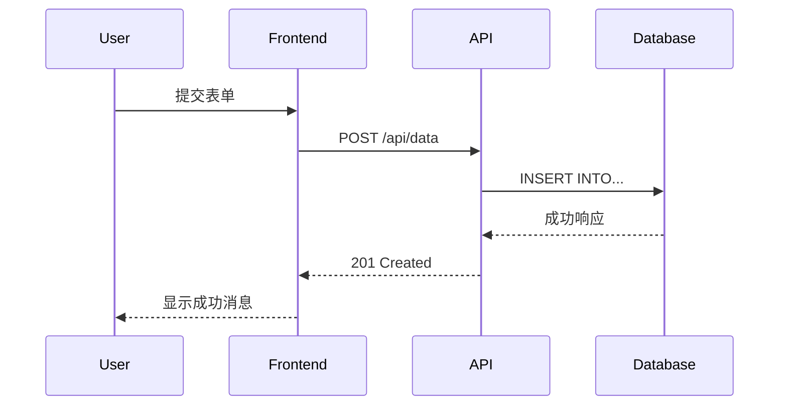

# 技术写作方法论

# 技术写作方法论：从原则到实践的完整指南

## 一、技术写作的核心原则

技术写作不是简单的文字堆砌，而是技术知识的系统化传递。掌握以下四大核心原则，是写出优秀技术文档的基础。

### 1. 清晰性原则
清晰性是技术文档的生命线。它要求文档结构合理、表达明确，让读者能够毫无歧义地理解内容。

**实现方法：**
- **分层组织**：使用标题层级（H1-H6）构建文档骨架
- **单一职责**：每个段落只表达一个核心观点
- **主动语态**：优先使用主动语态，减少被动语态
- **术语一致**：创建术语表，确保全文术语使用一致

**反例分析：**
```markdown
# 错误的表达方式
配置文件被系统读取，然后参数被解析，数据库连接将被建立。

# 正确的表达方式
系统读取配置文件，解析其中的参数，然后建立数据库连接。
```

### 2. 准确性原则
技术文档必须准确无误，任何错误都可能导致生产事故或开发效率低下。

**实践要点：**
- **代码验证**：所有代码示例必须实际运行并验证
- **版本标注**：明确标注适用的技术版本和环境
- **事实核查**：数据、配置参数需经过多次确认
- **边界说明**：明确说明功能的限制和边界条件

**准确性检查清单：**
1. 代码示例是否可直接复制运行？
2. API参数类型和返回值是否准确？
3. 配置项的默认值和有效范围是否说明？
4. 依赖环境和版本要求是否明确？

### 3. 简洁性原则
简洁不等于简略，而是在完整的基础上去除冗余信息。

**简洁写作技巧：**
- **删除冗余词**：“进行分析”→“分析”，“做出决定”→“决定”
- **合并相似步骤**：将可并行的操作合并说明
- **使用列表替代段落**：多步骤操作用有序列表呈现
- **避免过度解释**：假设读者具备基础技术知识

**对比示例：**
```markdown
# 冗长版本
为了能够成功安装这个软件包，您需要首先确保您的系统中已经安装了Node.js环境，
并且版本需要在14.0.0以上。然后您需要打开您的终端或命令行工具，使用npm命令
来进行安装。

# 简洁版本
### 前提条件
- Node.js 14.0.0+

### 安装
```bash
npm install package-name
```
```

### 4. 完整性原则
完整性要求文档覆盖所有必要信息，不留知识空白。

**完整性维度：**
- **功能完整性**：覆盖所有功能点
- **流程完整性**：从安装到使用的全流程
- **异常完整性**：包含错误处理和故障排除
- **示例完整性**：提供典型使用场景的示例

**完整性评估矩阵：**
| 维度 | 检查点 | 评分(1-5) |
|------|--------|-----------|
| 安装部署 | 环境要求、安装步骤、验证方法 | |
| 基础使用 | 核心功能、基本示例、配置说明 | |
| 高级功能 | 进阶特性、优化建议、最佳实践 | |
| 故障排除 | 常见错误、日志分析、解决步骤 | |
| API参考 | 所有接口、参数说明、返回值 | |

## 二、技术文档类型详解

不同类型的技术文档服务于不同的受众和目的，选择合适的文档类型至关重要。

### 1. API文档
API文档是开发者与系统交互的桥梁，直接影响集成效率。

**优秀API文档的要素：**
```yaml
# OpenAPI规范示例片段
paths:
  /users/{id}:
    get:
      summary: 获取用户信息
      description: 根据用户ID获取详细的用户资料
      parameters:
        - name: id
          in: path
          required: true
          description: 用户唯一标识符
          schema:
            type: integer
            format: int64
            example: 12345
      responses:
        '200':
          description: 成功获取用户信息
          content:
            application/json:
              schema:
                $ref: '#/components/schemas/User'
        '404':
          description: 用户不存在
```

**API文档最佳实践：**
- **交互式示例**：提供可执行的代码片段
- **认证说明**：清晰描述认证方式和步骤
- **错误码表**：包含所有可能错误码及解决方案
- **版本管理**：明确标注API版本和兼容性

### 2. 用户指南
用户指南面向最终用户，强调易用性和实用性。

**结构设计模式：**
```markdown
# 用户指南结构模板
## 快速开始
### 安装指南
### 首次使用
### 核心概念

## 功能详解
### [功能模块1]
#### 使用场景
#### 操作步骤
#### 示例演示

## 高级配置
### 自定义设置
### 性能优化
### 安全配置

## 故障排除
### 常见问题
### 错误代码
### 联系支持
```

### 3. 架构文档
架构文档记录系统设计决策和整体结构。

**架构文档关键部分：**
```mermaid
# 使用Mermaid绘制架构图
graph TD
    A[用户界面层] --> B[业务逻辑层]
    B --> C[数据访问层]
    C --> D[数据库]
    
    B --> E[消息队列]
    E --> F[异步处理器]
    F --> G[外部服务]
    
    style A fill:#e1f5fe
    style B fill:#f3e5f5
    style C fill:#e8f5e8
```

**架构决策记录(ADR)模板：**
```markdown
# ADR-001: 选择微服务架构

## 状态
已接受

## 上下文
系统需要支持高并发、快速迭代，且团队规模增长迅速...

## 决策
采用微服务架构，服务间通过REST API通信

## 后果
- 优点：独立部署、技术栈灵活
- 缺点：运维复杂度增加、分布式事务困难
```

### 4. RFC（请求评论）
RFC是技术标准制定流程中的重要文档。

**RFC写作规范：**
```markdown
RFC 791: Internet Protocol

摘要
本文档描述了互联网协议(IP)版本4的规范...

1. 引言
1.1. 动机
1.2. 范围

2. 总览
2.1. 与其他协议的关系
2.2. 操作模型

3. 规范
3.1. 首部格式
3.2. 寻址
3.3. 分片与重组

附录
A. 参考文献
B. 致谢
```

### 5. ADR（架构决策记录）
ADR记录架构决策的上下文、决策和后果。

**ADR生命周期管理：**
```python
# ADR管理工具示例
class ADRManager:
    def __init__(self):
        self.decisions = {}
        self.next_id = 1
    
    def propose_decision(self, title, context, decision, consequences):
        """提议新的架构决策"""
        adr_id = f"ADR-{self.next_id:04d}"
        adr = {
            "id": adr_id,
            "title": title,
            "status": "proposed",
            "context": context,
            "decision": decision,
            "consequences": consequences,
            "date": datetime.now().isoformat()
        }
        self.decisions[adr_id] = adr
        self.next_id += 1
        return adr_id
    
    def accept_decision(self, adr_id):
        """接受架构决策"""
        if adr_id in self.decisions:
            self.decisions[adr_id]["status"] = "accepted"
            return True
        return False
```

## 三、技术写作完整流程

### 1. 规划阶段
**需求分析框架：**
```python
class DocumentationPlanner:
    def __init__(self, project):
        self.project = project
        self.stakeholders = self.identify_stakeholders()
        self.content_gap = self.analyze_gap()
    
    def identify_stakeholders(self):
        """识别文档利益相关者"""
        return {
            "developers": {
                "needs": ["API参考", "代码示例", "架构图"],
                "skill_level": "intermediate",
                "primary_goal": "快速集成"
            },
            "operators": {
                "needs": ["部署指南", "监控配置", "故障排除"],
                "skill_level": "advanced",
                "primary_goal": "系统稳定性"
            },
            "end_users": {
                "needs": ["用户指南", "教程", "常见问题"],
                "skill_level": "beginner",
                "primary_goal": "功能使用"
            }
        }
    
    def analyze_gap(self):
        """分析现有文档的差距"""
        existing_docs = self.project.get_existing_docs()
        required_docs = self.generate_required_docs()
        
        return {
            "missing": list(set(required_docs) - set(existing_docs)),
            "outdated": self.identify_outdated_docs(existing_docs),
            "incomplete": self.identify_incomplete_docs(existing_docs)
        }
```

**文档路线图制定：**
```markdown
## Q1 2024 文档路线图

### 1月
- [ ] 完成API v2.0文档
- [ ] 创建快速入门指南
- [ ] 设置文档自动化流水线

### 2月
- [ ] 编写微服务架构文档
- [ ] 创建视频教程系列
- [ ] 建立文档贡献指南

### 3月
- [ ] 完善故障排除手册
- [ ] 添加交互式示例
- [ ] 文档国际化准备
```

### 2. 草稿阶段
**内容创作工作流：**
```python
class DraftWriter:
    def __init__(self, template):
        self.template = template
        self.outline = []
        self.content_blocks = []
    
    def create_outline(self, topic):
        """创建文档大纲"""
        outline = {
            "title": topic,
            "sections": [
                {"title": "介绍", "content": "目的、受众、前提"},
                {"title": "核心概念", "content": "关键术语和原理"},
                {"title": "实施步骤", "content": "详细操作指南"},
                {"title": "示例演示", "content": "实际案例展示"},
                {"title": "最佳实践", "content": "推荐做法和优化"},
                {"title": "故障排除", "content": "常见问题解决"},
                {"title": "相关资源", "content": "参考链接和进一步阅读"}
            ]
        }
        return outline
    
    def write_section(self, section, research_data):
        """编写文档章节"""
        content = f"""
## {section['title']}

{self.generate_introduction(section['content'])}

{self.provide_technical_details(research_data)}

{self.create_code_examples(research_data)}

{self.add_visual_aids(section['title'])}
"""
        return content
    
    def generate_introduction(self, purpose):
        """生成引言部分"""
        return f"""
### 概述
本章节旨在{purpose}，帮助读者理解并掌握相关概念和技术。

### 目标读者
- 有{prerequisite}基础的开发者
- 需要{use_case}的系统管理员
- 了解{technology}的技术决策者
"""
```

### 3. 评审阶段
**多维度评审清单：**
```yaml
# 评审检查表配置文件
review_checklist:
  technical_accuracy:
    - 所有代码示例是否可执行？
    - API参数和返回值是否准确？
    - 版本信息是否正确？
    
  clarity_and_structure:
    - 文档结构是否清晰？
    - 术语使用是否一致？
    - 章节逻辑是否连贯？
    
  completeness:
    - 是否覆盖所有功能点？
    - 是否包含错误处理？
    - 是否提供足够示例？
    
  usability:
    - 文档是否易于搜索？
    - 示例是否可复制粘贴？
    - 是否提供多种格式？
```

**自动化质量检查：**
```python
# 文档质量自动化检查工具
class DocumentationAuditor:
    def __init__(self):
        self.checkers = [
            LinkChecker(),
            CodeBlockValidator(),
            TerminologyConsistency(),
            ReadabilityScorer()
        ]
    
    def audit_document(self, doc_path):
        """审计文档质量"""
        report = {
            "score": 0,
            "issues": [],
            "suggestions": []
        }
        
        doc_content = self.read_document(doc_path)
        
        for checker in self.checkers:
            result = checker.check(doc_content)
            report["score"] += result["score"]
            report["issues"].extend(result["issues"])
            report["suggestions"].extend(result["suggestions"])
        
        report["score"] /= len(self.checkers)
        return report
    
    def generate_report(self, audit_result):
        """生成审计报告"""
        report_md = f"""
# 文档质量审计报告

## 总体评分: {audit_result['score']:.1f}/10

## 发现问题
{self.format_issues(audit_result['issues'])}

## 改进建议
{self.format_suggestions(audit_result['suggestions'])}

## 详细检查结果
{self.generate_detailed_report()}
"""
        return report_md
```

### 4. 发布阶段
**发布流程自动化：**
```yaml
# GitHub Actions 文档发布工作流
name: Documentation Deployment

on:
  push:
    branches: [ main ]
    paths:
      - 'docs/**'
      - 'README.md'

jobs:
  build-and-deploy:
    runs-on: ubuntu-latest
    
    steps:
    - uses: actions/checkout@v3
    
    - name: Set up Python
      uses: actions/setup-python@v4
      with:
        python-version: '3.9'
    
    - name: Install dependencies
      run: |
        pip install mkdocs-material
        
    - name: Build documentation
      run: mkdocs build
      
    - name: Deploy to GitHub Pages
      uses: peaceiris/actions-gh-pages@v3
      with:
        github_token: ${{ secrets.GITHUB_TOKEN }}
        publish_dir: ./site
```

### 5. 维护阶段
**文档生命周期管理：**
```python
class DocumentationMaintenance:
    def __init__(self):
        self.version_control = GitIntegration()
        self.feedback_system = FeedbackCollector()
        self.metrics_tracker = MetricsTracker()
    
    def monitor_usage(self):
        """监控文档使用情况"""
        metrics = {
            "page_views": self.get_page_views(),
            "search_queries": self.analyze_search_logs(),
            "feedback_score": self.calculate_feedback_score(),
            "error_reports": self.collect_error_reports()
        }
        
        return metrics
    
    def schedule_updates(self, metrics):
        """根据指标调度更新"""
        update_priorities = []
        
        if metrics["page_views"] < 100:  # 低访问量
            update_priorities.append({
                "type": "content_refresh",
                "reason": "低访问量文档",
                "priority": "medium"
            })
        
        if metrics["error_reports"] > 10:  # 多错误报告
            update_priorities.append({
                "type": "urgent_fix",
                "reason": "多错误报告",
                "priority": "high"
            })
        
        return update_priorities
```

## 四、文档即代码（Docs as Code）

### 1. Markdown 生态系统
Markdown已成为技术文档的事实标准，其生态系统非常成熟。

**Markdown扩展语法示例：**
```markdown
# 高级Markdown功能

## Mermaid图表


## 数学公式
行内公式：$E=mc^2$

块级公式：
$$
\int_{-\infty}^{\infty} e^{-x^2} dx = \sqrt{\pi}
$$

## 任务列表
- [x] 完成文档规划
- [ ] 编写API参考
- [ ] 添加代码示例
- [ ] 评审和修正

## 脚注
这是一个脚注示例[^1]。

[^1]: 脚注内容可以包含详细说明。
```

### 2. AsciiDoc 高级功能
AsciiDoc提供了比Markdown更丰富的文档功能。

**AsciiDoc企业级特性：**
```asciidoc
= 技术架构文档
:author: 技术团队
:revnumber: 1.0
:revdate: 2024-01-01
:toc: left
:sectnums:
:icons: font

== 概述

本文档描述了系统的技术架构设计。

=== 设计目标

[cols="1,2,1"]
|===
|目标 |描述 |优先级

|高性能
|支持10,000 QPS并发
|高

|高可用
|99.99% SLA
|高

|可扩展
|模块化设计
|中
|===

== 架构设计

[plantuml, architecture, svg]
----
@startuml
node "负载均衡器" as LB
node "API网关" as GW
node "用户服务" as US
node "订单服务" as OS
node "数据库集群" as DB

LB --> GW
GW --> US
GW --> OS
US --> DB
OS --> DB
@enduml
----

=== 技术选型

[TIP]
====
建议使用Kubernetes进行容器编排，便于服务管理和扩展。
====

== 部署指南

```bash
# 部署命令示例
kubectl apply -f deployment.yaml
kubectl get pods -w
```

[WARNING]
====
生产环境部署前，请务必进行充分的测试。
====
```

### 3. MDX（Markdown + JSX）
MDX将Markdown与React组件结合，适合现代文档站点。

**MDX组件化文档示例：**
```mdx
# 交互式API文档

<APIPlayground 
  endpoint="/api/users"
  method="GET"
  headers={{
    "Authorization": "Bearer {{token}}",
    "Content-Type": "application/json"
  }}
  responseExample={{
    "users": [
      {
        "id": 1,
        "name": "John Doe",
        "email": "john@example.com"
      }
    ]
  }}
/>

## 代码示例

```javascript
// 完整的Node.js示例
const axios = require('axios');

async function fetchUsers() {
  try {
    const response = await axios.get('https://api.example.com/users', {
      headers: {
        'Authorization': `Bearer ${process.env.API_TOKEN}`
      }
    });
    
    console.log('用户数据:', response.data);
    return response.data;
  } catch (error) {
    console.error('获取用户失败:', error.message);
    throw error;
  }
}

// 导出为可复用的组件
export const UserFetcher = () => {
  const [users, setUsers] = useState([]);
  const [loading, setLoading] = useState(false);
  
  const handleFetch = async () => {
    setLoading(true);
    try {
      const data = await fetchUsers();
      setUsers(data.users);
    } finally {
      setLoading(false);
    }
  };
  
  return (
    <div>
      <button onClick={handleFetch} disabled={loading}>
        {loading ? '加载中...' : '获取用户'}
      </button>
      <UserList users={users} />
    </div>
  );
};
```

## 五、API文档工具链

### 1. Swagger/OpenAPI 工具生态

**完整的OpenAPI工作流：**
```yaml
# swagger-spec.yaml 示例
openapi: 3.0.3
info:
  title: 用户管理API
  description: 用户管理系统RESTful API
  version: 1.0.0
  contact:
    name: API支持团队
    email: api-support@example.com

servers:
  - url: https://api.example.com/v1
    description: 生产环境
  - url: https://staging-api.example.com/v1
    description: 预发布环境

paths:
  /users:
    post:
      tags:
        - 用户管理
      summary: 创建新用户
      description: 创建一个新的用户账户
      operationId: createUser
      requestBody:
        required: true
        content:
          application/json:
            schema:
              $ref: '#/components/schemas/CreateUserRequest'
            example:
              username: "john_doe"
              email: "john@example.com"
              password: "securePassword123"
      responses:
        '201':
          description: 用户创建成功
          content:
            application/json:
              schema:
                $ref: '#/components/schemas/UserResponse'
        '400':
          description: 请求参数错误
        '409':
          description: 用户名或邮箱已存在

components:
  schemas:
    CreateUserRequest:
      type: object
      required:
        - username
        - email
        - password
      properties:
        username:
          type: string
          minLength: 3
          maxLength: 50
          pattern: '^[a-zA-Z0-9_]+$'
          example: "john_doe"
        email:
          type: string
          format: email
          example: "john@example.com"
        password:
          type: string
          format: password
          minLength: 8
          example: "securePassword123"
    
    UserResponse:
      type: object
      properties:
        id:
          type: integer
          format: int64
          example: 12345
        username:
          type: string
          example: "john_doe"
        email:
          type: string
          format: email
          example: "john@example.com"
        created_at:
          type: string
          format: date-time
          example: "2024-01-01T00:00:00Z"
```

**Swagger工具链集成：**
```python
# 自动化Swagger文档生成
from flask import Flask, jsonify
from flask_swagger_ui import get_swaggerui_blueprint
from apispec import APISpec
from apispec.ext.marshmallow import MarshmallowPlugin
from marshmallow import Schema, fields

app = Flask(__name__)

# 创建APISpec实例
spec = APISpec(
    title="用户API",
    version="1.0.0",
    openapi_version="3.0.3",
    plugins=[MarshmallowPlugin()],
)

# 定义Schema
class UserSchema(Schema):
    id = fields.Int(dump_only=True)
    username = fields.Str(required=True)
    email = fields.Email(required=True)
    created_at = fields.DateTime(dump_only=True)

# 注册Schema到spec
spec.components.schema("User", schema=UserSchema)

# 定义路由并生成文档
@app.route('/users/<int:user_id>', methods=['GET'])
def get_user(user_id):
    """获取用户信息
    ---
    get:
      summary: 获取单个用户
      parameters:
        - in: path
          name: user_id
          schema:
            type: integer
          required: true
          description: 用户ID
      responses:
        200:
          description: 成功
          content:
            application/json:
              schema: UserSchema
    """
    # 实际业务逻辑
    user = {"id": user_id, "username": "test", "email": "test@example.com"}
    return jsonify(UserSchema().dump(user))

# Swagger UI配置
SWAGGER_URL = '/api/docs'
API_URL = '/static/swagger.json'
swaggerui_blueprint = get_swaggerui_blueprint(
    SWAGGER_URL,
    API_URL,
    config={'app_name': "用户API"}
)
app.register_blueprint(swaggerui_blueprint, url_prefix=SWAGGER_URL)
```

### 2. Redoc 高级配置

**Redoc自定义主题配置：**
```yaml
# redoc-config.yaml
theme:
  colors:
    primary:
      main: "#1976d2"
    success:
      main: "#4caf50"
    error:
      main: "#f44336"
  
  typography:
    fontSize: "16px"
    fontFamily: "Roboto, sans-serif"
    headings:
      fontFamily: "Montserrat, sans-serif"
    code:
      fontSize: "14px"
      fontFamily: "Source Code Pro, monospace"
  
  sidebar:
    backgroundColor: "#fafafa"
    width: "280px"
    textColor: "#333"
    activeTextColor: "#1976d2"
  
  rightPanel:
    backgroundColor: "#263238"
    textColor: "#fff"
    width: "40%"

# 功能开关
disableSearch: false
hideDownloadButton: false
expandResponses: "200,201"
requiredPropsFirst: true
sortPropsAlphabetically: false
```

**Redoc中间件集成（Node.js）：**
```javascript
const express = require('express');
const { Redoc } = require('redoc-express');
const swaggerUi = require('swagger-ui-express');

const app = express();

// OpenAPI规范
const openApiSpec = {
  openapi: '3.0.0',
  info: {
    title: '示例API',
    version: '1.0.0',
    description: '使用Redoc展示的API文档',
  },
  // ... 其他规范内容
};

// Redoc配置
const redocConfig = {
  title: 'API文档',
  spec: openApiSpec,
  redocOptions: {
    theme: {
      colors: {
        primary: { main: '#1976d2' },
      },
      typography: {
        fontSize: '15px',
        fontFamily: 'Inter, sans-serif',
      },
    },
    scrollYOffset: 60,
    hideDownloadButton: false,
    expandResponses: '200',
    pathInMiddlePanel: true,
    requiredPropsFirst: true,
    sortPropsAlphabetically: true,
    hideSingleRequestSampleTab: true,
    nativeScrollbars: true,
  },
};

// 使用Redoc中间件
app.get('/docs', Redoc(redocConfig));

// 同时提供Swagger UI
app.use('/swagger', swaggerUi.serve, swaggerUi.setup(openApiSpec));

app.listen(3000, () => {
  console.log('文档服务运行在 http://localhost:3000/docs');
});
```

### 3. ReadMe 平台集成

**ReadMe平台自动化脚本：**
```python
import requests
import json
from datetime import datetime

class ReadMeManager:
    def __init__(self, api_key, project_slug):
        self.api_key = api_key
        self.project_slug = project_slug
        self.base_url = "https://dash.readme.com/api/v1"
        self.headers = {
            "Authorization": f"Basic {api_key}",
            "Content-Type": "application/json"
        }
    
    def sync_openapi_spec(self, spec_file):
        """同步OpenAPI规范到ReadMe"""
        with open(spec_file, 'r') as f:
            spec_content = f.read()
        
        response = requests.post(
            f"{self.base_url}/api-specification",
            headers=self.headers,
            json={
                "definition": spec_content,
                "category": "API Reference",
                "hidden": False
            }
        )
        
        if response.status_code == 200:
            print(f"OpenAPI规范同步成功: {spec_file}")
            return response.json()
        else:
            raise Exception(f"同步失败: {response.text}")
    
    def create_changelog_entry(self, version, changes):
        """创建更新日志条目"""
        changelog_data = {
            "title": f"版本 {version} 更新",
            "body": self._format_changelog(changes),
            "category": "Changelog",
            "hidden": False,
            "metadata": {
                "version": version,
                "release_date": datetime.now().isoformat()
            }
        }
        
        response = requests.post(
            f"{self.base_url}/changelogs",
            headers=self.headers,
            json=changelog_data
        )
        
        return response.json()
    
    def _format_changelog(self, changes):
        """格式化更新日志内容"""
        formatted = f"## 新功能\n"
        formatted += "\n".join([f"- {change['feature']}" for change in changes.get('features', [])])
        
        formatted += f"\n\n## 改进\n"
        formatted += "\n".join([f"- {change['improvement']}" for change in changes.get('improvements', [])])
        
        formatted += f"\n\n## 修复\n"
        formatted += "\n".join([f"- {change['bugfix']}" for change in changes.get('bugfixes', [])])
        
        return formatted
    
    def analyze_doc_performance(self):
        """分析文档性能指标"""
        metrics = {
            "page_views": self._get_page_views(),
            "search_queries": self._get_search_analytics(),
            "feedback_scores": self._get_feedback_data(),
            "error_reports": self._get_error_reports()
        }
        
        return {
            "summary": self._generate_performance_summary(metrics),
            "recommendations": self._generate_recommendations(metrics)
        }
```

## 六、技术博客写作方法论

### 1. 选题策略与内容规划

**选题矩阵分析：**
```python
import pandas as pd
from datetime import datetime, timedelta

class TopicPlanner:
    def __init__(self):
        self.topic_database = []
        self.metrics = {}
    
    def analyze_topic_potential(self, topic):
        """分析选题潜力"""
        analysis = {
            "search_volume": self.estimate_search_volume(topic),
            "competition": self.analyze_competition(topic),
            "relevance": self.check_relevance(topic),
            "freshness": self.check_freshness(topic),
            "practicality": self.assess_practicality(topic)
        }
        
        # 计算综合得分
        weights = {
            "search_volume": 0.25,
            "competition": 0.20,
            "relevance": 0.30,
            "freshness": 0.15,
            "practicality": 0.10
        }
        
        score = sum(analysis[k] * weights[k] for k in analysis.keys())
        
        return {
            "topic": topic,
            "score": score,
            "analysis": analysis,
            "recommended": score >= 7.0
        }
    
    def generate_content_calendar(self, topics, months=3):
        """生成内容日历"""
        calendar = []
        
        for i, topic in enumerate(topics):
            pub_date = datetime.now() + timedelta(weeks=i*2)
            calendar.append({
                "topic": topic["topic"],
                "publish_date": pub_date.strftime("%Y-%m-%d"),
                "category": self.categorize_topic(topic["topic"]),
                "target_audience": self.identify_audience(topic["topic"]),
                "estimated_time": self.estimate_writing_time(topic["topic"]),
                "seo_keywords": self.extract_keywords(topic["topic"])
            })
        
        return pd.DataFrame(calendar)
    
    def categorize_topic(self, topic):
        """分类选题"""
        categories = {
            "tutorial": ["教程", "指南", "入门", "学习"],
            "comparison": ["对比", "比较", "vs", "选择"],
            "case_study": ["案例", "实战", "实践", "经验"],
            "deep_dive": ["深入", "原理", "源码", "底层"],
            "opinion": ["观点", "思考", "趋势", "未来"]
        }
        
        topic_lower = topic.lower()
        for category, keywords in categories.items():
            if any(keyword in topic_lower for keyword in keywords):
                return category
        
        return "general"
```

### 2. 文章结构与写作技巧

**技术博客结构模板：**
```markdown
# [吸引人的标题]: [副标题]


## 导言
### 问题背景
描述读者遇到的问题或挑战，建立共鸣。

### 解决方案概述
简要介绍你将提供的解决方案。

### 预期收获
明确读者将学到什么，设置预期。

## 技术深度解析
### 核心概念
解释关键技术概念，使用类比和图示。

### 实现原理
深入技术细节，但保持可理解性。

### 代码实现
```python
# 提供完整、可运行的代码示例
def implement_solution():
    """
    详细注释解释每一步
    """
    pass
```

## 实战演练
### 环境准备
列出所需环境和工具。

### 步骤详解
1. **第一步**: 详细说明
2. **第二步**: 详细说明
3. **第三步**: 详细说明

### 常见问题
解决可能遇到的典型问题。

## 最佳实践
### 性能优化
### 安全考虑
### 可维护性建议

## 总结
### 关键要点回顾
- 要点1
- 要点2  
- 要点3

### 下一步行动
建议读者接下来可以做什么。

### 相关资源
- 官方文档
- 相关项目
- 进一步阅读

## 关于作者
简短介绍你的专业背景和联系方式。

---
**标签**: #技术标签 #编程语言 #应用场景

**发布信息**: 
- 发布日期: YYYY-MM-DD
- 阅读时间: X分钟
- 字数: XXXX字
```

### 3. SEO优化策略

**技术博客SEO清单：**
```python
class SEOOptimizer:
    def __init__(self, target_keyword):
        self.keyword = target_keyword
        self.checklist = {
            "on_page": self.check_on_page_seo(),
            "technical": self.check_technical_seo(),
            "content": self.check_content_seo()
        }
    
    def check_on_page_seo(self):
        """检查页面SEO元素"""
        return {
            "title_tag": {
                "length": "50-60字符",
                "keyword_placement": "开头或靠近开头",
                "uniqueness": True
            },
            "meta_description": {
                "length": "150-160字符",
                "keyword_included": True,
                "call_to_action": True
            },
            "headings": {
                "h