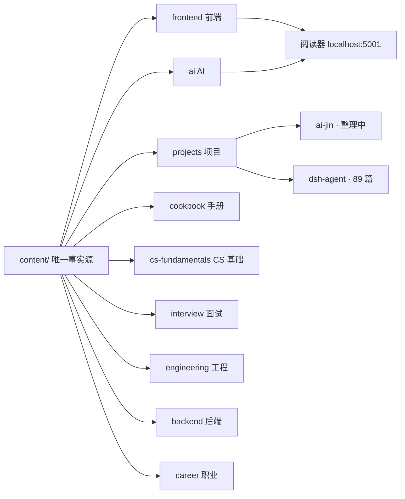

# Obsidian 知识图谱速查

> 结论先行：**Obsidian 原生就有图谱功能，零插件零开发**。把 `E:\GitHub\knowledge\content` 作为仓库（vault）打开即可使用。图谱的价值取决于文档之间的 `[[双链]]` 数量——目前我们的语料几乎全是"孤岛"，从整理 AI 金文档开始养成随手双链的习惯，图才会慢慢长出网络。

## 一、把 content/ 变成 vault（一次性）

1. 打开 Obsidian →「打开本地仓库作为 vault」→ 选择 `E:\GitHub\knowledge\content`；
2. 阅读器顶栏的「Obsidian 已连接」指的就是这件事；
3. Obsidian 的所有操作直接读写 md 文件，和阅读器、Git 三方共享同一份语料，互不冲突。

## 二、打开图谱

| 图谱 | 入口 | 默认快捷键 |
|---|---|---|
| 全局关系图 | 左侧 ribbon 的圆点图标，或命令面板输入「关系图」 | `Ctrl+G` |
| 局部关系图 | 当前文档右上角「更多选项」→ 局部关系图 | 命令面板 |

局部图谱只显示当前文档的邻居（它链接的、链接它的），整理单篇时最实用；全局图谱用来看大势。

## 三、过滤：按域查看，不被 500+ 节点淹没

图谱左上角的筛选器支持搜索语法，配合我们的目录结构：

- **按域过滤**：输入 `path:"projects/"` 只看项目域，`path:"frontend/"` 只看前端域；
- **按标签过滤**：`tag:#项目` 或 `tag:#踩坑`；
- **排除干扰**：`-path:"_inbox"`（收件箱不该出现在图谱里）；
- **颜色分组**（筛选器旁的色块）：给每个域一条规则，例如 `path:"frontend/"` 一色、`path:"ai/"` 一色——九个域一眼分层；
- **显示选项**：孤立节点太多时关掉「较少链接的文件」，只看已经连成网的。

## 四、关键认知：图谱长不出来的原因和解法

Obsidian 图谱的连线只来自文档内的 `[[双链]]` 和普通链接。当前语料 518 篇几乎没有双链（迁移来的历史文档），所以图谱现在是几百个孤点——**这不是功能问题，是习惯问题**。

养成三个随手动作：

1. 整理 AI 金文档时，提到别的篇目就打 `[[`，Obsidian 会自动补全文件名；
2. 一篇新笔记至少链向 1-2 篇旧笔记；
3. frontmatter 的 `tags` 也会成为图谱节点，标签本身就是一种弱连接。

## 五、本知识库的结构一图流

## 六、相关条目

- 阅读器内置图谱视图：见仓库根目录 `BACKLOG.md`（延后评估项）；
- 整理规范：`content/_inbox/ARCHIVE-PLAN.md` 是收件箱归档的总体计划。
