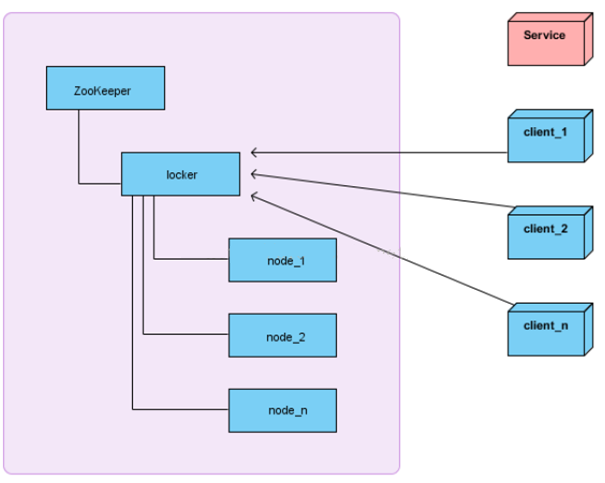
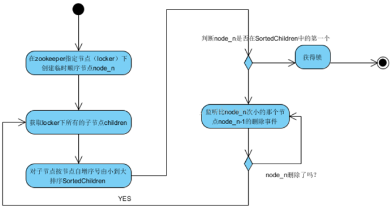

本页收录 10 道 ZooKeeper 基础与应用面试题，覆盖数据模型与 znode、Watcher 机制、命名/配置/集群/锁四类典型场景；难度分布为初级 4 题、中级 5 题、高级 1 题，每题附核心结论、关键要点与面试官追问。原理向的 9 题（ZAB、选举、同步、Session）见同目录《Zookeeper 面试 9 题 · 分布式原理》。

> 💡 说明
> 语料来自开源仓库 `interview_internal_reference` 的 ZooKeeper 篇，原稿多为几百字的要点式答案。本库按现行 ZooKeeper 3.8/3.9 行为补齐细节（Container/TTL 节点、持久化 Watcher、Curator 用法），并把原稿里含糊的"基于互斥锁"这类表述改写为可追问的机制描述。

## 概念与数据模型（4 题）

### 1. ZooKeeper 是什么？它解决分布式系统里的什么问题？｜初级

核心结论：ZooKeeper 是一个高可用的分布式协调服务，把"多个进程要对某件事达成一致"这件难事收拢成一个小的、强一致的树状存储 + 通知机制，让上层应用不必自己实现共识协议。

- 出身：Google 的 Chubby 论文公开后，Yahoo 的工程团队做出 ZooKeeper，后来成为 Apache 顶级项目；Hadoop 生态里 HBase、Kafka（旧版）、Hive、Pig、Dubbo 都依赖它，"动物园管理员"的名字由此而来。
- 它解决的问题：命名服务、配置管理、集群成员管理、分布式锁、leader 选举、Barrier/队列、元数据存储——本质都是"共享的、需要一致视图的小量状态"。
- 数据模型：一棵 znode 树（命名空间），每个节点可带数据与属性，整棵树常驻内存，磁盘只存事务日志与快照；因此读极快、容量很小（单节点数据上限 1MB）。
- 一致性：写走 Leader 并由 ZAB 协议原子广播给多数派，多数确认后才算提交，所以是 **CP 系统**——网络分区时少数派一侧不可用，但不会给出分歧的答案。
- 提供的一致性保证（官方四条）：顺序一致性（客户端自己的写按发起顺序生效）、原子性、单一系统镜像、耐久性；注意**不保证读的最新性**（读可以落在滞后的 Follower 上）。

> ⚠️ 注意
> 别把 ZooKeeper 当数据库或缓存用：1MB 的节点上限、整棵树必须装进内存、写要过半数落盘（吞吐有限，通常几千到上万 QPS），它只适合放"元数据与状态"。同样别把它当消息队列——原稿提到"队列管理"，那是同步屏障和轻量 FIFO，不是能堆积消息的 MQ。

> 🎯 关键要点
> - 一句话：分布式协调服务，把共识问题收成一个强一致的树
> - 数据在内存、日志在磁盘，容量小、读快、写要过半
> - CP 系统：分区时少数派拒绝服务
> - 读可能读到旧值，写才保证强一致
> - 别拿它当存储、缓存或 MQ

> 🔍 追问
> - ZooKeeper 为什么能做到读很快、写却吞吐有限？
> - 它和 etcd、Consul 的定位差别在哪？
> - 你的系统里没有 ZK 会怎样？为什么现在有些项目反而在去掉 ZK？

### 2. ZooKeeper 对外提供了哪些能力？｜初级

核心结论：四件套——一个层级化的文件系统、一套数据变更的通知机制、一套顺序与原子保证（含版本号）、一组分布式协调原语（选举/锁/屏障/队列）。

- 文件系统：`/app1/hosts/host1` 这样的路径式命名空间，节点可携带数据；`create/read/write/delete/list` 齐备。
- 通知机制：客户端对某个 znode 注册 Watcher，节点变化时服务端主动推送事件（一次性）。这是配置推送、上下线感知的底座。
- 顺序访问：`SEQUENTIAL` 节点由服务端保证全局递增编号，是公平锁与 master 选举的关键。
- 原子性与一致性：单个写操作原子生效；所有写经 Leader 串行广播，集群视图一致。
- 会话与临时节点：Session 断开后临时节点自动消失，这一条几乎支撑了 ZK 一半的实际用途（存活探测）。
- 版本号与 CAS：每个 znode 有 `czxid/mzxid/pzxid`、`version/cversion/aversion`，`setData(path, data, version)` 传 `-1` 忽略版本，传具体值即为 compare-and-set。
- 权限：znode 可挂 ACL（`digest`/`ip`/`world` 方案），生产常配 `super` 密码。

| 能力 | 典型 API | 支撑的场景 |
|---|---|---|
| 文件系统 | create/setData/getData | 配置、元数据 |
| Watcher | exists/getData + watch | 上下线感知、推送 |
| 顺序节点 | CreateMode.SEQUENTIAL | 公平锁、选主 |
| 临时节点 | CreateMode.EPHEMERAL | 存活探测、成员管理 |
| 版本号 | setData(…, version) | CAS、防覆盖 |

> 💡 提示
> 被问"ZK 提供了什么"时，原稿只答了"文件系统 + 通知机制"两点，容易显得只看过简介。真正值得点出的是**临时节点 + Session 生命周期**和**顺序编号由服务端统一分配**这两条——它们才是别的 KV 存储没有的东西。

> 🎯 关键要点
> - 文件系统 + Watch + 顺序 + 会话，四件套
> - 临时节点跟着 Session 走，是存活探测的根
> - 序号由服务端分配，客户端无法伪造顺序
> - 版本号让 setData 变成 CAS，避免并发覆盖
> - ACL 能限权，但别把它当安全边界

> 🔍 追问
> - 只用 Redis 能不能实现这些能力？差在哪？
> - `setData` 带版本号和不带，并发下行为差别是什么？
> - 为什么 ZK 的 Watch 不能做成"永久 + 带数据"？

### 3. ZooKeeper 的文件系统模型是怎样的？为什么不能存大量数据？｜初级

核心结论：它是"目录也能带数据"的内存树，为了低延迟把整棵树放在内存、把变更写磁盘日志；内存装不下大对象，所以单节点上限 1MB，整集群适合放 MB 级元数据而不是 GB 级业务数据。

- 与 Unix 文件系统的差异：任何节点（包括目录节点）都能存数据；路径必须绝对且以 `/` 开头；节点创建时父节点必须已存在；不能有空节点（不存在"空目录"这一说，节点即数据）。
- 每个 znode 的 stat：`czxids`（创建事务 id）、`mzxid`（最后修改）、`pzxid`（最后子节点变更）、`ctime/mtime`、`version`（数据版本）、`cversion`（子节点版本）、`aversion`（ACL 版本）、`dataLength`、`numChildren`、`ephemeralOwner`（临时节点归属的 sessionId，持久节点为 0）。
- 数据上限：`jute.maxbuffer` 默认约 1MB（客户端与服务端都要改，且不能只改一侧）。这个限制同时约束了事务日志体积与快照大小。
- 为什么快：读全部命中内存；写先落事务日志（顺序写）再进内存，日志刷到一定条数（`snapCount`）生成快照，重启时"快照 + 增量日志"恢复。
- 为什么不能放大对象：① 内存是主要成本，副本数 × 数据量；② 每次写要把数据完整广播给多数派并落盘；③ Watcher 通知会带动整节点数据；④ 快照与事务日志会滚成大文件，恢复时间变长。
- 正确用法：ZK 存"指针"（HBase 的 Region 位置、Kafka 的 broker 列表与 topic 配置），真正的数据放在 HDFS/S3/DB 里。

> ⚠️ 注意
> 原稿说"每个节点存放数据上限为 1M"是对的，但漏了配套结论：**节点数量也要克制**。几万个小节点没问题，几十万节点会让快照、Leader 切换时的全量同步、`zkCli` 的 `ls` 都变成事故源。

> 🎯 关键要点
> - 目录节点也能存数据，路径绝对、父必须先存在
> - 整棵树在内存 → 读快、容量小
> - 单节点 1MB（jute.maxbuffer），别改客户端一侧
> - stat 里的三个 zxid 与三个 version 是排查依据
> - ZK 存指针，不存数据本体

> 🔍 追问
> - ZK 重启后是怎么把数据恢复回来的？
> - 为什么 `ephemeralOwner` 对持久节点是 0？这个字段有什么用？
> - 一个 znode 存了 900KB 数据，会有什么问题？

### 4. znode 有哪几种类型？分别用在什么场景？｜中级

核心结论：按"是否随 Session 消失"分持久/临时，按"是否自动编号"分普通/顺序，组合出四种常用类型；3.5 之后又加了 Container 与 TTL 两类"会自动清理空目录"的节点。

| 类型 | 生命周期 | 典型场景 |
|---|---|---|
| PERSISTENT | 显式删除才消失 | 配置、元数据、路径根 |
| PERSISTENT_SEQUENTIAL | 同上，名字自动 +1 | 全局唯一序号、任务编号、队列 |
| EPHEMERAL | 创建它的 Session 结束即删 | 服务注册、成员存活标记 |
| EPHEMERAL_SEQUENTIAL | Session 结束即删 + 自动编号 | 公平锁、leader 竞选、会话计数 |
| CONTAINER（3.5+） | 变空后由服务端定期删除 | 临时工作目录，避免"孤儿目录"堆积 |
| TTL（3.5+） | 超时自动删除（需开 `extendedTypesEnabled`） | 有过期时间的持久节点 |

- 关键约束：**临时节点不能有子节点**。所以 `/services/host1` 这种"父持久 + 子临时"是标准形态，而想在临时节点下再挂东西一定报错。
- 顺序号的来源：序号由 Leader 统一分配并随事务广播，因此**集群范围内单调递增**，不是本地计数器，重启也不复用（`ParentNode` 里记着 `sseq`）。
- 为什么需要 Container 节点：传统做法里"创建临时工作目录 → 里面节点被删光 → 空目录永久残留"，清理要靠额外逻辑；Container 让服务端自己回收，3.5 之前只能靠 `purge` 思路或外部任务。
- 工程细节：`CreateMode` 在 Curator 里对应 `PERSISTENT`/`EPHEMERAL`/`PERSISTENT_SEQUENTIAL`/`EPHEMERAL_SEQUENTIAL`/`CONTAINER`/`PERSISTENT_WITH_TTL` 等枚举。

> 💡 提示
> 面试里能补一句"临时节点不能有子节点，所以服务注册的父目录必须是持久节点"，就说明你真的建过 ZK 结构，而不是背了四种类型的名词。

> 🎯 关键要点
> - 两个维度组合：持久/临时 × 普通/顺序
> - 临时节点跟 Session 同生共死，且不能有子节点
> - 序号由服务端全局分配，重启不复用
> - Container/TTL 解决"空目录残留"，3.5+ 才有
> - 选主用 EPHEMERAL_SEQUENTIAL，配置用 PERSISTENT

> 🔍 追问
> - 临时节点为什么不允许有子节点？
> - 客户端 Session 过期但进程还活着，会发生什么？
> - Container 节点和 TTL 节点的区别是什么？

## 通知机制与应用场景（3 题）

### 5. ZooKeeper 的 Watcher 通知机制是怎么工作的？有哪些坑？｜中级

核心结论：客户端注册 Watcher，服务端在数据变化时推一个"只说类型、不带结果"的事件；它一次性、无序保证跨路径、且事件与后续读之间没有原子性，所以生产代码必须"收到通知就重读 + 校验版本"，并自己实现续注。

- 注册时机：`exists()`、`getData()`、`getChildren()` 三类可以带 watch 标志；事件类型对应 `NodeCreated`/`NodeDeleted`/`NodeDataChanged`/`NodeChildrenChanged`。
- 六个特性：轻量（一个回调）、异步（不阻塞正常读写）、主动推送、**一次性**（触发后失效，要重新注册）、仅通知（不带新值）、顺序性（同一 server 上按事务顺序触发）。
- 实现位置：Watcher 记录在**服务端该连接的内存表**里（`WatcherManager`），不持久化——客户端断线重连后所有 Watch 全部丢失，必须在 `Watcher.Event.KeeperState.SyncConnected` 状态恢复时重新注册。Curator 的 `PathChildrenCache`/`TreeCache`/`CuratorCache` 就是替你做续注与状态维护。
- 四个真实坑：
  - **丢中间状态**：两次通知之间节点被改了 10 次，你只收到一次 `NodeDataChanged`，中间值不可见。要"看到每一次变化"就不能靠 Watch，得读事务日志或换 MQ。
  - **通知与读不原子**：收到事件 → 去 `getData` 的间隙里数据又变了，读到的是更新的值。若业务要求"基于某个版本做决策"，必须把 `stat.version` 一起读出来并在写回时做 CAS。
  - **惊群**：一个父节点上挂了 1000 个 Watch，子节点频繁变动会让服务端与网络同时被打爆。ZK 3.5 之后对子节点变更做了合并优化（`zoo.commit.procesor` 相关），但根子上仍要少挂 Watch。
  - **注册顺序**：先注册 Watch 再读数据。反过来（先读后注册）会在两步之间发生的变更被漏掉。
- 3.6+ 提供 `addWatch` 注册**持久化 Watcher**（不触发后失效），但仍不保证不漏事件。

> ⚠️ 注意
> 原稿写"如果被 watch 的节点频繁更新，会出现丢数据的情况"——准确说法是**丢事件不丢数据**：节点内容始终在 ZK 里，你只是没被通知到每一次变更。所以正确解法不是"让 ZK 别丢"，而是"收到任一事件就重读全量并对比"，或改用 `getChildren` + 版本号做增量收敛。

> 🎯 关键要点
> - Watch 一次性，触发后必须重新注册
> - 事件只带类型不带数据，收到就要重读
> - 断线重连后 Watch 全丢，要在状态恢复里重建
> - 先注册再读，否则漏事件
> - 大规模 Watch 会引发惊群，优先监听父目录子节点变化

> 🔍 追问
> - 用 Watch 做配置推送，怎么保证客户端不会停在旧值上？
> - 服务下线时 ZK 推的是 `NodeDeleted`，如果这个事件丢了怎么办？
> - 为什么 ZK 不把 Watch 设计成"带数据 + 永久"？

### 6. ZooKeeper 有哪些典型应用场景？每个场景用的是什么机制？｜初级

核心结论：所有场景都是同一套原语的组合——临时节点表达"存活"、顺序节点表达"次序"、Watcher 表达"变化要被知道"、版本号表达"只能有一个赢家"。

- 命名/服务发现：服务实例在 `/services/xxx` 下建临时节点写自己的地址，消费方 `getChildren + watch` 拿到全量并感知增减（Dubbo 注册中心经典用法）。
- 配置中心：配置放持久节点，客户端 Watch 该节点，改一次全集群生效。
- 集群管理 / 成员存活：临时节点 + Session 超时，机器宕机节点自动消失。
- Leader 选举：所有候选建 `EPHEMERAL_SEQUENTIAL`，编号最小者当选；或让 ZK 自己选主（ZAB 内部）。
- 分布式锁：临时顺序节点 + 只监听前一个节点（见下一节第 10 题）。
- Barrier / 队列：凑齐 N 个成员才放行（监听子节点数量）；FIFO 队列用顺序节点编号决定出队次序。
- 元数据管理：HBase 用它存 Region 位置与表状态，Kafka 旧版存 broker/topic/consumer offset（Kafka 3.x 起可自管元数据去掉 ZK）。
- 双主防脑裂：配合 fencing token（把 zxid/epoch 发给客户端），旧主即使还没察觉被废，也能被下游识别拒绝。

| 场景 | 核心机制 | 一句话实现 |
|---|---|---|
| 服务发现 | 临时节点 + Watch 子节点 | 上线建节点，下线自动消失 |
| 配置中心 | 持久节点 + Watch 数据 | 改节点即推送 |
| 选主 | 临时顺序节点 | 最小者当主 |
| 分布式锁 | 临时顺序 + 监听前驱 | 排队拿锁 |
| Barrier | Watch 子节点数量 | 凑齐才放行 |
| 元数据 | 树 + 版本 CAS | 存指针不存数据 |

> 💡 提示
> 答这题不要罗列名词，要给"机制 → 场景"的映射，并能各说一句实现。面试官真正在听的是：你是否理解 ZK 只有"临时节点、顺序号、Watch、版本"这四块积木。

> 🎯 关键要点
> - 一切场景都是四块积木的组合
> - 存活靠临时节点，次序靠顺序节点
> - 变化靠 Watch，唯一赢家靠版本 CAS
> - Kafka 去 ZK 化说明它并非不可替代
> - 选对机制比记住场景名重要

> 🔍 追问
> - 服务发现用 ZK 和用注册中心（Nacos）在一致性诉求上有什么不同？
> - 为什么 HBase 离不开 ZK？它具体存了什么？
> - 这些场景里哪些其实用 etcd/Consul 更合适？

### 7. 用 ZooKeeper 做命名服务（服务注册与发现）是怎么实现的？｜中级

核心结论：把 ZK 的树当作全局唯一名字的登记表——父目录是服务名、临时子节点是实例地址，消费方读全量子节点并 Watch 变化，从而得到"实时、无冗余"的实例列表。

- 结构约定：`/services/<服务名>/<ip:port#seq>` 或 `/services/<服务名>/<instanceId>`，父节点持久、子节点临时（顺序），节点数据里放地址、权重、协议、健康标记等元信息。
- 注册：启动成功后 `create` 临时节点；进程崩溃或 Session 超时（默认 `tickTime × tickInterval`，通常 2 倍 tickTime 起）后服务端自动删除，其他机器收到 `NodeDeleted`/`NodeChildrenChanged`。
- 发现：`getChildren` 拿列表 + 注册 Watch；任一变更后重新 `getChildren`（不要试图靠事件增量维护本地列表，会漂移）。
- 消费方本地缓存：把实例列表缓存在内存，Watch 只当"该刷新了"的信号，避免每次调用都打 ZK。
- 与 Dubbo 的关系：Dubbo 的 `zookeeper` 注册中心就是这个模型（provider 建临时节点，consumer 订阅 provider 变更）；`dubbo` 协议路径下还带 `configurators/routers` 等节点做动态路由与降级。
- 局限（这题的加分部分）：
  - 健康只到"进程在不在"，探不到"服务好不好"（Full GC 卡死、依赖故障时进程活着但不可用），必须叠加主动探活与熔断。
  - 实例数上万时 Watch 风暴明显，ZK 的写吞吐也撑不住高频上下线（K8s 场景就是典型反例）。
  - 没有权重/同机房路由/健康检查这些注册中心该有的能力，要自己在节点数据里加约定。
  - 网络抖动导致 Session 过期会误删实例，出现"服务在但被摘掉"的抖动，需要客户端重连后重建 + 消费方容忍短暂不一致。

> ⚠️ 注意
> 别把 ZK 的"CP"当成注册中心的优点。对服务发现来说，**因为网络分区就摘掉一半可用实例，往往比看到几秒旧列表更糟**——这正是 Nacos 提供 AP 模式（临时实例走 Distro 协议）的原因。答命名服务时能指出这个取舍，说明你想清楚了而不是照抄。

> 🎯 关键要点
> - 父持久 + 子临时，节点数据放实例元信息
> - 变更靠 getChildren 全量重取，不做增量修补
> - 本地缓存 + Watch 当刷新信号，别每次查 ZK
> - Session 过期即被摘除，抖动会误伤
> - 注册中心要 CP 还是 AP，取决于业务能容忍什么

> 🔍 追问
> - 实例的临时节点被误删但进程还在，你怎么发现和恢复？
> - 为什么服务发现场景常常选 AP 而不是 CP？
> - 一个服务 5000 个实例、每分钟几十次上下线，ZK 撑得住吗？

## 实战：配置、集群与锁（3 题）

### 8. 用 ZooKeeper 做配置中心怎么做？和 Nacos、Apollo 比差在哪？｜中级

核心结论：配置写持久节点、客户端 Watch 该节点即可实现"改一次全集群生效"；但 ZK 只提供存储与通知，不提供灰度、多环境、审计、加密、控制台，这些正是专用配置中心的价值。

- 基本形态：`/config/<应用>/<环境>/<key>`，value 存 JSON 或 properties 片段；应用启动时读一次并注册 Watch，收到 `NodeDataChanged` 后重读并热更新。
- 工程要点：
  - 一个 key 一个节点 vs 一整个 JSON 一个节点：前者可细粒度 Watch 但节点多、批量读要多次往返；后者一次读全、但任一改动会惊动所有 Watcher。实践按"变更频率相近的配置聚成一个节点"。
  - 版本化：把 `stat.version` 或 `mzxid` 记在本地，热更新时对比，避免重复生效或回退。
  - 兜底：ZK 不可用时必须能用**本地缓存文件**启动（Curator 的 `Cache`、或自己写快照），否则配置中心故障会放大成全站启动失败。
  - 安全：配置里常有密码，ZK 的 ACL 粒度粗、明文存储，生产要加密（或用外部 KMS）。
- 与专用方案的差距：

| 能力 | ZooKeeper | Nacos / Apollo |
|---|---|---|
| 灰度/定向发布 | 无，要自己做 | 内置 |
| 多环境多集群隔离 | 靠路径约定 | 内置 namespace/group |
| 变更审计与回滚 | 只有事务日志 | 控制台可视化 |
| 加密配置 | 无 | 支持 |
| 长连接推送规模 | Watch 数量受限 | 为大规模客户端设计 |
| 运维成本 | 要养一个 ZK 集群 | 有界面、有权限体系 |

- 结论式回答：如果系统里已经有 ZK（HBase/Kafka/Dubbo 在用），拿它做**低频、小体量、内部**配置是合理的；但一旦需要灰度发布、多环境隔离、审计合规，就该用专门的配置中心，而不是在 ZK 上长出第二套控制台。

> 💡 提示
> 这题不要答成"ZK 能做配置中心，很好用"。真实工程结论是有条件的：能做的边界是"配置量小、变更少、不需要灰度"。给出边界比给结论更值钱。

> 🎯 关键要点
> - 持久节点存配置 + Watch 实现热更新
> - 节点粒度按"变更频率"聚，不按 key 拆散
> - 必须有本地快照兜底，防 ZK 挂了起不来
> - 缺灰度/审计/加密，是 ZK 与配置中心的真实差距
> - 已有 ZK 才考虑复用，别为配置专门建集群

> 🔍 追问
> - 配置推送到 1000 个实例，怎么保证不会有一半停在旧值？
> - 热更新时配置解析失败，你怎么回退？
> - 为什么把数据库密码放 ZK 是危险做法？

### 9. ZooKeeper 怎么做集群管理——机器上下线感知和 master 选举？｜中级

核心结论：上下线靠"临时节点 + Watch 父目录"，选主靠"临时顺序节点 + 最小者当选"，两者共用同一套机制，都不需要中心化的探活服务。

- 成员感知：每台机器在 `/cluster/nodes` 下创建 `EPHEMERAL` 节点（数据写自己的地址与角色），并 `getChildren + Watch` 该父目录。机器宕机 → Session 超时 → 节点删除 → 所有机器收到 `NodeChildrenChanged` → 重新拉列表。
- Master 选举（应用层）：所有候选创建 `EPHEMERAL_SEQUENTIAL` 节点，**编号最小者当选 master**，其余只监听"比自己小的那一个"节点；master 崩溃后其临时节点消失，次小者收到通知后接任。
- 为什么监听前驱而不是监听父目录：监听父目录会让所有节点都被唤醒（惊群），且要重新比较全部编号；只听前驱则每次只有紧邻的一个候选被唤醒，链路清晰、开销小。
- 心跳与租约：master 也可主动定时 `setData` 自己的节点做"我还活着"的证据；从节点 Watch 数据变化，超时未更新就触发重选。这比只依赖 Session 更可控（Session 超时粒度粗，且受 GC 影响）。
- ZAB 内部的 Leader 选举是另一件事：那是 ZK 集群自己的主（见原理篇第 6 题），别和"业务用 ZK 选主"混为一谈——面试里能说清这是两层选举，很加分。
- 脑裂与 fencing：ZK 保证多数派才提交，所以不会同时有两个"被多数承认"的 master；但**旧 master 可能还没察觉自己已被废**，仍在处理请求。解法是给每次任期一个单调递增的 fencing token（用 `zxid` 或 `epoch` 或顺序节点编号），下游存储校验 token，拒绝旧 master 的写。

> ⚠️ 注意
> "选完主就万事大吉"是这题最大的坑。选主只解决"谁来做"，不解决"旧主什么时候真的停"。任何用 ZK 选主的系统都要回答：GC 停顿 30 秒导致 Session 过期、新主已上任、旧主醒来继续写——怎么防？答案只能是 fencing token 或让旧主在写之前自查任期，光靠"它应该会自己退出"是不够的。

> 🎯 关键要点
> - 上下线 = 临时节点 + Watch 父目录
> - 选主 = 临时顺序节点 + 只听前驱
> - Session 超时是粗粒度租约，要自己加心跳
> - ZK 自身选主与业务选主是两层，别混
> - 没有 fencing token 的选主都不算安全

> 🔍 追问
> - master 假死（进程在但不干活）怎么检测？
> - 从节点数远大于主节点处理能力时，你的选举结构会出什么问题？
> - 为什么 etcd 用 lease + revision 做同一件事？

### 10. 用 ZooKeeper 实现分布式锁怎么做？为什么用临时顺序节点而不是直接抢一个节点？｜高级

核心结论：加锁 = 在锁目录下创建临时顺序节点，编号最小者持锁，其余只监听自己的前驱节点；释放锁 = 删除自己的节点。用顺序节点是为了避免惊群、拿到公平顺序、并让"等待队列"天然由 ZK 维护。

- 朴素做法的问题：所有客户端去 `create /lock`，成功者持锁。它能工作，但① 所有等待者都 Watch `/lock`，释放瞬间全员被唤醒去抢（惊群），ZK 与网络同时被打爆；② 谁抢到不确定，没有公平性；③ 一个客户端崩溃时若 Session 未过期，锁一直被占。
- 正确做法（可重入读/写锁的 Curator `InterProcessMutex` 就是这个模型）：
  1. 在 `/lock` 下 `create` 一个 `EPHEMERAL_SEQUENTIAL` 节点，得到 `/lock/lock-0000000007`；
  2. `getChildren("/lock")`（**不注册 Watch**），排序；
  3. 若自己的编号最小 → 拿到锁；
  4. 否则找到"比自己小的最大那个"节点，对它 `exists + Watch`，然后阻塞等待；
  5. 前驱被删（释放或 Session 过期）→ 收到通知，回到第 2 步重新判定；
  6. 释放锁：`delete` 自己的节点。
- 为什么只听前驱：任一时刻只有紧邻的后继会被唤醒，唤醒链路是 O(1) 而不是 O(n)；同时天然形成 FIFO 公平队列。
- 可重入：节点数据里写 `uuid + 线程 id + 重入次数`，判定时先看最小节点是不是自己的 uuid，是则计数加一，释放时减到 0 才删节点。
- 必须处理的四件事：
  - **Session 超时导致锁提前丢失**：客户端 Full GC 或网络抖动超过 Session 超时，ZK 删掉临时节点、别人拿锁，而你的业务还在临界区里跑。这是 ZK 锁的根本缺陷，只能靠 fencing token（把节点序号作为版本号带给下游，旧 token 的写被拒）缓解，无法根除。
  - **锁的粒度与目录设计**：`/lock/order/{orderId}` 这种按资源分目录，避免所有请求挤在同一把锁上。
  - **删除节点失败**：释放要幂等，网络异常时靠 Session 过期兜底。
  - **不要靠 `Thread.sleep` 轮询重试**：用 Watch 阻塞等待，否则既慢又打 ZK。
- 与其他方案对比：

| 方案 | 一致性 | 公平性 | 主要风险 |
|---|---|---|---|
| ZK 临时顺序节点 | CP，会话保证 | FIFO | Session 过期丢锁 |
| Redis `SET NX PX` | AP，看门狗续期 | 无序 | 主从切换丢锁 |
| Redis Redlock | 有争议 | 无序 | 时钟跳变、GC |
| DB 唯一索引/`SELECT FOR UPDATE` | 强 | 靠 DB | 性能与死锁 |

- 原稿"代码的实现主要是基于互斥锁"这句没有信息量：真正的实现是 Curator 的 `InterProcessMutex`/`InterProcessReadWriteLock`（读锁用 `READ_` 前缀、写锁用 `WRITE_` 前缀，写锁要等前面没有未释放的读锁与写锁），业务代码里只写 `mutex.acquire(timeout, unit)`。

> ⚠️ 注意
> 面试里最容易被反将一军的点是："ZK 锁能保证不出问题吗？"正确答案是**不能**——它保证的是"互斥的通常情况"，在 GC 停顿、Session 超时、时钟漂移下都可能失效。所以要么接受"锁只用于降低冲突概率"，要么把 fencing token 打到存储层，要么用数据库的行锁/唯一约束做最终防线。说"ZK 锁绝对可靠"会被追着打。

> 🎯 关键要点
> - 临时顺序节点 + 只听前驱，解决惊群与公平
> - 释放靠删节点，异常靠 Session 过期兜底
> - 可重入靠 uuid + 线程 id + 计数
> - Session 超时丢锁是本质缺陷，用 fencing token 缓解
> - 生产用 Curator，不要自己手写状态机

> 🔍 追问
> - 客户端拿到锁后 Full GC 40 秒，期间别人拿了锁，怎么防数据被写坏？
> - 读多写少的场景，ZK 上做读写锁要注意什么？
> - 为什么 Redis 的 Redlock 会被 Martin Kleppmann 质疑？
> - 如果允许偶尔不互斥，你的方案可以怎么简化？
