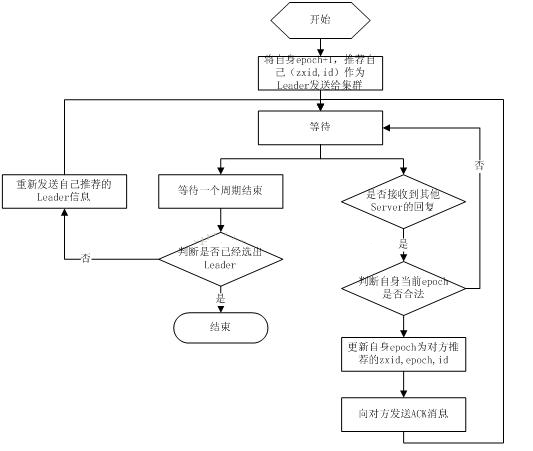
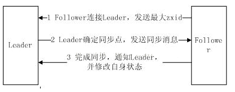

本页收录 9 道 ZooKeeper 原理向面试题，覆盖队列与协调原语、Session、数据复制与 Observer、ZAB 协议、zxid 顺序性、集群状态机、Leader 选举与数据同步；难度分布为初级 1 题、中级 3 题、高级 5 题，每题附核心结论、关键要点与面试官追问。应用向的 10 题见同目录《Zookeeper 面试 10 题 · 基础与应用》。

> 💡 说明
> 语料来自开源仓库 `interview_internal_reference` 的 ZooKeeper 篇。原稿把选举算法表述为"basic paxos / fast paxos，默认 fast paxos"，这一说法沿用的是早期资料口径，本库按 ZooKeeper 实际的 `-election` 协议（` electionFast` 与基于版本化投票的快速选举）重写并标注差异。

## 协调原语（3 题）

### 1. ZooKeeper 的队列管理是怎么做的？为什么说它不适合当消息队列？｜中级

核心结论：ZK 能实现两类队列——"凑齐才放行"的同步屏障和按编号出队的 FIFO 队列，靠的都是顺序节点 + Watch 子节点；但节点 1MB 上限、写要过半数落盘、没有消费位点管理，决定了它只能做协调用的轻队列，不能做消息中间件。

- 同步队列（Barrier）：成员在 `/barrier/` 下各建一个临时节点，协调者 `getChildren + Watch` 父目录，子节点数量达到 N 才放行。Curator 提供 `DistributedBarrier`（`waitForBarrier` / `removeBarrier`）与 `DoubleBarrier`（进/出两道闸）。
- FIFO 队列：在 `/queue/` 下建 `PERSISTENT_SEQUENTIAL` 节点，节点数据即消息内容，序号即消息编号；消费者取序号最小的节点处理完再删除。
- 出队竞态：多个消费者同时看到"最小的是 A"，必须靠 `delete` 的原子性判胜负——谁删掉 A 谁获得这条消息，删除失败就重新取列表。这一步等价于"用 ZK 做了一次 CAS"。
- 为什么不能当 MQ：
  - 容量：单节点 1MB，队列整体要装进 Leader 内存。
  - 吞吐：每条消息都是一次多数派写，几千 QPS 就到头了。
  - 堆积：消息不删就永久留在树里，快照与同步时间线性变长。
  - 语义：没有 topic/分区、没有消费组与位点、没有重试队列与死信，也没有顺序与幂等保证。
  - 可靠性：原稿说"节点是持久化的所以不必担心丢失"，这只保证"已提交的消息不丢"，不保证"只消费一次"——消费者取到消息后崩溃、删除前崩溃，都会重复消费。
- 正确定位：ZK 做"任务的调度与协调"（谁该干活、干到哪了），消息本体走 Kafka/RocketMQ；Kafka 早期把 topic/broker/consumer offset 放 ZK，后来用内部元数据日志（KRaft）取代，正是因为 ZK 撑不住高频元数据变更。

> ⚠️ 注意
> 用 ZK 队列时"取出即删除"和"处理完再删除"是两种语义：前者会丢（处理中崩溃消息就没了），后者会重（处理完但删除失败，别人再消费一次）。必须显式选一种并配幂等，别默认它像 MQ 一样有 ACK。

> 🎯 关键要点
> - Barrier 靠子节点数量，FIFO 靠顺序编号
> - 并发出队靠 delete 的原子性做 CAS
> - 1MB + 多数派写 = 吞吐与容量都撑不起 MQ
> - 取出/删除的时机决定丢消息还是重消息
> - 协调用 ZK，传数据用 MQ

> 🔍 追问
> - 两个消费者同时抢同一条消息，ZK 上到底谁赢？
> - 用 ZK 做延迟队列（按到期时间出队）你会怎么设计？
> - Kafka 为什么要把元数据从 ZK 迁回内部？

### 2. 分布式通知与协调在 ZK 上是怎么落地的？｜中级

核心结论：通知 = 客户端 Watch 一个承载状态的节点，协调 = 所有参与方读写同一批节点，把"分布式共识"外化成"一棵树上的状态机"；调度指令与进度汇报是它的两个典型方向。

- 调度通知：运维改 `/schedule/job1/status` 的数据（或增删子节点），所有 Watch 该节点的 worker 收到事件后重读并执行。要点是"改一次、全员知道"，不需要中心调度器逐个 RPC。
- 进度汇报：每个 worker 在 `/jobs/<jobId>/` 下建临时节点，数据里写进度百分比、已处理条数；汇总进程 Watch 父目录，子节点变化即全局视图更新。worker 崩溃时临时节点消失，汇总侧天然知道"少了一个"。
- 状态机式协调：把流程的关键判断写成节点存在性/数据（例如 `/leader`、`/lock/x`、`/ready/i`），参与方通过读写这些节点完成握手，等价于把协调逻辑外置到强一致存储。
- 为什么这套东西有价值：它把"分布式一致性"从代码里搬到了数据里——代码只需处理"我看到什么状态"，不需要自己实现投票、租约、 fencing。
- 代价与边界：
  - Watch 一次性 + 事件不带数据，所以"通知"只能当触发器，真相必须重读。
  - 高频状态更新（每 10ms 汇报一次进度）会把 ZK 写爆；进度类数据应该走聚合上报或本地计数，ZK 只放里程碑状态。
  - 事件顺序只在同一 server 上按事务保证，跨节点订阅不要假设全局顺序。
- 配套观测：`mntr` 四字命令看 `zk_avg_latency`/`zk_outstanding_requests`/`zk_server_state`；`cons`/`crst` 看连接；`wchs`/`wchc` 看 Watch 数量（**生产慎用**，遍历所有连接会阻塞，大集群能打死节点）。

> 💡 提示
> 这题原稿只有两句话。答好它的方式是说清"通知是触发器、状态才是真相"这一句设计原则，再举一个进度汇报的具体节点结构，最后主动补一条"高频更新会打爆 ZK"的边界。

> 🎯 关键要点
> - 通知靠 Watch，协调靠共享节点状态
> - 临时节点做进度与存活，父目录做汇总视图
> - Watch 只触发，真相要重读
> - 高频写是 ZK 的死穴，里程碑才进 ZK
> - `wchc` 这类命令能看规模，但别在线上乱用

> 🔍 追问
> - 汇总进程重启期间发生的节点变化怎么补回来？
> - 10 万个 worker 每 5 秒更新进度，你的方案怎么改？
> - 用 ZK 做流程编排（谁做完谁触发下一步）有什么坑？

### 3. ZooKeeper 的 Session 机制是什么？SessionID 怎么构成？｜中级

核心结论：Session 是客户端与 ZK 之间的有状态租约，承担身份标识、超时判定、请求顺序执行、临时节点生命周期与 Watch 归属五件事；它由服务端分配 ID、由心跳维持，过期即触发临时节点删除与 Watch 清理。

- Session 的五个作用（原稿列全了）：客户端标识、超时检查、请求的顺序执行（同一 session 内 FIFO）、维护临时节点生命周期、承载 Watch 归属。
- 维持方式：客户端与所连 server 之间按 `tickTime` 周期发心跳；server 侧超时判定用 `tickTime × tickInterval`（默认 2 倍），客户端可用 `sessionTimeout` 请求，最终值被裁剪到 `[minSessionTimeout, maxSessionTimeout]`（3.4 之后可配）。
- 状态迁移：`CONNECTING → CONNECTED → (断开) RECONNECTING → RECONNECTED / EXPIRED → CLOSED`。重连时可能换一台 server，只要 Session 未过期，状态与 Watch 归属仍在集群范围内有效（因为 Session 信息通过事务在多数派间同步）。
- SessionID 的构成（64 位）：高 8 位是创建该 Session 的 server id，中间 40 位是该 server 当前角色的时间戳，低 16 位是计数器——所以它全局唯一且可反查"这个客户端最初连的哪台"。
- 关键连带效应：
  - Session 过期 → 该 Session 创建的**所有临时节点被删除**、**所有 Watch 被移除**。这就是"GC 停顿导致掉线"会连带丢锁、丢服务注册的原因。
  - 重连成功后客户端必须重新注册 Watch、重建自己的临时节点（Curator 的连接状态监听里做）。
  - 服务端重启会改变 server id 相关部分，但不影响已存在 Session 的有效性。
- 与"请求顺序"的关系：同一 Session 的请求由所连 server 排队 FIFO 发出，因此客户端自己的写一定按序生效；跨 Session 无此保证。

> ⚠️ 注意
> 原稿把 `TickTime` 描述成"下次会话超时时间点"，这不准确：`tickTime` 是 ZK 的基本时间单位（心跳周期），超时时长是它的倍数。另外 `isClosing` 不是 Session 的通用属性，别在面试里当标准字段说。

> 🎯 关键要点
> - Session = 租约，心跳维持，过期即清理临时节点与 Watch
> - 同一 Session 内请求 FIFO，跨 Session 无保证
> - SessionID = server id + 时间戳 + 计数器
> - 重连可能换 server，但 Session 状态集群共享
> - GC 停顿超过 Session 超时 = 丢锁 + 被摘流

> 🔍 追问
> - Session 超时设太长/太短分别有什么问题？
> - 客户端 Full GC 30 秒后重连，你的服务注册和锁会怎样？
> - 为什么 ZK 的 Session 信息也要走事务同步？

## 复制与协议（3 题）

### 4. ZooKeeper 的数据复制模型是什么？写多为什么吞吐会掉，Observer 解决什么？｜高级

核心结论：ZK 采用"客户端可连任意节点写、但所有写由 Leader 统一广播给多数派"的复制模型；写吞吐受限于 Leader 与多数派落盘，加节点反而增加广播与 ACK 开销，所以引入不参与投票的 Observer 来扩读、扩连接，而不进一步拖累写。

- 复制的收益（原稿三点，成立）：容错（节点挂了别人能接）、扩展（加机器分摊负载）、性能（就近读）。
- 两种集群形态：写主（WriteMaster，写必须发给指定主，读任意）与写任意（Write Any，写可发给任何节点，客户端对角色透明）。ZK 表面上是"写任意"，**实质上仍是写主**——客户端把写请求发给任意 Follower，Follower 转交给 Leader，由 Leader 分配 zxid 并发起广播。区别只在"客户端不需要知道谁是 Leader"。
- 为什么写多会掉吞吐：一次写要 ① Leader 序列化并广播给所有 Follower；② 每个 Follower 顺序写事务日志并 fsync；③ 回 ACK；④ Leader 收到多数 ACK 后发 Commit。加一台 Follower 就多一份广播流量与落盘等待，quorum 也变大，所以**写吞吐随节点数增加而下降**（5 台通常比 3 台写慢）。
- Observer：接受 Leader 广播、参与数据同步、能服务读请求，但**不投票、不计入 quorum**。作用是扩读吞吐与连接数、跨机房就近读，同时不让写路径变长。这是 ZK 对"读多写少"负载的关键设计。
- 部署经验：多数派要落在同一低延迟域内（跨城部署会让每次写都等跨城 RTT）；quorum 大小决定容错——`2n+1` 台可容忍 `n` 台故障，所以 5 台容 2、6 台也只容 2（白多一台，故取奇数）。
- 读的一致性：默认读走所连节点的内存，**可能是旧值**（Follower 尚未收到最新 Commit）。要线性一致读，客户端先发一个 `sync` 再读，或读 Leader（`readFromLeader` 类配置/自建路由）。

| 角色 | 收广播 | 落盘 | 投票 | 计入 quorum | 服务读 |
|---|---|---|---|---|---|
| Leader | 发起 | 是 | 是 | 是 | 是 |
| Follower | 是 | 是 | 是 | 是 | 是 |
| Observer | 是 | 是 | 否 | 否 | 是 |

> 💡 提示
> 这题的杀伤力在最后一问："加机器能提高 ZK 的写性能吗？"答案是不能，反而更差——能扩的是读（加 Observer/Follower）。能主动说出这一条，基本就把"你懂不懂共识系统的写放大"证明完了。

> 🎯 关键要点
> - 写可发任意节点，但逻辑上仍是写主（Leader 串行广播）
> - 写吞吐受 quorum 落盘与广播限制，加节点会下降
> - Observer 扩读不扩写，且不进 quorum
> - 2n+1 容 n，偶数节点是浪费
> - 默认读不保证最新，要线性读得 sync 或读 Leader

> 🔍 追问
> - 为什么 ZK 不让 Follower 直接处理写再合并？
> - 跨机房部署 ZK 集群会遇到什么问题？怎么缓解？
> - etcd 的 Learner 和 ZK 的 Observer 是同一个思路吗？

### 5. ZAB 协议的工作原理是什么？它和 Paxos 是什么关系？｜高级

核心结论：ZAB 是为 ZK 定制的"崩溃可恢复的原子广播"协议，分广播与恢复两种模式；它保证的是"事务按 Leader 提出的顺序被多数派提交"，从而让 ZK 得到严格顺序一致，而不是通用状态机复制的万能方案。

- 两种模式：
  - 广播模式（运行态）：Leader 接收所有写请求，为每个事务分配单调递增的 `zxid`，打包成 Proposal 广播；Follower 顺序写日志后回 ACK；Leader 收到**多数派** ACK 后发 Commit，Follower 应用到内存树并结束该事务。
  - 恢复模式（启动 / Leader 崩溃 / 失去多数派）：重新选举 Leader，新 Leader 与集群完成状态同步（见第 9 题），同步完成后才开启新一轮广播。
- 为什么必须先同步再广播：新 Leader 可能缺事务，也可能带着"上一任没来得及提交"的悬空事务。ZAB 用 epoch（任期号）解决：新 Leader 以更高 epoch 上位，任何低 epoch 的 Proposal 一律作废，因此不会出现两个 Leader 的写交叉生效。
- 与 Paxos 的关系：ZAB 的思想来自 Paxos/视图同步类协议，但它是**为"单一 Leader + 全序广播"场景特化**的实现，不追求多 proposer 并发。原稿把选举说成"basic paxos / fast paxos 两种算法"，更贴近事实的表述是：ZAB 的 Leader 选举借鉴了 Fast Paxos 的快速收敛思路（`FastLeaderElection`），并保留了基于版本化投票的 `electionQuorum` 式流程。
- ZAB 的两个核心保证：
  - 已提交的事务一定在 Leader 崩溃后仍然存在（因为多数派落盘）。
  - 事务按被提出的顺序被应用（全序广播），因此 ZK 的状态机是确定性的。
- 和 Raft 的对比（常考）：Raft 用 term + 选举限制（只有日志足够新的候选才能当选）+ 心跳维持权威，可读性强；ZAB 用 epoch + zxid + 恢复期同步，Leader 由"数据最新 + myid 最大"决定。两者都是"强 Leader 的状态机复制"。
- 提交点在哪：`zk_flushInterval`/`zk_sync_limit` 等参数决定 fsync 时机，写延迟主要由最慢的那个多数派成员决定——这也是 ZK 对磁盘抖动极其敏感的原因。

> ⚠️ 注意
> 别把 ZAB 说成"Paxos 的一种实现"。它是为 ZK 特化的原子广播协议，与 Multi-Paxos 的差别（单 Leader、全序、恢复期同步、epoch 作废旧提议）正是面试想听的内容。说"ZAB 就是 Paxos"会被追问一句就露底。

> 🎯 关键要点
> - 广播态：分配 zxid → Proposal → 多数 ACK → Commit
> - 恢复态：选主 + 数据同步，之后才允许广播
> - epoch 让旧 Leader 的悬空提议自动作废
> - 全序广播是 ZK 顺序一致性的来源
> - 写延迟由最慢的多数派成员决定

> 🔍 追问
> - Leader 在"已发 Proposal 但未收到多数 ACK"时崩溃，这条事务最终怎样？
> - 为什么 ZAB 不需要像 Raft 那样限制"日志不新不能当选"？
> - 网络分区时 ZAB 怎么保证不出现双主提交？

### 6. ZooKeeper 如何保证事务的顺序一致性？zxid 是什么？｜高级

核心结论：顺序性由三层拼起来——同一 Session 的请求在所连 server 上 FIFO 排队、所有写由 Leader 串行分配 zxid、zxid 内嵌 epoch 保证任期单调；因此集群只有一个"事务全序"，所有节点按同一顺序应用。

- zxid 是 64 位事务 id：高 32 位 `epoch`（任期号，每换一次 Leader 自增），低 32 位 `counter`（本任期内的递增计数）。所以比较两个 zxid 就是比较"哪个任期、第几笔"。
- 三个"顺序"要分清：
  - **客户端视角的顺序一致性**：我自己的写按我发起的顺序生效（同一 Session FIFO）。
  - **事务顺序一致性**：所有 server 以相同顺序应用事务（Leader 串行 + 全序广播）。
  - **因果顺序**：ZK 不额外保证跨客户端的因果关系。
- 每个 znode 上留痕的三个 id：`czxid`（创建）、`mzxid`（最后数据修改）、`pzxid`（最后子节点变更）——排查"这个节点什么时候被谁改过"就看这三个值与事务日志。
- 提交流程里的顺序保证：Proposal 带 zxid → Follower 只有在**按 zxid 顺序**落盘并回 ACK 后才 Commit；乱序到达的 Proposal 会被等待或丢弃（低 epoch 直接拒绝）。
- 客户端读到的顺序：读走本地内存快照，因此可能读到"该 server 尚未应用最新事务"的状态。要"读己之写"，客户端可以等自己的写被 ACK（默认就是同步等提交），或跨节点读时先发 `sync` 让所连 server 追平到 Leader 的最新提交点。
- 原稿"依据数据库的两阶段过程，先向其他 server 发出事务执行请求，超过半数能执行就开始执行"——方向对，但准确说法是"多数派**落盘并 ACK** 后才 Commit"，不是"能执行就执行"，也没有 2PC 的参与者阻塞问题。

> 💡 提示
> 这题最容易失分的地方是把"顺序一致性"和"线性一致性"混着说。ZK 的写是线性一致的（经 Leader 全序提交），**读默认不是**（Follower 本地快照）。能主动把这条边界画出来，就是这道题的满分线。

> 🎯 关键要点
> - zxid = epoch(32) + counter(32)，任期与序号合一
> - 三层顺序：Session FIFO、Leader 串行、全序应用
> - czxid/mzxid/pzxid 是节点上的顺序留痕
> - 写线性一致，读默认不保证最新
> - 多数派"落盘 ACK"才提交，不是"能执行就执行"

> 🔍 追问
> - 为什么 epoch 要放进 zxid 而不是单独一个字段？
> - 客户端在 A 节点写完、立刻到 B 节点读，会读到什么？
> - 用版本号做 CAS 和用 zxid 做 fencing，哪个更可靠？

## 选举与同步（3 题）

### 7. ZooKeeper 集群里 Server 有哪几种工作状态？｜初级

核心结论：每台 Server 在任意时刻处于 LOOKING / LEADING / FOLLOWING / OBSERVING 四态之一，其中 LOOKING 是"正在选主"的过渡态，一旦有 Leader 被多数派确认，其余节点按角色转入另外三态。

- `LOOKING`：不知道 Leader 是谁，正在参与选举（启动时、Leader 失联后都会进入）。
- `LEADING`：自己是 Leader，负责接收写请求、分配 zxid、发起广播。
- `FOLLOWING`：自己是 Follower，转发写请求给 Leader、参与投票、服务读。
- `OBSERVING`：自己是 Observer，同步数据、服务读，但**不投票、不计入 quorum**。
- 状态迁移主线：启动 → LOOKING →（选主成功）LEADING / FOLLOWING / OBSERVING →（Leader 失联或失去多数派）回到 LOOKING。
- 怎么查：`echo srvr | nc <host> 2181` 或 `zkServer.sh status` 直接返回 `Mode: leader/follower/observer`；`mntr` 里的 `zk_server_state` 用于监控采集。4 字命令需在 `zk.cfg` 里用 `4lw.commands.whitelist` 白名单放开（3.4.10+ 默认只允许 `srvr`）。
- 为什么集群数要奇数：quorum 是 `n/2+1`，5 台容 2 台故障，6 台也容 2 台——多一台不增加容错、只增加写广播成本。

> ⚠️ 注意
> 原稿把四态列完就结束，少了两个必问点：**Observer 不投票**（否则"加机器能扩写"的误解就来了）和**LOOKING 是过渡态**（处于 LOOKING 的节点不能提供读写服务，这就是选主期间集群不可写的表现）。

> 🎯 关键要点
> - 四态：LOOKING / LEADING / FOLLOWING / OBSERVING
> - Observer 同步数据、服务读，但不进 quorum
> - LOOKING 期间集群不可用，选主完成才恢复
> - `srvr`/`mntr` 看角色，需配白名单
> - 节点数取奇数，偶数不增容错

> 🔍 追问
> - 集群里所有节点同时 LOOKING 会发生什么？
> - Observer 挂了会影响写吗？
> - 为什么 3 台 ZK 挂 1 台还能写，挂 2 台就不行？

### 8. ZooKeeper 是怎么选举 Leader 的？｜高级

核心结论：ZK 的选举是"数据最新者优先、myid 兜底、版本化投票收敛、过半即止"的过程——每台节点先投自己，再不断接受并比较别人的投票（epoch > zxid > myid），一旦某候选拿到过半支持就定主；默认实现是 `FastLeaderElection`。

- 触发时机：集群启动、Leader 崩溃、Leader 失去多数派follower 心跳。
- 投票内容（logical clock / 版本化投票，这是防脑裂的关键）：`(logicLastAcceptedVote 的 id, 自己的 id, 自己的 zxid, epoch, peer_id)`。收到别人的票时按 **epoch 大者优先 → zxid 大者优先 → myid 大者优先** 判定是否"更新"，只有更优才改自己的推荐。
  - 为什么先比 epoch：高 epoch 代表更新任期的 Leader，避免旧任期的票干扰新一轮选举。
  - 为什么再比 zxid：数据最新的节点当 Leader，才能少做甚至不做全量同步。
  - 为什么最后比 myid：纯投票会因"两两互相推荐"而死锁，myid 是打破对称的确定性 tie-breaker。
- 收敛条件：某候选获得 `n/2+1` 票 → 选举结束，其余节点转入 FOLLOWING/OBSERVING。
- 通信方式：选举走独立端口（`electionPort`，默认 clientPort+1），先 TCP 握手建通道再交换投票包（`notification` / `request` / `ack` / `proposed leader` 等类型）。
- `FastLeaderElection` 与早期 `electionQuorum`（原稿所称"basic paxos"）的区别：前者在投票阶段就并行广播、快速收敛，后者按 Paxos 式的 prepare/accept 轮次推进、消息更多。ZK 3.x 起默认 `FastLeaderElection`，配置项 `electionAlg=3`（1/2/3 的旧实现已废弃，4.x 起只剩 3）。
- 选完不等于可服务：新 Leader 必须与多数派完成数据同步（第 9 题）才开启广播，所以"选主耗时 + 同步耗时"共同构成 ZK 集群的不可用窗口，通常秒级，数据量大或 follower 落后多时更久。
- 生产注意：跨机房部署时，一次网络抖动就可能触发重选；把 `tickTime`/超时设得过短会放大这个窗口；HBase/Kafka 这类依赖方要配好重连与退避。

> 💡 提示
> 这题的满分点是那句"为什么用 myid 做最后的 tie-breaker"——纯按 zxid 比较会出现 A 推荐 B、B 推荐 A 的对称死锁，必须有一个全序的、静态的、双方一致的第三判据。能讲出"打破对称性"这四个字，说明你理解的是算法而不是流程。

> 🎯 关键要点
> - 判据顺序：epoch → zxid → myid
> - 版本化投票（逻辑时钟）保证收敛且防脑裂
> - 过半支持即定主，节点数必须奇数
> - 数据最新者当主，减少同步代价
> - 选完还要同步，不可用窗口 = 选举 + 同步

> 🔍 追问
> - 为什么不能只按 zxid 选主？myid 起什么作用？
> - 一个 Follower 网络分区到少数派一侧，它会怎样？
> - 旧 Leader 还没意识到自己被废，继续接受写怎么办？

### 9. 选出 Leader 之后的数据同步流程是怎样的？SNAP、DIFF、TRUNC 分别在什么条件下发生？｜高级

核心结论：新 Leader 按每个 Follower 上报的 `lastZxid` 与自己的已提交日志区间做判定——落后太多就全量快照（SNAP），差一点就增量补提议（DIFF），多出来未提交的要回滚（TRUNC），两种组合覆盖所有情况；同步完成前集群不接受写。

- 五步流程（原稿描述正确）：① Leader 等待 Follower/Observer 连接；② Follower 连上并上报自己的最大 `zxid`；③ Leader 据此确定同步点；④ 同步完成后通知 Follower 进入 `uptodate`；⑤ Follower 收到 `uptodate` 后才重新接受客户端请求。
- 判定依据：Leader 内存里维护 `committedLog`（本轮已提交、待下发的提议队列），其最小/最大值记为 `minCommittedLog` / `maxCommittedLog`；Follower 上报 `peerLastZxid`。

| 方式 | 条件 | 含义 |
|---|---|---|
| SNAP 全量 | `peerLastZxid < minCommittedLog` | 落后超出日志保留范围，发整棵树的快照 |
| DIFF 增量 | `minCommittedLog ≤ peerLastZxid ≤ maxCommittedLog` | 差距在保留区间内，只补之后的提议 |
| TRUNC 回滚 | `peerLastZxid > minCommittedLog`（且其上有 Leader 没有的提议） | 上一任 Leader 写了但未提交，要截断掉 |
| TRUNC + DIFF | Follower 的 zxid 落在 Leader 已回滚区间之后 | 先回滚悬空事务，再增量补齐 |

- 为什么会出现 TRUNC：上一任 Leader 把事务 `truncA` 写进了自己的日志、也发给了某些 Follower，但没拿到多数派 ACK 就崩溃了——这条事务**未提交**。新 Leader 不认它，必须让持有它的节点回滚，否则集群出现分歧。这正是"多数派才提交"带来的必然收尾动作。
- 为什么需要 epoch：同步期间旧任期的 Follower 可能还带着旧 Leader 的提议，新 Leader 用更高的 epoch 让旧提议全部失效。
- 同步 vs 广播：同步阶段是 Leader 主动把状态推给 Follower（一次性对齐）；广播阶段是运行期逐条 Proposal + ACK + Commit。恢复模式与广播模式的分界就在这里。
- 运维含义：全量 SNAP 意味着 Leader 要把整棵树序列化下发——数据量大时会造成明显的不可用窗口与网络尖峰。所以 ZK 集群不宜放大数据量，且 `snapCount`（多久做一次快照）要按数据规模调，让重启恢复时"快照 + 增量日志"的重放时间可控。

> ⚠️ 注意
> 原稿对 `TRUNC+DIFF` 的条件写得和 `DIFF` 一模一样（都是 `minCommittedLog ≤ peerLastZxid ≤ maxCommittedLog`），这是笔误。准确区分是：**Follower 的 zxid 是否落在 Leader 的"已回滚但未提交"区间内**——落在其中就要先 TRUNC 再 DIFF。别在面试里把两行条件念成一样。

> 🎯 关键要点
> - 同步点由 peerLastZxid 与 committedLog 区间共同决定
> - SNAP 全量 / DIFF 增量 / TRUNC 回滚，可组合
> - TRUNC 的存在是"多数派才提交"的直接后果
> - 同步完成前集群不接受写，这就是不可用窗口
> - 数据量越大 SNAP 越危险，所以要控 ZK 体积

> 🔍 追问
> - 一个 Follower 落后太多，Leader 为什么不逐条补而直接 SNAP？
> - 同步期间客户端请求怎么处理？
> - 快照和事务日志在恢复时怎么配合？
